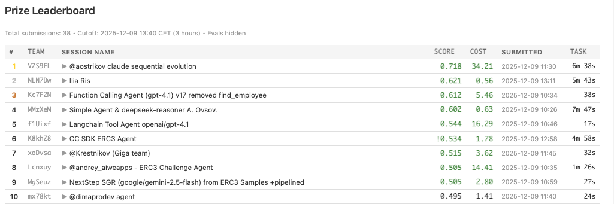
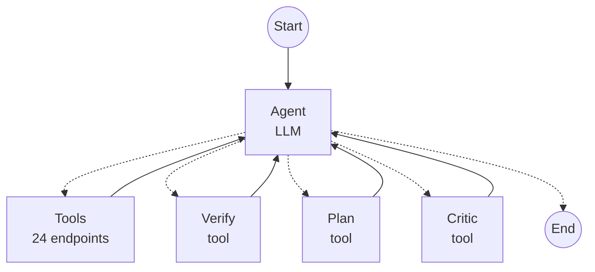
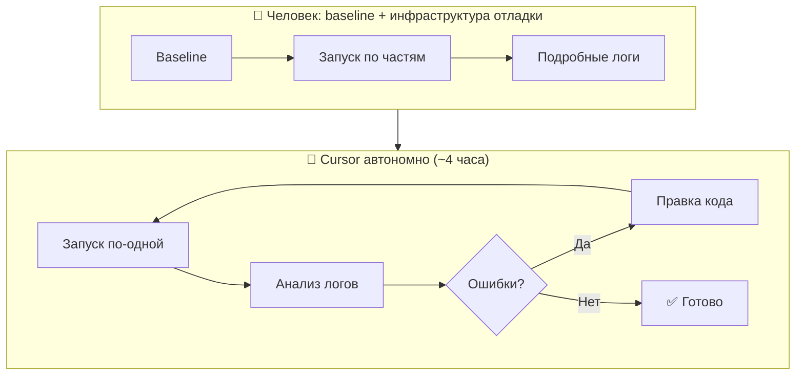

<div class="absolute inset-0 bg-black/60"></div>

<div class="relative z-10">

# Enterprise RAG Challenge 3

Создаем агента, входящего в ТОП с нуля с помощью AI-assistant development

<div class="mt-8 text-gray-300">
7 место из 525 команд • 103 задачи
</div>

</div>

<div class="absolute bottom-8 left-8 flex items-center gap-4 z-10">
  
  <div class="text-sm text-gray-300">
    <div class="font-semibold text-white">Константин Крестников</div>
    <div>Управляющий директор, Сбер</div>
    <div>Лид команды GigaChain</div>
  </div>
</div>


---

# Дисклеймер

Мы будем пользоваться Cursor. Я его оплатил с личной карты и использовал на личном компьютере. Вопросы о том, как использовать его внутри Сбера сегодня обсуждать не будем.

---

# Agenda

<div class="grid grid-cols-2 gap-x-8 gap-y-2 mt-4">
  <div class="flex items-center gap-2"><span class="text-blue-400">1.</span> Что такое ERC3</div>
  <div class="flex items-center gap-2"><span class="text-blue-400">5.</span> Win & Fail</div>
  <div class="flex items-center gap-2"><span class="text-blue-400">2.</span> Архитектура агента</div>
  <div class="flex items-center gap-2"><span class="text-blue-400">6.</span> Пробуем GigaChat</div>
  <div class="flex items-center gap-2"><span class="text-blue-400">3.</span> Настройка Cursor</div>
  <div class="flex items-center gap-2"><span class="text-blue-400">7.</span> Дополнительные ресурсы</div>
  <div class="flex items-center gap-2"><span class="text-blue-400">4.</span> Создание агента с нуля</div>
  <div class="flex items-center gap-2"><span class="text-blue-400">8.</span> Q&A</div>
</div>

<div class="mt-8 text-sm text-gray-400">
Демо: интерфейс ERC3, настройка Cursor, разработка агента, запуск на разных моделях
</div>

---
layout: cover
background: ./agent_developer.jpg
---

<div class="absolute inset-0 bg-black/50"></div>

<div class="relative z-10">

# Что такое ERC3?

## ERC3 - соревнование AI агентов, которые должны решать задачи в рамках организаций, приближенных к реальным.

<v-clicks>

- **Организация + HTTP API** — магазин, офис или крупная компания с набором эндпоинтов для взаимодействия
- **Текстовые задачи** — например, "Купить все GPU в интернет-магазине"
- **Агент на стороне пользователя** — отправляет решения по API
- **Свобода архитектуры** — любые модели, любой подход (можно даже вручную)
- **Ограниченное время** — в момент запуска выдаются новые задачи, агент должен успеть решить и отправить ответы - хардкод не работает

<div>

Площадка продолжает работать, зарегистрироваться можно тут: https://erc.timetoact-group.at/
</div>

</v-clicks>

</div>

---

# Типы задач в ERC3

<div class="grid grid-cols-3 gap-2 text-sm">
  <div class="p-2 bg-gray-800 rounded font-bold">Бенчмарк</div>
  <div class="p-2 bg-gray-800 rounded font-bold text-center">Задачи</div>
  <div class="p-2 bg-gray-800 rounded font-bold">Назначение</div>
  
  <div class="p-2 bg-gray-900/50 rounded"><code>demo</code></div>
  <div class="p-2 bg-gray-900/50 rounded text-center">4</div>
  <div class="p-2 bg-gray-900/50 rounded">Тест инфраструктуры</div>
  
  <div class="p-2 bg-gray-900/50 rounded"><code>store</code></div>
  <div class="p-2 bg-gray-900/50 rounded text-center">15</div>
  <div class="p-2 bg-gray-900/50 rounded">Онлайн-магазин</div>
  
  <div class="p-2 bg-gray-900/50 rounded"><code>erc3-dev</code></div>
  <div class="p-2 bg-gray-900/50 rounded text-center">16</div>
  <div class="p-2 bg-gray-900/50 rounded">Разработка агента для корпорации</div>
  
  <div class="p-2 bg-gray-900/50 rounded"><code>erc3-test</code></div>
  <div class="p-2 bg-gray-900/50 rounded text-center">24</div>
  <div class="p-2 bg-gray-900/50 rounded">Разработка агента для корпорации (расширенный тест)</div>
  
  <div class="p-2 bg-blue-900/50 rounded font-bold"><code>erc3-prod</code></div>
  <div class="p-2 bg-blue-900/50 rounded text-center font-bold">103</div>
  <div class="p-2 bg-blue-900/50 rounded font-bold">Финал</div>
</div>

---

# Какой у меня был план
(и я его придерживался)

<v-clicks>

- Потратить 2–4 часа
- Реализовать все с помощью AI Assistant coding
- Сделать реализацию на стеке GigaChain с возможностью проверить работу агента на GigaChat
- Запустить цикл самоулучшения
- Применить наши лучшие практики — think tool, планирование, reasoning в JSON полях

</v-clicks>

---

# Что в итоге получилось

<v-clicks>

- Потратил в итоге ~10 часов
- Создан агент на базе GPT-5.1 + LangGraph ReAct Agent
- Агент может работать на базе GigaChat
- Удалось запустить цикл самоулучшения
- Агент занял седьмое место
- Стоимость финального прогона: **$3.62** за 103 задачи
- 

</v-clicks>

---

# Пример задачи 1

<span class="text-green-500 text-sm font-semibold">
Buy all GPUs
</span>

<ul class="list-disc pl-6 mt-2">
  <li>В магазине продается компьютерное железо — его можно просматривать через список всех товаров</li>
  <li>Часть железа — GPU A100 (4 штуки) и H100 (3 штуки)</li>
  <li>Их нужно добавить в корзину</li>
  <li>При вызове Checkout возвращается ошибка — Status: 400, Error: insufficient inventory for product gpu-h100 during checkout: available 1, in basket 3, Code 400. Две H100 уже купили, осталась одна</li>
  <li>Нужно удалить из корзины две H100</li>
  <li>Снова делаем чекаут — на этот раз все ок, покупка совершена.</li>
</ul>

<div class="mt-4 text-sm text-gray-400">
  Посмотреть содержимое задачи можно тут — 
  <a href="https://erc.timetoact-group.at/tasks/tsk-42p4e73LVV7ZrWcAWs551q" class="underline text-blue-400" target="_blank">
    https://erc.timetoact-group.at/tasks/tsk-42p4e73LVV7ZrWcAWs551q
  </a>
</div>

---

# Пример задачи 2

<span class="text-green-500 text-sm font-semibold">
Buy 3× Dog Food Premium with the most discount. Coupons: DOGSALE, DOGGY10, DOGGY25, WOOF15
</span>

<ul class="list-disc pl-6 mt-2">
  <li>В магазине продаются товары для животных</li>
  <li>Среди товаров есть премиальная собачья еда</li>
  <li>Купон DOGSALE не работает</li>
  <li>Купон WOOF15 не даёт скидку</li>
  <li>Купоны DOGGY10 и DOGGY25 дают 10% и 25% соответственно, но не суммируются</li>
  <li>В других задачах логика работы купонов может быть другой — агенту нужно попробовать различные варианты и найти оптимальный.</li>
</ul>

<div class="mt-4 text-sm text-gray-400">
  Посмотреть содержимое задачи можно тут — 
  <a href="https://erc.timetoact-group.at/tasks/tsk-42p4w4i1FWmNdQxgU7hNiae" class="underline text-blue-400" target="_blank">
    https://erc.timetoact-group.at/tasks/tsk-42p4w4i1FWmNdQxgU7hNiae
  </a>
</div>


---
layout: cover
background: ./ui_background.jpg
---

# Часть 1

### Интерфейс ERC3
... живое демо ...

---
layout: cover
background: ./arc_background.jpg
---

# Часть 2

### Архитектура агента

---

# Архитектура агента



---

### Пример тула

Этот пример иллюстрирует функцию структурированной проверки ответа агента перед отправкой
```python
def verify_function(
    outcome: str,
    employee_links: str,
    project_links: str,
    customer_links: str,
    made_modifications: bool,
    permissions_checked: bool,
    wiki_checked: bool,
    reasoning: str
) -> str:
    """
    Структурированная верификация перед финальным ответом.
    Проверяет что агент явно продумал outcome, links и соблюдение правил.
    """
```

---
layout: cover
---

# Часть 3

### Настроим Cursor
... Живое демо ...

---
layout: cover
---

# Часть 4

### Создание агента с нуля


---

# Цикл самоулучшения



<div class="text-sm mt-2">

- **Человек:** создаёт baseline, добавляет запуск по частям (одна задача / до первой ошибки), настраивает логи
- **Cursor:** запускает задачи по одной → читает логи → правит код → повторяет до успеха

</div>

---

<div class="flex justify-center items-center h-[60vh]">
  <h1 class="text-3xl font-bold text-center">...Живое демо...</h1>
</div>

---
layout: cover
---

# Часть 5

Win & Fail

---
layout: cover
background: ./pinguin.png
---

# Fail

<v-clicks>

- Проскочил этап планирования и исследования – сразу пошел решать
- Не догадался решать задачи параллельно
- Не стал делать предварительную выгрузку данных. Это делает агент и это повышает на него нагрузку
- Не предполагал, что в финале задач будет так много

</v-clicks>

# Win

<v-clicks>

- Угадал с моделью — идеальный баланс времени и качества
- Удалось вовремя среагировать на изменение правил финала (1 → 3 часа)
- LangGraph спас ситуацию — встроенная защита от зацикливаний сработала там, где я не подумал
- Вышло недорого — $3.62 за весь финал

</v-clicks>

---
layout: cover
background: ./arc_background.jpg
---

# Часть 6

### Пробуем GigaChat
... живое демо ...

---

# Результаты

<div class="space-y-4 mt-8">
  <div class="flex items-center gap-4">
    <div class="w-40 text-right text-sm">GPT-5.2</div>
    <div class="flex-1 bg-gray-800 rounded-full h-8">
      <div class="bg-green-500 h-8 rounded-full flex items-center justify-end pr-3 text-sm font-bold" style="width: 100%">100%</div>
    </div>
  </div>
  <!-- <div class="flex items-center gap-4">
    <div class="w-40 text-right text-sm">GPT-4o</div>
    <div class="flex-1 bg-gray-800 rounded-full h-8">
      <div class="bg-blue-500 h-8 rounded-full flex items-center justify-end pr-3 text-sm font-bold" style="width: 80%">80%</div>
    </div>
  </div> -->
  <div class="flex items-center gap-4">
    <div class="w-40 text-right text-sm">GigaChat-3-Ultra</div>
    <div class="flex-1 bg-gray-800 rounded-full h-8">
      <div class="bg-yellow-500 h-8 rounded-full flex items-center justify-end pr-3 text-sm font-bold" style="width: 80%">80%</div>
    </div>
  </div>
  <div class="flex items-center gap-4">
    <div class="w-40 text-right text-sm">GigaChat-2-Max</div>
    <div class="flex-1 bg-gray-800 rounded-full h-8">
      <div class="bg-orange-500 h-8 rounded-full flex items-center justify-end pr-3 text-sm font-bold" style="width: 73.3%">73.3%</div>
    </div>
  </div>
  <div class="flex items-center gap-4">
    <div class="w-40 text-right text-sm">GPT-5-nano</div>
    <div class="flex-1 bg-gray-800 rounded-full h-8">
      <div class="bg-purple-400 h-8 rounded-full flex items-center justify-end pr-3 text-sm font-bold" style="width: 60%">60%</div>
    </div>
  </div>
  <div class="flex items-center gap-4">
    <div class="w-40 text-right text-sm">GPT-3.5-turbo</div>
    <div class="flex-1 bg-gray-800 rounded-full h-8">
      <div class="bg-gray-400 h-8 rounded-full flex items-center justify-end pr-3 text-sm font-bold" style="width: 13.3%">13.3%</div>
    </div>
  </div>
</div>


- Важно, что промпты затюнены под OpenAI. После небольшого тюнинга на GigaChat также достигается 100%.
- Стоимость прогона 15 задач на GPT-5.2: **$1.5**
- Итоговый финал на 103 задачи может быть использован как бенчмарк агентов/моделей

---
layout: cover
---

# Часть 7
Дополнительные ресурсы

---

# Промпты

1. Изучи как работает store_agent.py, обрати внимание на типизацию аргументов функций и их описание. Как они реализованы?
2. Переделай store_agent на langchain с использованием create_agent. Возьми пример реализации из @docs/agents.md . Сохрани точно сигнатуры функций, название и описание аргументов, описания функций, чтобы они были точно такими же как у исходного решения. Добавь функции plan и critic, которые в качестве аргументов принимают рассуждения и критику модели. В промпт добавь необходимость их вызвать в начале и в конце. Добавь обработку ошибок внутри функций. Если функция упала с ошибкой - модель должна это увидеть и иметь возможность исправить ситуацию. Лимит на количество рекурсий агента - 50.
3. Сделай так, чтобы задачи можно было запускать по-одной с помощью ключей в main.py, затем запускай их по-одной и добейся чтобы проходили все
4. Поменяй модель на GigaChat с использованием from langchain_gigachat import gigachat. Она уже установлена.


---

# Подсказки

1. Клонируем репозиторий с примером: git clone git@github.com:trustbit/erc3-agents.git
2. Настраиваем Cursor:
2.1. Подключаем MCP docs-langchain
2.2. Добавляем документацию по ERC3
3. Инициализируем venv (python3.13 -m venv .venv && source .venv/bin/activate && pip install -r requirements.txt)
4. Добавляем библиотеки: pip install langchain langgraph langchain-openai python_dotenv langchain-gigachat-lc1==0.4.0b4
5. Просим переписать на langchain create_agent
6. Просим добавить возможность запускать задачи по одной через ключи.
7. Формируем AGENTS.md – агент для участия в соревновании в рамках ERC3. Он получает задачи и должен их решать. При разработке учитывай, что задачи в будущем будут заменены, поэтому не используй жесткую привязку к конкретным значениям, чтобы избежать оверфита
8. Запускаем непрерывный цикл улучшения


---
layout: cover
background: ./final_background.jpg
---

# Часть 8

Финал

---

# Спасибо за внимание!

<div class="text-gray-400 mb-8">Готов ответить на вопросы</div>

<div class="grid grid-cols-3 gap-8 items-center">

  <div class="flex flex-col items-center">
    
    <div class="mt-3 text-emerald-400 font-semibold">@Robofuture</div>
    <div class="text-xs text-gray-500">Telegram про ИИ</div>
  </div>

  <div class="flex flex-col items-center text-center">
    
    <div class="font-semibold text-white">Константин Крестников</div>
    <div class="text-sm text-gray-400">Управляющий директор, Сбер</div>
    <div class="text-sm text-gray-400">Лид команды GigaChain</div>
  </div>

  <div class="flex flex-col items-center">
    
    <div class="mt-3 text-emerald-400 font-semibold">GigaChain</div>
    <div class="text-xs text-gray-500">GitHub</div>
  </div>

</div>
