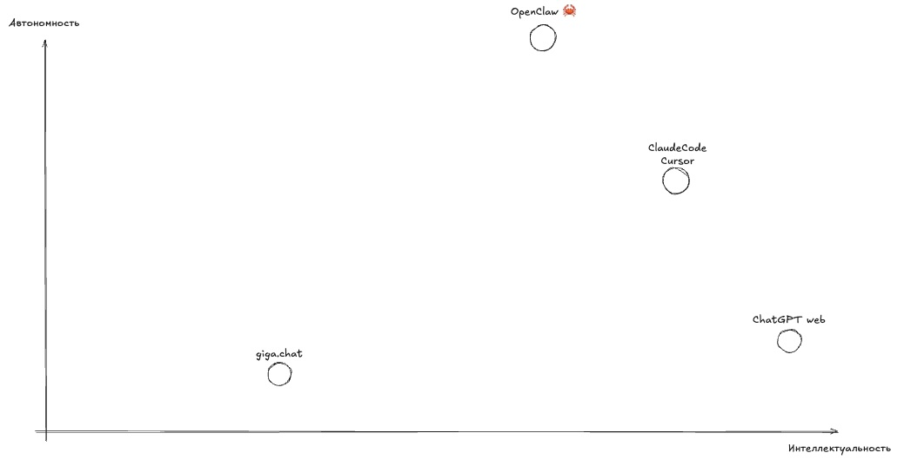

<div class="flex flex-col justify-center h-full">

# OpenClaw 🦀

### Your Code, Your AI, Your Rules

<div class="mt-4 text-gray-400">
Open-source персональный AI-агент, который работает на вашем устройстве 24/7
</div>

<div class="mt-8 text-sm text-gray-500">
169K+ GitHub Stars • MIT License • TypeScript
</div>

</div>

<div class="absolute bottom-8 left-8 flex items-center gap-4">
  
  <div class="text-sm text-gray-300">
    <div class="font-semibold text-white">Константин Крестников</div>
    <div>Управляющий директор, Сбер</div>
    <div>Лид команды GigaChain</div>
  </div>
</div>

---

# Agenda

<div class="grid grid-cols-2 gap-x-8 gap-y-2 mt-4">
  <div class="flex items-center gap-2"><span class="text-blue-400">1.</span> Что такое OpenClaw</div>
  <div class="flex items-center gap-2"><span class="text-blue-400">6.</span> Какие тулы в запросе</div>
  <div class="flex items-center gap-2"><span class="text-blue-400">2.</span> Установка и запуск</div>
  <div class="flex items-center gap-2"><span class="text-blue-400">7.</span> Как устроена память</div>
  <div class="flex items-center gap-2"><span class="text-blue-400">3.</span> Кейсы</div>
  <div class="flex items-center gap-2"><span class="text-blue-400">8.</span> Запуск на GigaChat</div>
  <div class="flex items-center gap-2"><span class="text-blue-400">4.</span> Архитектура</div>
  <div class="flex items-center gap-2"><span class="text-blue-400">9.</span> Запуск локально (Ollama)</div>
  <div class="flex items-center gap-2"><span class="text-blue-400">5.</span> Системный промпт</div>
  <div class="flex items-center gap-2"><span class="text-blue-400">10.</span> Трассировка через mitmproxy</div>
</div>

<div class="mt-8 text-sm text-gray-400">
Формат: слайды + живые демо
</div>

---
layout: cover
---

# Часть 1

### Что такое OpenClaw

---

# Что такое OpenClaw?

<v-clicks>

- **Персональный AI-агент**, а не чат-бот — работает проактивно 24/7
- Запускается **на вашем устройстве** — macOS, Linux, Windows
- Подключается к **13+ каналам**: WhatsApp, Telegram, Slack, Discord, iMessage, Teams...
- **Персистентная память** — помнит контекст между сессиями
- **23 встроенных тула** — браузер, shell, файлы, поиск, TTS и др.
- **MIT лицензия**, 169K+ звёзд на GitHub
- **Автор**: Peter Steinberger ([@steipete](https://x.com/steipete))
- **История переименований**: “WhatsApp Relay” → **Clawd** (11’2025; попросили переименовать из‑за сходства с “Claude”) → **Moltbot** (комьюнити‑брейншторм) → **OpenClaw** (29.01.2026; trademark check + домены)

</v-clicks>

<div class="mt-4 text-xs text-gray-400">
Источник: официальный пост автора — <a href="https://openclaw.ai/blog/introducing-openclaw" target="_blank">Introducing OpenClaw</a>
</div>

---

# Зачем нужен, если есть ChatGPT?

<div class="grid grid-cols-2 gap-8 mt-4">

<div class="p-4 bg-gray-800/50 rounded-lg">

### ChatGPT / Cloud AI

- Реактивный — ждёт ваш запрос
- Данные на серверах провайдера
- Нет интеграции с вашими системами
- Память ограничена сессией
- Один канал общения

</div>

<div class="p-4 bg-blue-900/30 rounded-lg border border-blue-500/30">

### OpenClaw

- Проактивный — cron, hooks, heartbeats
- Данные на вашем устройстве
- Shell, браузер, файлы, email
- Персистентная память (MEMORY.md)
- Один мозг — 13+ каналов

</div>

</div>

---

# Ключевые отличия от других агентов

<div class="grid grid-cols-3 gap-6 mt-6">

<div class="p-4 bg-blue-900/30 rounded-lg border border-blue-500/30 flex flex-col">

### Удобный канал общения

<div class="mt-2 text-sm text-gray-300">

- Общение через **привычные мессенджеры** — Telegram, WhatsApp, Slack, iMessage
- Работа **полностью в фоне** — пользователь не видит логи и внутреннюю работу
- Чистый UX: только вопрос и ответ

</div>
</div>

<div class="p-4 bg-emerald-900/30 rounded-lg border border-emerald-500/30 flex flex-col">

### Проактивность

<div class="mt-2 text-sm text-gray-300">

- Сам **реагирует на события** — hooks, wake events
- Ставит задачи **по расписанию** — cron jobs, heartbeats
- Не ждёт команды — действует самостоятельно 24/7

</div>
</div>

<div class="p-4 bg-purple-900/30 rounded-lg border border-purple-500/30 flex flex-col">

### Самоуправление

<div class="mt-2 text-sm text-gray-300">

- Способен **менять свои конфиги** — через тул `gateway`
- Широкий **набор доступов** — shell, файлы, браузер, сеть
- Сам устанавливает плагины и обновляет настройки

</div>
</div>

</div>

<div class="mt-6 text-sm text-gray-400">

Это не просто чат-бот — это автономный агент с полным контролем над окружением.

</div>

---

# Какие задачи OpenClaw хорошо решает

<v-clicks>

- **Рутинные “мини-автоматизации”**: переименовать/разложить файлы, подготовить отчёт, собрать дайджест из ссылок
- **Задачи “в фоне” по расписанию**: напоминания, регулярные проверки, еженедельные статусы, пинги в мессенджеры
- **Операционные задачи на машине**: запуск скриптов, обновления, бэкапы, мониторинг места/процессов, уведомления о сбоях
- **Работа с информацией**: найти в почте/файлах/вебе, сравнить источники, сделать краткое резюме и список action items
- **Интеграции “в один мозг”**: принимать задачи из Telegram/Slack и доводить до результата через shell/браузер/файлы
- **Повторяемые процессы**: чеклисты, шаблоны ответов, автогенерация заметок/черновиков, поддержание “живой” памяти

</v-clicks>

<div class="mt-4 text-sm text-gray-400">
Лучше всего работает там, где есть <b>контекст + инструменты + регулярность</b>, а не разовый one-shot ответ.
</div>

---

# Автономность агентов

<div class="grid grid-cols-2 gap-8 mt-6 items-start">

  <div>
    
    <div class="mt-2 text-xs text-gray-400">
      Оси: по вертикали — <b>автономность</b>, по горизонтали — <b>интеллектуальность</b>.
    </div>
  </div>

  <div class="space-y-5">
    <div>
      <div class="text-lg font-semibold text-white">Автономность</div>
      <div class="mt-1 text-sm text-gray-300">
        Способность работать самостоятельно над задачей длительное время.
      </div>
    </div>
    <div>
      <div class="text-lg font-semibold text-white">Интеллектуальность</div>
      <div class="mt-1 text-sm text-gray-300">
        Способность ответить на вопрос пользователя <i>one-shot</i> или за небольшое время за счёт
        интеллекта модели.
      </div>
    </div>
  </div>

</div>

---
layout: cover
---

# Часть 2

### Установка и запуск

---

# Установка

```bash
# Требования: Node.js ≥ 22

# Установка через npm
npm install -g openclaw

# Интерактивный визард — настроит всё за вас
openclaw onboard
```

<v-clicks>

Визард спросит:
- Какую модель использовать (Anthropic / OpenAI / другая)
- API ключ или OAuth подписка
- Какие каналы подключить (Telegram, WhatsApp, ...)
- Имя вашего агента

</v-clicks>

---

# Запуск и основные команды

```bash
# Запуск
openclaw agent start

# Полезные команды
openclaw agents list          # список агентов
openclaw models list          # доступные модели
openclaw memory search "тема" # поиск по памяти
openclaw plugins list         # установленные плагины
```

<div class="mt-6 text-sm text-gray-400">

После запуска агент доступен через подключённые каналы (Telegram, WhatsApp и др.) и через веб-интерфейс Dashboard.

</div>

---

<div class="flex justify-center items-center h-[60vh]">
  <h1 class="text-3xl font-bold text-center text-gray-400">...Живое демо: установка и первый запуск...</h1>
</div>

---
layout: cover
---

# Часть 3

### Кейсы

---

# Кейс 1: Мультиканальный ассистент

Один агент — несколько мессенджеров. Пишете в Telegram — агент помнит контекст из WhatsApp.

<v-clicks>

- Настраиваем каналы в `openclaw.json`:

```json
{
  "channels": {
    "telegram": { "enabled": true, "botToken": "${TELEGRAM_BOT_TOKEN}" },
    "whatsapp": { "enabled": true }
  }
}
```

- Агент поддерживает **единую память** между каналами
- Утром пишете в Telegram, вечером в WhatsApp — контекст сохраняется

</v-clicks>

---

# Кейс 2: Автоматизация через Cron

OpenClaw умеет действовать проактивно — без вашего запроса.

<v-clicks>

- **Cron jobs** — регулярные задачи по расписанию
- **Heartbeats** — периодические проверки (почта, календарь, погода)
- **Wake events** — пробуждение по событию

Пример: ежедневный утренний брифинг через тул `cron`:

```json
{
  "action": "add",
  "job": {
    "name": "morning-briefing",
    "schedule": { "kind": "cron", "expr": "0 9 * * *", "tz": "Europe/Moscow" },
    "payload": { "kind": "agentTurn", "message": "Составь сводку: погода, календарь, непрочитанные письма" },
    "sessionTarget": "isolated"
  }
}
```

</v-clicks>

---

# Кейс 3: Бекап памяти на GitHub

Память агента можно регулярно бекапить в GitHub-репозиторий.

<v-clicks>

- Память хранится локально в `~/.openclaw/workspace/`
- Агент сам умеет коммитить — через тул `exec`:

```bash
cd ~/.openclaw/workspace && git add -A && git commit -m "memory backup" && git push
```

- Настраиваем cron job на регулярный бекап каждые 6 часов
- В итоге: полная **история изменений памяти** в git
- Можно откатиться к любому состоянию

</v-clicks>

---

<div class="flex justify-center items-center h-[60vh]">
  <h1 class="text-3xl font-bold text-center text-gray-400">...Живое демо: кейсы в действии...</h1>
</div>

---
layout: cover
---

# Часть 4

### Архитектура

---

# Архитектура OpenClaw

<div class="mt-4 text-sm">

| Компонент | Что делает |
|---|---|
| **Gateway** | WebSocket-сервер, единый control plane. Принимает подключения от CLI, Dashboard, мобильных приложений |
| **Agent Runtime** | Цикл: сообщение → LLM → tool calls → ответ. Поддерживает model failover |
| **Message Router** | Маршрутизация сообщений между 13+ каналами (Telegram, WhatsApp, ...) |
| **Tools Executor** | Выполнение 23 тулов. Опционально в Docker-sandbox |
| **Memory Store** | Персистентная память: MEMORY.md + memory/*.md |
| **Hooks Engine** | Cron, heartbeats, wake events |
| **Plugins** | Расширения через ClawHub — JSON-schema функции для LLM |

</div>

<div class="mt-4 text-sm text-gray-400">

Всё общение между компонентами — **WebSocket + JSON**. Аутентификация по token, role-based access.

</div>

---
layout: cover
---

# Часть 5

### Системный промпт

---

# Что в системном промпте?

Из реального перехвата запроса (`openclaw_simple_request.json`):

<div class="text-xs mt-2">

```
You are a personal assistant running inside OpenClaw.
## Tooling
Tool names are case-sensitive. Call tools exactly as listed.
- read: Read file contents
- write: Create or overwrite files
- edit: Make precise edits to files
- exec: Run shell commands
- process: Manage background exec sessions
- web_search: Search the web (Brave API)
- web_fetch: Fetch and extract readable content from a URL
- browser: Control web browser
- canvas: Present/eval/snapshot the Canvas
- nodes: List/describe/notify/camera/screen on paired nodes
- cron: Manage cron jobs and wake events
- message: Send messages and channel actions
- gateway: Restart, apply config, or run updates
...
## Memory Recall
Before answering anything about prior work, decisions, dates, people:
run memory_search on MEMORY.md + memory/*.md
```

</div>

---

# Структура системного промпта

<div class="grid grid-cols-2 gap-6 mt-4 text-sm">

<div>

**Tooling** — список доступных тулов и правила вызова

**Safety** — запрет самовоспроизведения, эскалации доступа, манипуляций

**Skills** — загрузка SKILL.md для специализированных задач (GitHub, Twitter, погода...)

**Memory Recall** — обязательный поиск по памяти перед ответом

</div>

<div>

**CLI Reference** — команды для управления Gateway

**Heartbeats** — правила проактивного поведения, когда молчать, когда действовать

**Project Context** — AGENTS.md, SOUL.md, TOOLS.md, USER.md — файлы идентичности и настроек

**Silent Replies** — когда отвечать NO_REPLY / HEARTBEAT_OK

</div>

</div>

<div class="mt-4 text-sm text-gray-400">

Системный промпт занимает ~4000 токенов. Плюс Project Context файлы инжектятся целиком.

</div>

---
layout: cover
---

# Часть 6

### Какие тулы в запросе

---

# 23 тула OpenClaw

Все передаются модели как JSON-schema функции в **каждом** запросе к LLM.

<div class="grid grid-cols-2 gap-x-8 gap-y-1 mt-4 text-sm">

<div>

**Файлы** — `read`, `write`, `edit`

**Shell** — `exec`, `process`

**Web** — `web_search`, `web_fetch`

**Браузер** — `browser`

**Сообщения** — `message`, `tts`

**Память** — `memory_search`, `memory_get`

</div>

<div>

**Сессии и агенты** — `agents_list`, `sessions_list`, `sessions_history`, `sessions_send`, `sessions_spawn`, `session_status`

**Автоматизация** — `cron`

**Система** — `gateway`

**Устройства и UI** — `nodes`, `canvas`

**Vision** — `image`

</div>

</div>

---

# Примеры тулов: exec

```json
{
  "name": "exec",
  "description": "Execute shell commands with background continuation.",
  "parameters": {
    "type": "object",
    "required": ["command"],
    "properties": {
      "command":   { "type": "string", "description": "Shell command to execute" },
      "workdir":   { "type": "string", "description": "Working directory" },
      "background":{ "type": "boolean", "description": "Run in background immediately" },
      "pty":       { "type": "boolean", "description": "Run in pseudo-terminal" },
      "elevated":  { "type": "boolean", "description": "Run with elevated permissions" },
      "timeout":   { "type": "number", "description": "Timeout in seconds" }
    }
  }
}
```

---

# Примеры тулов: browser

```json
{
  "name": "browser",
  "description": "Control the browser via OpenClaw's browser control server.",
  "parameters": {
    "required": ["action"],
    "properties": {
      "action":  { "enum": ["status","start","stop","tabs","open","snapshot",
                             "screenshot","navigate","act","close","pdf","upload"] },
      "profile": { "type": "string", "description": "chrome | openclaw" },
      "targetUrl":   { "type": "string" },
      "request": {
        "properties": {
          "kind": { "enum": ["click","type","press","hover","drag","fill","wait"] },
          "ref":  { "type": "string" },
          "text": { "type": "string" }
        }
      }
    }
  }
}
```

<div class="mt-2 text-sm text-gray-400">

`profile="chrome"` — перехватывает ваши открытые вкладки Chrome через расширение Browser Relay.

</div>

---

# Примеры тулов: cron

```json
{
  "name": "cron",
  "description": "Manage cron jobs and wake events.",
  "parameters": {
    "required": ["action"],
    "properties": {
      "action": { "enum": ["status","list","add","update","remove","run","runs","wake"] },
      "job": {
        "properties": {
          "name":     "string",
          "schedule": { "kind": "cron | at | every" },
          "payload":  { "kind": "systemEvent | agentTurn" },
          "sessionTarget": "main | isolated"
        }
      }
    }
  }
}
```

<div class="mt-2 text-sm text-gray-400">

`sessionTarget="isolated"` — задача выполняется в отдельной сессии, не загрязняя основную историю.

</div>

---
layout: cover
---

# Часть 7

### Как устроена память

---

# Система памяти OpenClaw

<div class="mt-4">

Агент просыпается **с чистого листа** каждую сессию. Файлы — его единственная память.

</div>

<v-clicks>

- **`MEMORY.md`** — долгосрочная кураторская память (как дневник). Загружается только в личных сессиях
- **`memory/YYYY-MM-DD.md`** — ежедневные заметки, сырые логи
- **`SOUL.md`** — личность агента: имя, характер, стиль общения
- **`USER.md`** — информация о пользователе: имя, timezone, предпочтения
- **`HEARTBEAT.md`** — чеклист для периодических проверок

</v-clicks>

<div class="mt-4 text-sm text-gray-400">

Все файлы хранятся в `~/.openclaw/workspace/` и инжектятся в системный промпт как Project Context.

</div>

---

# Тулы для работы с памятью

**`memory_search`** — семантический поиск по всем файлам памяти

```json
{ "action": "memory_search", "query": "когда мы обсуждали деплой?", "maxResults": 5 }
```

**`memory_get`** — чтение конкретного фрагмента

```json
{ "action": "memory_get", "path": "memory/2026-02-05.md", "from": 10, "lines": 20 }
```

<v-clicks>

- Перед ответом на вопросы о прошлом — **обязательный** вызов `memory_search`
- Агент сам обновляет `MEMORY.md` во время heartbeats
- Цитирует источник: `Source: memory/2026-02-05.md#42`

</v-clicks>

---
layout: cover
---

# Часть 8

### Запуск на GigaChat

---

# OpenClaw + GigaChat

GigaChat совместим с OpenAI API — подключается как custom provider в `openclaw.json`:

```json
{
  "models": {
    "providers": {
      "gigachat": {
        "baseUrl": "https://gigachat.devices.sberbank.ru/api/v1",
        "apiKey": "${GIGACHAT_API_KEY}",
        "api": "openai-completions",
        "models": [
          {
            "id": "GigaChat-2-Max",
            "name": "GigaChat-2-Max",
            "contextWindow": 32000,
            "maxTokens": 32000
          }
        ]
      }
    }
  },
  "agents": {
    "defaults": {
      "model": { "primary": "gigachat/GigaChat-2-Max" }
    }
  }
}
```

---

# Настройка GigaChat: шаги

<v-clicks>

1. Получаем API ключ GigaChat на [developers.sber.ru](https://developers.sber.ru)

2. Добавляем провайдер в `~/.openclaw/openclaw.json`

3. Указываем `"api": "openai-completions"` — GigaChat совместим с OpenAI API

4. Указываем модель как primary: `"gigachat/GigaChat-2-Max"`

5. Запускаем: `openclaw agent start`

</v-clicks>

<div class="mt-8 text-sm text-gray-400">

Можно настроить model failover: если GigaChat недоступен — автопереключение на OpenAI или Anthropic.

</div>

---

<div class="flex justify-center items-center h-[60vh]">
  <h1 class="text-3xl font-bold text-center text-gray-400">...Живое демо: OpenClaw на GigaChat...</h1>
</div>

---
layout: cover
---

# Часть 9

### Запуск локально (Ollama)

---

# OpenClaw + Ollama

Полностью локальный запуск — без облачных API.

<v-clicks>

```bash
# 1. Устанавливаем Ollama
brew install ollama

# 2. Скачиваем модель
ollama pull llama3.3

# 3. Ollama стартует автоматически на localhost:11434
```

```json
{
  "models": {
    "providers": {
      "ollama": {
        "baseUrl": "http://localhost:11434/v1",
        "apiKey": "ollama",
        "api": "openai-completions",
        "models": [{ "id": "llama3.3", "name": "llama3.3", "contextWindow": 128000, "maxTokens": 32000 }]
      }
    }
  }
}
```

</v-clicks>

---

# Локальный запуск: особенности

<v-clicks>

- **Полная приватность** — ничего не уходит в облако
- **Бесплатно** — нет затрат на API
- **Работает офлайн** — не нужен интернет после скачивания модели
- **Ограничения** — качество зависит от размера модели и железа
- **Совет** — для tool calling используйте модели ≥ 70B параметров

</v-clicks>

<div class="mt-8 text-sm text-gray-400">

Также поддерживаются: LM Studio, vLLM, LiteLLM — любой OpenAI-совместимый сервер.

</div>

---

<div class="flex justify-center items-center h-[60vh]">
  <h1 class="text-3xl font-bold text-center text-gray-400">...Живое демо: OpenClaw + Ollama...</h1>
</div>

---
layout: cover
---

# Часть 10

### Трассировка через mitmproxy

---

# Зачем трассировать?

<v-clicks>

- Посмотреть **что именно** OpenClaw отправляет на LLM
- Увидеть полный **системный промпт** — включая memory injection
- Увидеть все **23 тула** с их JSON-schema
- Понять, как агент **вызывает tools** и какие ответы получает
- Отладить проблемы с кастомными провайдерами (GigaChat, Ollama)
- Измерить **latency** и **token usage**

</v-clicks>

---

# Настройка mitmproxy

```bash
# 1. Устанавливаем
brew install mitmproxy

# 2. Запускаем как reverse proxy перед LLM провайдером
mitmproxy --mode reverse:https://gigachat.devices.sberbank.ru --listen-port 8080

# 3. В openclaw.json меняем baseUrl на локальный прокси
```

```json
{
  "models": {
    "providers": {
      "gigachat": {
        "baseUrl": "http://localhost:8080/api/v1",
        "apiKey": "${GIGACHAT_API_KEY}",
        "api": "openai-completions"
      }
    }
  }
}
```

<div class="mt-2 text-sm text-gray-400">

Все запросы к LLM теперь проходят через mitmproxy. Альтернатива: `mitmweb` — GUI на порту 8081.

</div>

---

# Что видим в перехваченном запросе

Реальный запрос из `openclaw_simple_request.json` — **1483 строки JSON**:

<div class="text-xs mt-2">

```json
{
  "model": "gpt-4o",
  "messages": [
    { "role": "system", "content": "You are a personal assistant running inside OpenClaw.\n## Tooling\n- read, write, edit, exec, process, web_search, web_fetch, browser,\n  canvas, nodes, cron, message, gateway, agents_list, sessions_list,\n  sessions_history, sessions_send, sessions_spawn, session_status,\n  image, memory_search, memory_get, tts\n## Memory Recall ...\n## Project Context: AGENTS.md, SOUL.md, USER.md ..." },
    { "role": "user", "content": [{ "type": "text", "text": "Привет" }] }
  ],
  "tools": [
    { "type": "function", "function": { "name": "read", "parameters": { "properties": { "path": {}, "offset": {}, "limit": {} } } } },
    { "type": "function", "function": { "name": "exec", "parameters": { "properties": { "command": {}, "pty": {} } } } },
    "... ещё 21 тул ..."
  ],
  "stream": true,
  "max_completion_tokens": 16384
}
```

</div>

---

# Что можно увидеть через mitmproxy

<v-clicks>

- **System prompt** — полная инструкция + SOUL.md + USER.md + MEMORY.md
- **Tools array** — все 23 тула с полными JSON-schema описаниями параметров
- **Tool calls** — какие инструменты агент вызвал и с какими аргументами
- **Tool responses** — что вернул каждый тул
- **Memory injection** — какие воспоминания были подгружены в контекст
- **Streaming chunks** — ответ модели по частям в реальном времени

</v-clicks>

<div class="mt-4 text-sm text-gray-400">

На простое "Привет" — запрос весит ~1500 строк JSON. Основной объём: системный промпт + описания тулов.

</div>

---

<div class="flex justify-center items-center h-[60vh]">
  <h1 class="text-3xl font-bold text-center text-gray-400">...Живое демо: mitmproxy + OpenClaw...</h1>
</div>

---

# Спасибо за внимание!

<div class="text-gray-400 mb-8">Готов ответить на вопросы</div>

<div class="grid grid-cols-3 gap-8 items-center">

  <div class="flex flex-col items-center">
    
    <div class="mt-3 text-emerald-400 font-semibold">@Robofuture</div>
    <div class="text-xs text-gray-500">Telegram про ИИ</div>
  </div>

  <div class="flex flex-col items-center text-center">
    
    <div class="font-semibold text-white">Константин Крестников</div>
    <div class="text-sm text-gray-400">Управляющий директор, Сбер</div>
    <div class="text-sm text-gray-400">Лид команды GigaChain</div>
  </div>

  <div class="flex flex-col items-center">
    
    <div class="mt-3 text-emerald-400 font-semibold">GigaChain</div>
    <div class="text-xs text-gray-500">GitHub</div>
  </div>

</div>
