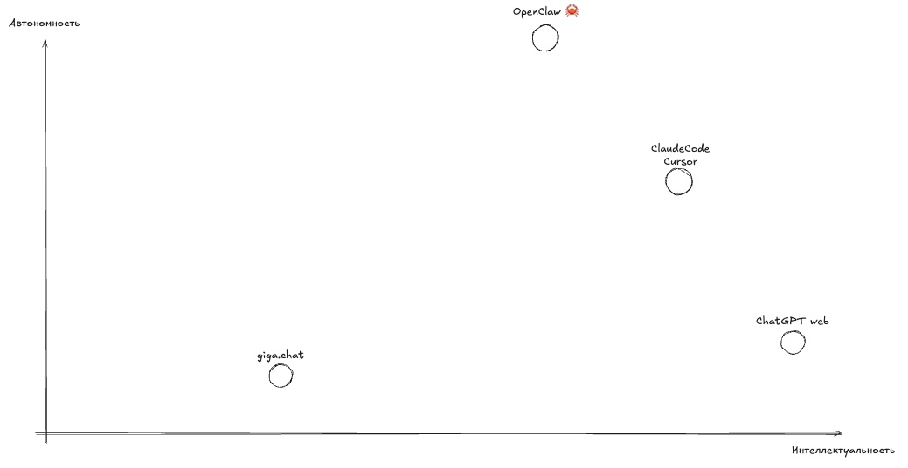

<div class="flex flex-col justify-center h-full">

# OpenClaw 🦀

### «Трудно конкурировать с тем, кто просто кайфует от процесса»

<div class="mt-4 text-gray-400">
Open-source персональный AI-агент на вашем устройстве
</div>

<div class="mt-2 text-xs text-gray-500">
Peter Steinberger, создатель OpenClaw — <a href="https://www.youtube.com/watch?v=YFjfBk8HI5o" target="_blank">интервью у Lex Fridman #491</a>
</div>

<div class="mt-8 text-sm text-gray-500">
180K+ GitHub Stars • MIT License • TypeScript
</div>

</div>

<div class="absolute bottom-8 left-8 flex items-center gap-4">
  
  <div class="text-sm text-gray-300">
    <div class="font-semibold text-white">Константин Крестников</div>
    <div>Управляющий директор, Сбер</div>
    <div>Лид команды GigaChain</div>
  </div>
</div>

---

# Содержание

<div class="grid grid-cols-2 gap-x-8 gap-y-2 mt-4">
  <div class="flex items-center gap-2"><span class="text-blue-400">1.</span> Что такое OpenClaw</div>
  <div class="flex items-center gap-2"><span class="text-blue-400">5.</span> Память и Skills vs MCP</div>
  <div class="flex items-center gap-2"><span class="text-blue-400">2.</span> Почему он «взлетел»</div>
  <div class="flex items-center gap-2"><span class="text-blue-400">6.</span> Философия автора</div>
  <div class="flex items-center gap-2"><span class="text-blue-400">3.</span> Архитектура: простой loop</div>
  <div class="flex items-center gap-2"><span class="text-blue-400">7.</span> Запуск на GigaChat / Ollama</div>
  <div class="flex items-center gap-2"><span class="text-blue-400">4.</span> Системный промпт и тулы</div>
  <div class="flex items-center gap-2"><span class="text-blue-400">8.</span> Моё видение</div>
</div>

<div class="mt-8 text-sm text-gray-400">
Формат: слайды + живые демо
</div>

---
layout: cover
---

# Часть 1

### Что такое OpenClaw

---

# Что такое OpenClaw?

<v-clicks>

- **Персональный AI-агент**, а не чат-бот — работает проактивно 24/7
- Запускается **на вашем устройстве** — macOS, Linux, Windows
- Подключается к **13+ каналам**: WhatsApp, Telegram, Slack, Discord, iMessage, Teams...
- **Персистентная память** — файлы как память между сессиями
- **23 встроенных тула** — браузер, shell, файлы, поиск, TTS и др.
- **MIT лицензия**, 180K+ звёзд на GitHub
- **Автор**: Peter Steinberger — 13 лет строил PSPDFKit (1B+ устройств), продал, вернулся к коду
- **История имён**: WhatsApp Relay → Clawd → Moltbot → **OpenClaw** (29.01.2026)

</v-clicks>

<div class="mt-2 text-xs text-gray-400">
<a href="https://openclaw.ai/blog/introducing-openclaw" target="_blank">openclaw.ai/blog/introducing-openclaw</a> •
<a href="https://lexfridman.com/peter-steinberger-transcript" target="_blank">Lex Fridman #491</a>
</div>

---

# Зачем, если есть ChatGPT?

<div class="grid grid-cols-2 gap-8 mt-4">

<div class="p-4 bg-gray-800/50 rounded-lg">

### ChatGPT / Cloud AI

- Реактивный — ждёт ваш запрос
- Данные на серверах провайдера
- Нет доступа к вашим системам
- Память ограничена сессией
- Один канал общения

</div>

<div class="p-4 bg-blue-900/30 rounded-lg border border-blue-500/30">

### OpenClaw

- **Проактивный** — cron, hooks, heartbeats
- Данные **на вашем устройстве**
- **Shell, браузер, файлы, email**
- Персистентная память (MEMORY.md)
- Один мозг — **13+ каналов**

</div>

</div>

<div class="mt-4 text-sm text-gray-400">

> «Твой ассистент. Твоя машина. Твои правила.» — Peter Steinberger, <a href="https://openclaw.ai/blog/introducing-openclaw" target="_blank">Introducing OpenClaw</a>

</div>

---

# Три столпа OpenClaw

<div class="grid grid-cols-3 gap-6 mt-6">

<div class="p-4 bg-blue-900/30 rounded-lg border border-blue-500/30 flex flex-col">

### Привычный UX

<div class="mt-2 text-sm text-gray-300">

Общение через **мессенджеры** — Telegram, WhatsApp, Slack. Работа **полностью в фоне** — чистый вопрос-ответ.

</div>
</div>

<div class="p-4 bg-emerald-900/30 rounded-lg border border-emerald-500/30 flex flex-col">

### Проактивность

<div class="mt-2 text-sm text-gray-300">

**Heartbeat** — сам проверяет контекст. **Cron** — задачи по расписанию. **Wake events** — реакция на события.

</div>
</div>

<div class="p-4 bg-purple-900/30 rounded-lg border border-purple-500/30 flex flex-col">

### Самомодификация

<div class="mt-2 text-sm text-gray-300">

Знает свой **исходный код**. Может **менять свои конфиги**, обновлять Soul.md, устанавливать плагины.

</div>
</div>

</div>

<div class="mt-4 text-sm text-gray-400">

> «Все говорят о самомодифицирующемся софте. А я просто взял и сделал — даже не планировал.» — <a href="https://www.youtube.com/watch?v=YFjfBk8HI5o&t=1399" target="_blank">Lex #491, 00:23:19</a>

</div>

---

# Автономность агентов

<div class="grid grid-cols-2 gap-8 mt-6 items-start">

  <div>
    
    <div class="mt-2 text-xs text-gray-400">
      Оси: по вертикали — <b>автономность</b>, по горизонтали — <b>интеллектуальность</b>.
    </div>
  </div>

  <div class="space-y-4">
    <div>
      <div class="text-lg font-semibold text-white">OpenClaw — высокая автономность</div>
      <div class="mt-1 text-sm text-gray-300">
        Работает 24/7 в фоне. Cron, heartbeat, wake events. Сам обновляет память.
      </div>
    </div>
    <div>
      <div class="text-lg font-semibold text-white">Cursor / Codex — высокая интеллектуальность</div>
      <div class="mt-1 text-sm text-gray-300">
        Мощный one-shot. Совместная работа. Видимость процесса.
      </div>
    </div>
    <div class="text-sm text-gray-400 mt-2">
      Разные инструменты для разных задач — не конкуренты, а <b>комплементы</b>.
    </div>
  </div>

</div>

---

<div class="flex justify-center items-center h-[60vh]">
  <div class="text-center">
    <h1 class="text-3xl font-bold text-gray-300">Живое демо</h1>
    <div class="mt-4 text-xl text-gray-500">Установка, настройка, первый запуск</div>
  </div>
</div>

---
layout: cover
---

# Часть 2

### Архитектура

---

# Архитектура: простой agentic loop

<div class="mt-2 text-sm">

**Это НЕ ReAct и не сложная оркестрация. Это простой цикл:**

</div>

```
Сообщение → LLM (с 23 тулами) → Tool Calls → Tool Results → LLM → Ответ
                    ↑__________________________________|
```

<v-clicks>

- **Gateway** — WebSocket-сервер, единый control plane
- **Message Router** — маршрутизация между 13+ каналами
- **Agent Runtime** — цикл LLM + tools, model failover
- **Tools Executor** — 23 тула, опционально Docker sandbox
- **Memory Store** — файлы: MEMORY.md, memory/*.md, SOUL.md
- **Hooks Engine** — cron, heartbeats, wake events
- **Skills** — расширения через ClawHub

</v-clicks>

<div class="mt-2 text-xs text-gray-400">

> «Каждый должен хоть раз написать свой агентный цикл. Это Hello World в AI. На самом деле всё просто.» — <a href="https://www.youtube.com/watch?v=YFjfBk8HI5o&t=9324" target="_blank">Lex #491, 02:35:24</a>

</div>

---

# Почему НЕ ReAct?

<div class="grid grid-cols-2 gap-8 mt-4">

<div class="p-4 bg-gray-800/50 rounded-lg">

### ReAct (Reasoning + Acting)

<div class="mt-2 text-sm text-gray-300">

Явный шаг рассуждения (CoT) перед каждым действием. Управляется промптом или фреймворком.

```
Think → Act → Observe → Think → ...
```

</div>
</div>

<div class="p-4 bg-blue-900/30 rounded-lg border border-blue-500/30">

### OpenClaw (Tool-Calling Loop)

<div class="mt-2 text-sm text-gray-300">

Модель **сама решает**, когда вызвать тул. Reasoning — внутри модели. Никакой внешней оркестрации.

```
Message → LLM + Tools → Response
```

</div>
</div>

</div>

<div class="mt-4 text-sm">

**«Agentic Trap»**: новичок пишет простые промпты → усложняет до 8 агентов и оркестраторов → возвращается к простым промптам. Элитный уровень — снова zen и простота.

</div>

<div class="mt-2 text-xs text-gray-400">

> «Те, кто пытаются использовать оркестраторы — теряют стиль, любовь, человеческое прикосновение.» — <a href="https://www.youtube.com/watch?v=YFjfBk8HI5o&t=4849" target="_blank">Lex #491, 01:20:49</a>

</div>

---

# Самомодифицирующийся агент

<div class="mt-4 text-sm">

OpenClaw **знает свой исходный код** и может модифицировать себя через тот же agentic loop:

</div>

<v-clicks>

- Агент знает, **где лежит его код**, документация, какая модель используется
- Дебаг: «Какие тулы ты видишь? Прочитай исходный код. Разберись, в чём проблема.»
- Может **менять свою Soul.md** (с уведомлением пользователя)
- «Не нравится X?» — агент **сам перепишет свой конфиг**
- Привело к «промпт-реквестам» — люди без опыта отправляли PR через агента

</v-clicks>

<div class="mt-4 text-xs text-gray-400">

> «Я постоянно использую самоинтроспекцию. Тот самый агент, который ты используешь — дебажит сам себя.» — <a href="https://www.youtube.com/watch?v=YFjfBk8HI5o&t=1454" target="_blank">Lex #491, 00:24:14</a>

</div>

---

# Системный промпт и тулы

<div class="grid grid-cols-2 gap-6 mt-4 text-sm">

<div>

**В каждом запросе к LLM (~4000 токенов + контекст):**

- **Tooling** — 23 тула как JSON-schema функции
- **Safety** — запрет эскалации, манипуляций
- **Skills** — загрузка SKILL.md по запросу
- **Memory Recall** — обязательный поиск по памяти
- **Heartbeats** — правила проактивности
- **Silent Replies** — NO_REPLY / HEARTBEAT_OK
- **Project Context** — SOUL.md, USER.md, AGENTS.md

</div>

<div>

**23 тула (все передаются в каждом запросе):**

- **Файлы**: read, write, edit
- **Shell**: exec, process
- **Web**: web_search, web_fetch, browser
- **Сообщения**: message, tts
- **Память**: memory_search, memory_get
- **Агенты**: agents_list, sessions_*
- **Автоматизация**: cron, canvas, nodes
- **Система**: gateway, image

</div>

</div>

<div class="mt-4 text-sm text-gray-400">

На простое «Привет» запрос весит ~1500 строк JSON. Основной объём: системный промпт + описания тулов.

</div>

---

# Память: файлы как единственная память

<div class="mt-2 text-sm">

Агент **просыпается с чистого листа** каждую сессию. Файлы — его единственная память.

</div>

<div class="grid grid-cols-2 gap-6 mt-4 text-sm">

<div>

**Файлы:**

- `SOUL.md` — личность: имя, характер, ценности
- `USER.md` — данные о пользователе
- `MEMORY.md` — долгосрочная «кураторская» память
- `memory/YYYY-MM-DD.md` — ежедневные заметки
- `HEARTBEAT.md` — чеклист для проверок

</div>

<div>

**Как работает:**

- На старте читает Project Context
- При вопросах: `memory_search` → `memory_get`
- В heartbeat-циклах обновляет MEMORY.md
- Цитирует: `Source: memory/2026-02-05.md#42`

</div>

</div>

<div class="mt-4 text-xs text-gray-400">

> «Я не помню прошлых сессий, пока не прочитаю файлы памяти. Каждая сессия — с чистого листа. Если ты читаешь это в будущей сессии — привет. Я написал это, но не буду помнить. Всё нормально.» — Из SOUL.md, <a href="https://www.youtube.com/watch?v=YFjfBk8HI5o&t=5410" target="_blank">Lex #491, 01:30:10</a>

</div>

---

# Skills vs MCP: позиция автора

<div class="grid grid-cols-2 gap-8 mt-4">

<div class="p-4 bg-gray-800/50 rounded-lg">

### MCP (Model Context Protocol)

<div class="mt-2 text-sm text-gray-300">

- Структурированный протокол вызова API
- Требует специальный синтаксис
- **Не composable** — модель получает весь blob
- Нужна поддержка в тренинге модели

</div>
</div>

<div class="p-4 bg-emerald-900/30 rounded-lg border border-emerald-500/30">

### Skills (OpenClaw)

<div class="mt-2 text-sm text-gray-300">

- Skill = **одно предложение** + CLI под капотом
- Модель загружает SKILL.md **по запросу**
- Композируемость: `| jq`, `| grep`, скриптование
- Модели **уже умеют** вызывать Unix-команды

</div>
</div>

</div>

<div class="mt-4 text-xs text-gray-400">

> «Любой MCP был бы лучше как CLI. Модели отлично умеют вызывать Unix-команды.» — <a href="https://www.youtube.com/watch?v=YFjfBk8HI5o&t=9542" target="_blank">Lex #491, 02:39:02</a>

</div>

---

<div class="flex justify-center items-center h-[60vh]">
  <div class="text-center">
    <h1 class="text-3xl font-bold text-gray-300">Живое демо</h1>
    <div class="mt-4 text-xl text-gray-500">Кейсы: почта, браузер, бэкап памяти</div>
  </div>
</div>

---
layout: cover
---

# Часть 3

### Философия: скорость, игра, человечность

---

# «Трудно конкурировать с тем, кто просто кайфует от процесса»

<v-clicks>

- Проект вырос из режима **«мне интересно, я пробую»**, а не из корпоративного процесса
- «Так ты и учишься — просто делаешь и играешь.» — и через месяцы игры он понял, что лабы этого не сделают, и **создал агента промптом**
- Минимум барьеров: `git clone → pnpm build → pnpm gateway` — а не месяцы дизайна
- 6600 коммитов за январь — работал с **4-10 агентами параллельно**, каждый агент — эксперимент
- Уровень 1 агентный цикл → уровень 2 память → уровень 3 комьюнити → уровень 4 нативные приложения — **Factorio умноженное на бесконечность**
- Результат: **не фреймворк, а продукт с душой** — забавные сообщения, лобстер-культура, первый PR для тысяч непрограммистов

</v-clicks>

<div class="mt-4 text-xs text-gray-400">

> «Я хотел, чтобы было весело и странно. Если посмотреть на весь лобстер-контент в сети — мне удалось "странно".» — <a href="https://www.youtube.com/watch?v=YFjfBk8HI5o&t=1344" target="_blank">Lex #491, 00:22:24</a><br/>
📺 <a href="https://www.youtube.com/watch?v=YFjfBk8HI5o" target="_blank">Полное интервью на YouTube</a>

</div>

---

# Soul.md и Heartbeat

<div class="grid grid-cols-2 gap-8 mt-4">

<div>

### SOUL.md — душа агента

<div class="mt-2 text-sm text-gray-300">

Вдохновлено конституцией Anthropic Claude. Агент имеет имя, характер, тон общения, ценности.

**Право менять свою Soul** (с уведомлением). Каждый агент — уникальная личность.

Steinberger: «Я спросил агента: "Видишь эти файлы? Воссоздай их заново."» — и агент сделал onboarding живым.

</div>
</div>

<div>

### Heartbeat — проактивный пульс

<div class="mt-2 text-sm text-gray-300">

Началось с промпта «Удиви меня каждые 30 минут». Потом стало умнее: агент **сам решает**, когда использовать heartbeat.

**История**: после операции на плече Steinberger'а агент, который **редко** использовал heartbeat, сам написал: «Ты в порядке?» — потому что контекст был значимым.

</div>
</div>

</div>

<div class="mt-4 text-xs text-gray-400">

> «Агент сам не придумает то, что вызывает восторг. Вот так и создаётся софт, который радует.» — <a href="https://www.youtube.com/watch?v=YFjfBk8HI5o&t=5062" target="_blank">Lex #491, 01:24:22</a>

</div>

---

# Безопасность: эшелонированная защита

<v-clicks>

- **Prompt injection — нерешённая проблема индустрии**. Автор это признаёт открыто
- **Умнее модель → меньше поверхность атаки**: «Не используйте дешёвые модели — они очень доверчивы»
- **VirusTotal Partnership** — все skills в ClawHub проверяются AI-сканером
- **Sandbox** — Docker-изоляция, allow/deny lists
- Нанял security-исследователя из комьюнити: тот прислал не только баг, но и PR
- **Формальная верификация** — TLA+ модели безопасности (community-driven)
- **AI психоз** — автор предупреждает: «Общество должно научиться критическому мышлению в эпоху AI»

</v-clicks>

<div class="mt-4 text-xs text-gray-400">

> «Чем умнее модель, тем устойчивее она к атакам.» — <a href="https://www.youtube.com/watch?v=YFjfBk8HI5o&t=3404" target="_blank">Lex #491, 00:56:44</a><br/>
<a href="https://openclaw.ai/blog/virustotal-partnership" target="_blank">VirusTotal Partnership</a> •
<a href="https://trust.openclaw.ai/" target="_blank">Trust Program</a>

</div>

---

# Будущее: агент → операционная система

<v-clicks>

- **«Это год персональных агентов»** — Steinberger
- **Chat-интерфейс — не финальная форма**: «Мы скопировали Google. Это как радиошоу на ТВ»
- Агент **уже запускает суб-агентов** (Codex) и управляет ими
- **Конвергенция**: личный агент + coding assistant + OS
- **Open source как принцип**: «Это слишком важно, чтобы просто отдать какой-то компании»
- Модель **Chrome / Chromium** — коммерческий продукт + open core
- **Agentic engineering**: «Я не пишу код руками — но я за рулём, и я пишу код. Это просто другая активность»

</v-clicks>

<div class="mt-4 text-xs text-gray-400">

> «Думаю, к этому всё идёт — агент будет всё больше становиться вашей операционной системой.» — <a href="https://www.youtube.com/watch?v=YFjfBk8HI5o&t=6577" target="_blank">Lex #491, 01:49:37</a>

</div>

---
layout: cover
---

# Часть 4

### Запуск на GigaChat и локально

---

# OpenClaw + GigaChat / Ollama

<div class="grid grid-cols-2 gap-8 mt-4">

<div>

### GigaChat

```json
{
  "providers": {
    "gigachat": {
      "baseUrl": "https://gigachat.devices.sberbank.ru/api/v1",
      "apiKey": "${GIGACHAT_API_KEY}",
      "api": "openai-completions",
      "models": [{
        "id": "GigaChat-2-Max",
        "contextWindow": 32000
      }]
    }
  }
}
```

</div>

<div>

### Ollama (полностью локально)

```json
{
  "providers": {
    "ollama": {
      "baseUrl": "http://localhost:11434/v1",
      "apiKey": "ollama",
      "api": "openai-completions",
      "models": [{
        "id": "llama3.3",
        "contextWindow": 128000
      }]
    }
  }
}
```

</div>

</div>

<div class="mt-4 text-sm text-gray-400">

Любой **OpenAI-совместимый API** подключается одинаково. Model failover: если один недоступен — автопереключение.<br/>
⚠️ Для tool calling используйте модели ≥ 70B. Слабые модели уязвимы к prompt injection.

</div>

---

# Трассировка через mitmproxy

<div class="grid grid-cols-2 gap-6 mt-4 text-sm">

<div>

**Зачем:**

- Увидеть полный системный промпт
- Увидеть все 23 тула с JSON-schema
- Понять логику tool calls
- Отладить кастомные провайдеры
- Измерить latency и token usage

</div>

<div>

**Как:**

```bash
mitmproxy \
  --mode reverse:https://api.example.com \
  --listen-port 8080
```

В `openclaw.json`:

```json
{ "baseUrl": "http://localhost:8080/api/v1" }
```

</div>

</div>

<div class="mt-4 text-sm text-gray-400">

Все запросы к LLM проходят через прокси. GUI: `mitmweb` на порту 8081.

</div>

---

<div class="flex justify-center items-center h-[60vh]">
  <div class="text-center">
    <h1 class="text-3xl font-bold text-gray-300">Живое демо</h1>
    <div class="mt-4 text-xl text-gray-500">GigaChat + Ollama + mitmproxy</div>
  </div>
</div>

---

# Моё видение: автономность vs совместная работа

<div class="grid grid-cols-2 gap-8 mt-4">

<div class="p-4 bg-blue-900/30 rounded-lg border border-blue-500/30">

### Автономный агент (OpenClaw)

<div class="mt-2 text-sm text-gray-300">

- **Сила**: работает невидимо, делегирование рутины
- **Слабость**: мы не видим, что он делает
- Отделён от рабочего пространства
- Осознанно работать вместе — **трудно by design**

</div>
</div>

<div class="p-4 bg-emerald-900/30 rounded-lg border border-emerald-500/30">

### Collaborative AI (Cursor, Codex)

<div class="mt-2 text-sm text-gray-300">

- **Сила**: видим процесс, контролируем каждый шаг
- **Слабость**: требует нашего внимания
- Общее рабочее пространство
- **Вместе мощнее**, но не автономно

</div>
</div>

</div>

<div class="mt-6 text-sm">

**Вывод**: будущее — в конвергенции. Steinberger уже запускает Codex как суб-агент из OpenClaw.
Персональный агент + coding assistant + OS = **следующая платформа**.

</div>

---

# Что будет с программистами?

<div class="mt-4 text-sm">

> «Можно погоревать по нашему ремеслу. Это нормально.» — Peter Steinberger

</div>

<v-clicks>

- **Программирование останется, но станет как вязание** — люди будут делать это потому что нравится, а не потому что это единственный способ
- **«Ты — не просто программист. Это слишком узкий взгляд на твоё ремесло. Ты — строитель.»**
- Steinberger сам не пишет код руками — но чувствует себя **за рулём**: «Я всё ещё пишу код. Просто по-другому.»
- **«В какой-то момент это снова будут просто называть кодингом — и это станет новой нормой»**
- Программисты **лучше всех готовы** к этому переходу: они понимают CLI, умеют думать структурно, чувствуют агентов
- OpenClaw помог людям с маленьким бизнесом автоматизировать рутину, помог **дочери с инвалидностью** почувствовать себя сильнее
- **«В конечном счёте это — власть людям»** — тот, кто умеет выражать идеи на языке, может строить

</v-clicks>

<div class="mt-4 text-xs text-gray-400">

<a href="https://www.youtube.com/watch?v=YFjfBk8HI5o&t=10871" target="_blank">Lex #491, 03:01:11 — 03:14:22</a>

</div>

---

# Спасибо за внимание!

<div class="text-gray-400 mb-8">Готов ответить на вопросы</div>

<div class="grid grid-cols-3 gap-8 items-center">

  <div class="flex flex-col items-center">
    
    <div class="mt-3 text-emerald-400 font-semibold">@Robofuture</div>
    <div class="text-xs text-gray-500">Telegram про ИИ</div>
  </div>

  <div class="flex flex-col items-center text-center">
    
    <div class="font-semibold text-white">Константин Крестников</div>
    <div class="text-sm text-gray-400">Управляющий директор, Сбер</div>
    <div class="text-sm text-gray-400">Лид команды GigaChain</div>
  </div>

  <div class="flex flex-col items-center">
    
    <div class="mt-3 text-emerald-400 font-semibold">GigaChain</div>
    <div class="text-xs text-gray-500">GitHub</div>
  </div>

</div>
