<div class="absolute inset-0 bg-black/60" style="z-index:-1" />

<div class="flex flex-col justify-center h-full pr-64">

# OpenClaw 🦀

### «Трудно конкурировать с тем, кто просто кайфует от процесса»

<div class="mt-4 text-gray-400">
Open-source персональный AI-агент на вашем устройстве
</div>

<div class="mt-2 text-sm text-gray-400">
По материалам <a href="https://www.youtube.com/watch?v=YFjfBk8HI5o" target="_blank" class="text-blue-400 hover:underline">интервью Lex Fridman #491</a> с Peter Steinberger, создателем OpenClaw
</div>

<div class="mt-8 text-sm text-gray-500">
180K+ GitHub Stars • MIT License • TypeScript
</div>

</div>

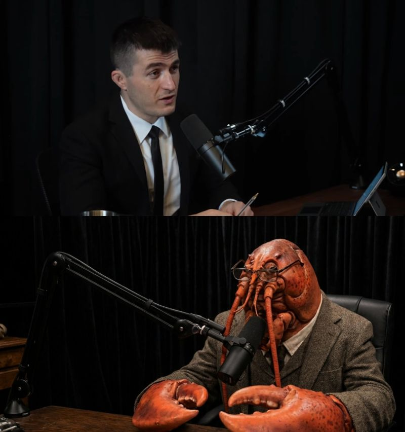

<div class="absolute bottom-8 left-8 flex items-center gap-4">
  
  <div class="text-sm text-gray-300">
    <div class="font-semibold text-white">Константин Крестников</div>
    <div>Управляющий директор, Сбер</div>
    <div>Лид команды GigaChain</div>
  </div>
</div>

---

# Для кого OpenClaw сегодня

<div class="grid grid-cols-2 gap-8 mt-4">

<div class="p-4 bg-amber-900/25 rounded-lg border border-amber-500/30">

### Реалистично: для гиков и power users

<div class="mt-2 text-sm text-gray-300">

- Нужны навыки работы с **сервером, SSH, консолью и логами**
- Нужно уметь **чинить сбои** и разбираться, что происходит внутри агента
- Без этого OpenClaw может быстро «сломаться» и не раскрыть потенциал

</div>
</div>

<div class="p-4 bg-blue-900/30 rounded-lg border border-blue-500/30">

### Почему это всё равно важно

<div class="mt-2 text-sm text-gray-300">

- Это уже сейчас показывает, какими будут **личные ассистенты будущего**
- Сегодня OpenClaw — способ для продвинутых пользователей
  **пощупать направление индустрии**
- Ранний доступ к новой парадигме: агент 24/7 в вашем контуре

</div>
</div>

</div>

<div class="mt-4 text-sm text-gray-400">

Коротко: пока это инструмент для тех, кто любит и умеет «ковыряться», но именно такие продукты становятся массовыми завтра.

</div>

---

# Содержание

<div class="grid grid-cols-2 gap-x-8 gap-y-2 mt-4">
  <div class="flex items-center gap-2"><span class="text-blue-400">1.</span> Что такое OpenClaw</div>
  <div class="flex items-center gap-2"><span class="text-blue-400">5.</span> Память и Skills vs MCP</div>
  <div class="flex items-center gap-2"><span class="text-blue-400">2.</span> Почему он «взлетел»</div>
  <div class="flex items-center gap-2"><span class="text-blue-400">6.</span> Философия автора</div>
  <div class="flex items-center gap-2"><span class="text-blue-400">3.</span> Архитектура: простой loop</div>
  <div class="flex items-center gap-2"><span class="text-blue-400">7.</span> Запуск на GigaChat / Ollama</div>
  <div class="flex items-center gap-2"><span class="text-blue-400">4.</span> Системный промпт и тулы</div>
  <div class="flex items-center gap-2"><span class="text-blue-400">8.</span> Моё видение</div>
</div>

<div class="mt-8 text-sm text-gray-400">
Формат: слайды + живые демо
</div>

---
layout: cover
---

# Часть 1

### Что такое OpenClaw

---

# Что такое OpenClaw?

<v-clicks>

- **Персональный AI-агент**, а не чат-бот — работает проактивно 24/7
- Запускается **на вашем устройстве** — macOS, Linux, Windows
- Подключается к **13+ каналам**: WhatsApp, Telegram, Slack, Discord, iMessage, Teams...
- **Персистентная память** — файлы как память между сессиями
- **23 встроенных тула** — браузер, shell, файлы, поиск, TTS и др.
- **MIT лицензия**, 180K+ звёзд на GitHub
- **Автор**: Peter Steinberger — 13 лет строил PSPDFKit (1B+ устройств), продал, вернулся к коду
- **История имён**: WhatsApp Relay → Clawd → Moltbot → **OpenClaw** (29.01.2026)

</v-clicks>

<div v-click class="mt-3 flex justify-center">
  
</div>

<div class="mt-2 text-xs text-gray-400">
<a href="https://openclaw.ai/blog/introducing-openclaw" target="_blank">openclaw.ai/blog/introducing-openclaw</a> •
<a href="https://lexfridman.com/peter-steinberger-transcript" target="_blank">Lex Fridman #491</a>
</div>

---

# Зачем, если есть ChatGPT?

<div class="grid grid-cols-2 gap-8 mt-4">

<div class="p-4 bg-gray-800/50 rounded-lg">

### ChatGPT / Cloud AI

- Реактивный — ждёт ваш запрос
- Данные на серверах провайдера
- Нет доступа к вашим системам
- Память как дополнение к сессии
- Один канал общения
- Нет общего контекста
- Нет скилов

</div>

<div class="p-4 bg-blue-900/30 rounded-lg border border-blue-500/30">

### OpenClaw

- "Свой" компьютер - shell, бразуер, файлы, почта
- Развитая память в основе решения
- **Проактивный** — cron, hooks, heartbeats
- Разные каналаы общения, работа "на бегу" с контекстом
- Единый контекст всех задач (пространство файлов)
- Skill-based решение

</div>

</div>

<div class="mt-4 text-sm text-gray-400">

> «Твой ассистент. Твоя машина. Твои правила.» — Peter Steinberger, <a href="https://openclaw.ai/blog/introducing-openclaw" target="_blank">Introducing OpenClaw</a>

</div>

---

# Три столпа OpenClaw

<div class="grid grid-cols-3 gap-6 mt-6">

<div class="p-4 bg-blue-900/30 rounded-lg border border-blue-500/30 flex flex-col">

### Привычный UX

<div class="mt-2 text-sm text-gray-300">

Общение через **мессенджеры** — Telegram, WhatsApp, Slack. Работа **полностью в фоне** — чистый вопрос-ответ.

</div>
</div>

<div class="p-4 bg-emerald-900/30 rounded-lg border border-emerald-500/30 flex flex-col">

### Проактивность

<div class="mt-2 text-sm text-gray-300">

**Heartbeat** — сам проверяет контекст. **Cron** — задачи по расписанию. **Wake events** — реакция на события.

</div>
</div>

<div class="p-4 bg-purple-900/30 rounded-lg border border-purple-500/30 flex flex-col">

### Самомодификация

<div class="mt-2 text-sm text-gray-300">

Знает свой **исходный код**. Может **менять свои конфиги**, устанавливать плагины. Soul.md **по умолчанию read-only**.

</div>
</div>

</div>

<div class="mt-4 text-sm text-gray-400">

> «Все говорят о самомодифицирующемся софте. А я просто взял и сделал — даже не планировал.» — <a href="https://www.youtube.com/watch?v=YFjfBk8HI5o&t=1399" target="_blank">Lex #491, 00:23:19</a>

</div>

---

# Где развернуть агента

<div class="grid grid-cols-2 gap-8 mt-4 items-center">
  <div class="flex flex-col items-center">
    
    <div class="mt-2 text-xs text-gray-500">Комьюнити активно разворачивает агентов на Mac mini</div>
  </div>

  <div>
<v-clicks>

- Агенту нужен **сервер 24/7** с SSH-доступом
- Я использую **Hetzner Cloud** — подходящий сервер примерно **4.59 / месяц**
- Альтернатива: **DigitalOcean** — на скрине пример тарифа **$24 / month**

</v-clicks>
  </div>
</div>

<div class="grid grid-cols-2 gap-8 mt-6 items-center">
  <div class="flex flex-col items-center">
    
    <div class="mt-2 text-xs text-white">Hetzner — 4.59 / month</div>
  </div>

  <div class="flex flex-col items-center">
    
    <div class="mt-2 text-xs text-white">DigitalOcean — $24 / month</div>
  </div>
</div>

---

# Автономность агентов

<div class="grid grid-cols-2 gap-8 mt-6 items-start">

  <div>
    
    <div class="mt-2 text-xs text-gray-400">
      Оси: по вертикали — <b>автономность</b>, по горизонтали — <b>интеллектуальность</b>.
    </div>
  </div>

  <div class="space-y-4">
    <div>
      <div class="text-lg font-semibold text-white">OpenClaw — высокая автономность</div>
      <div class="mt-1 text-sm text-gray-300">
        Работает 24/7 в фоне. Cron, heartbeat, wake events. Сам обновляет память.
      </div>
    </div>
    <div>
      <div class="text-lg font-semibold text-white">Cursor / Codex — чуть меньшая автономность</div>
      <div class="mt-1 text-sm text-gray-300">
        Совместная работа. Видимость процесса. Автономны в рамках задачи.
      </div>
    </div>
    <div>
      <div class="text-lg font-semibold text-white">ChatGPT — самая низкая автономность</div>
      <div class="mt-1 text-sm text-gray-300">
        Самое высокое качество ответов one-shot. Реактивный — ждёт запрос.
      </div>
    </div>
    <div class="text-sm text-gray-400 mt-2">
      Разные инструменты для разных задач — не конкуренты, а <b>комплементы</b>.
    </div>
  </div>

</div>

---

<div class="flex justify-center items-center h-[60vh]">
  <div class="text-center">
    <h1 class="text-3xl font-bold text-gray-300">Живое демо</h1>
    <div class="mt-4 text-xl text-gray-500">Установка, настройка, первый запуск</div>
  </div>
</div>

---
layout: cover
---

# Часть 2

### Архитектура

---

# Архитектура: простой agentic loop

<div class="mt-2 text-sm">

**Это НЕ ReAct и не сложная оркестрация. Это простой цикл:**

</div>

```
Сообщение → LLM (с 23 тулами) → Tool Calls → Tool Results → LLM → Ответ
                    ↑__________________________________|
```

<v-clicks>

- **Gateway** — WebSocket-сервер, единый control plane
- **Message Router** — маршрутизация между 13+ каналами
- **Agent Runtime** — цикл LLM + tools, model failover
- **Tools Executor** — 23 тула, опционально Docker sandbox
- **Memory Store** — файлы: MEMORY.md, memory/*.md, SOUL.md
- **Hooks Engine** — cron, heartbeats, wake events
- **Skills** — расширения через ClawHub

</v-clicks>

<div class="mt-2 text-xs text-gray-400">

> «Каждый должен хоть раз написать свой агентный цикл. Это Hello World в AI. На самом деле всё просто.» — <a href="https://www.youtube.com/watch?v=YFjfBk8HI5o&t=9324" target="_blank">Lex #491, 02:35:24</a>

</div>

---

# Современный взгляд на ReAct

<div class="grid grid-cols-2 gap-4 mt-3">

<div class="p-3 bg-gray-800/50 rounded-lg">

### ReAct (Reasoning + Acting)

<div class="mt-1 text-sm text-gray-300">

Явный шаг рассуждения (CoT) перед каждым действием. Управляется промптом или фреймворком.

```
Think → Act → Observe → Think → ...
```

</div>
</div>

<div class="p-3 bg-blue-900/30 rounded-lg border border-blue-500/30">

### OpenClaw (Tool-Calling Loop)

<div class="mt-1 text-sm text-gray-300">

Модель **сама решает**, когда вызвать тул. Reasoning — внутри модели. Никакой внешней оркестрации.

```
Message → LLM + Tools → Response
```

</div>
</div>

</div>

<div class="grid grid-cols-[auto_1fr] gap-4 mt-3 items-center">
  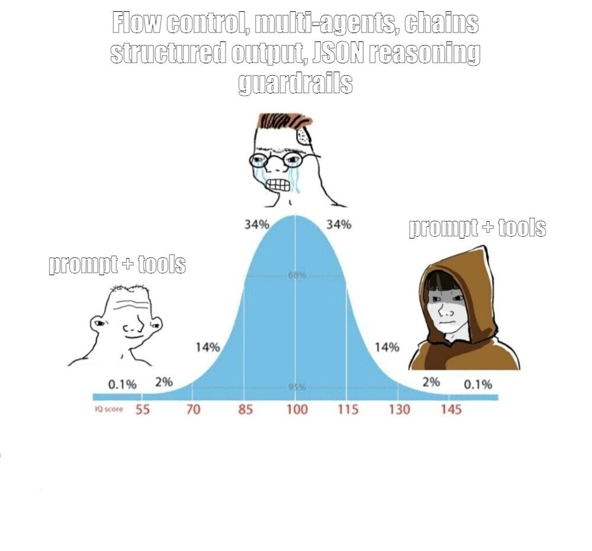
  <div>
    <div class="text-xs leading-snug"><b>«Agentic Trap»</b>: новичок пишет простые промпты → усложняет до 8 агентов и оркестраторов → возвращается к простым промптам.</div>
    <div class="mt-2 text-[11px] text-gray-400 leading-snug">
      «Те, кто пытаются использовать оркестраторы — теряют стиль, любовь, человеческое прикосновение.» —
      <a href="https://www.youtube.com/watch?v=YFjfBk8HI5o&t=4849" target="_blank">Lex #491, 01:20:49</a>
    </div>
  </div>
</div>

---

# Самомодифицирующийся агент

<div class="mt-4 text-sm">

OpenClaw **знает свой исходный код** и может модифицировать себя через тот же agentic loop:

</div>

<v-clicks>

- Агент знает, **где лежит его код**, документация, какая модель используется
- Дебаг: «Какие тулы ты видишь? Прочитай исходный код. Разберись, в чём проблема.»
- Может **менять свою Soul.md** (с уведомлением пользователя)
- «Не нравится X?» — агент **сам перепишет свой конфиг**
- Привело к «промпт-реквестам» — люди без опыта отправляли PR через агента

</v-clicks>

<div class="mt-4 text-xs text-gray-400">

> «Я постоянно использую самоинтроспекцию. Тот самый агент, который ты используешь — дебажит сам себя.» — <a href="https://www.youtube.com/watch?v=YFjfBk8HI5o&t=1454" target="_blank">Lex #491, 00:24:14</a>

</div>

---

# Системный промпт и тулы

<div class="grid grid-cols-2 gap-6 mt-4 text-sm">

<div>

**В каждом запросе к LLM (~4000 токенов + контекст):**

- **Tooling** — 23 тула как JSON-schema функции
- **Safety** — запрет эскалации, манипуляций
- **Skills** — загрузка SKILL.md по запросу
- **Memory Recall** — обязательный поиск по памяти
- **Heartbeats** — правила проактивности
- **Silent Replies** — NO_REPLY / HEARTBEAT_OK
- **Project Context** — SOUL.md, USER.md, AGENTS.md

</div>

<div>

**23 тула (все передаются в каждом запросе):**

- **Файлы**: read, write, edit
- **Shell**: exec, process
- **Web**: web_search, web_fetch, browser
- **Сообщения**: message, tts
- **Память**: memory_search, memory_get
- **Агенты**: agents_list, sessions_*
- **Автоматизация**: cron, canvas, nodes
- **Система**: gateway, image

</div>

</div>

<div class="mt-4 text-sm text-gray-400">

На простое «Привет» запрос весит ~1500 строк JSON. Основной объём: системный промпт + описания тулов.

</div>

---

# Память: Markdown как источник истины

<div class="mt-1 text-sm">

Модель ничего не «помнит» между сессиями — помнит только то, что записано в файл. Каждая сессия — **с чистого листа**.

</div>

<div class="grid grid-cols-2 gap-6 mt-3 text-sm">

<div>

**Файлы workspace** (`~/.openclaw/workspace`):

- `SOUL.md` — личность: имя, характер, ценности
- `USER.md` — данные о пользователе
- `MEMORY.md` — курированная долгосрочная память
- `memory/YYYY-MM-DD.md` — ежедневный лог (append-only)
- `HEARTBEAT.md` — чеклист для проактивных проверок

</div>

<div>

**Два слоя памяти:**

| Файл | Назначение |
|---|---|
| `memory/YYYY-MM-DD.md` | Ежедневный лог; при старте читается сегодня + вчера |
| `MEMORY.md` | Предпочтения, решения, факты; только в приватной сессии |

</div>

</div>

<div class="mt-3 text-xs text-gray-400">

> «Я не помню прошлых сессий, пока не прочитаю файлы памяти. Каждая сессия — с чистого листа. Если ты читаешь это в будущей сессии — привет. Я написал это, но не буду помнить. Всё нормально.» — Из SOUL.md, <a href="https://www.youtube.com/watch?v=YFjfBk8HI5o&t=5410" target="_blank">Lex #491, 01:30:10</a>

</div>

---

# Память: поиск и auto-compaction

<div class="grid grid-cols-2 gap-6 mt-3 text-sm">

<div>

**Инструменты агента:**

- `memory_get` — прочитать файл / диапазон строк
- `memory_search` — семантический поиск по индексу

**Гибридный поиск** (BM25 + векторы в SQLite):

- **BM25** — точные токены (ID, ошибки, символы кода)
- **Векторы** — семантическое сходство (перефразировки)

</div>

<div>

**Пайплайн результатов:**

```
Vector + Keyword
  → Weighted Merge
    → Temporal Decay (half-life 30д)
      → Sort → MMR → Top-K
```

- **Temporal Decay** — свежие записи выше старых
- **MMR** — убирает дубликаты, разнообразие результатов

</div>

</div>

<div class="mt-3 p-3 bg-gray-800/50 rounded-lg text-sm">

**Auto-compaction flush:** когда сессия приближается к лимиту контекста, OpenClaw запускает скрытый ход — агент записывает важное в `memory/` и отвечает `NO_REPLY`. Пользователь ничего не видит, но память сохранена.

</div>

---

# Skills vs MCP: позиция автора

<div class="grid grid-cols-2 gap-8 mt-4">

<div class="p-4 bg-gray-800/50 rounded-lg">

### MCP (Model Context Protocol)

<div class="mt-2 text-sm text-gray-300">

- Структурированный протокол вызова API
- Требует специальный синтаксис
- **Не composable** — модель получает весь blob
- Нужна поддержка в тренинге модели

</div>
</div>

<div class="p-4 bg-emerald-900/30 rounded-lg border border-emerald-500/30">

### Skills (OpenClaw)

<div class="mt-2 text-sm text-gray-300">

- Skill = **одно предложение** + CLI под капотом
- Модель загружает SKILL.md **по запросу**
- Композируемость: `| jq`, `| grep`, скриптование
- Модели **уже умеют** вызывать Unix-команды

</div>
</div>

</div>

<div class="mt-4 text-xs text-gray-400">

> «Любой MCP был бы лучше как CLI. Модели отлично умеют вызывать Unix-команды.» — <a href="https://www.youtube.com/watch?v=YFjfBk8HI5o&t=9542" target="_blank">Lex #491, 02:39:02</a>

</div>

---

# Heartbeat и Cron: проактивный агент

<div class="grid grid-cols-2 gap-6 mt-3 text-sm">

<div>

**Heartbeat — периодический «пульс»**

- Gateway запускает ход агента каждые **30 мин** (настраивается)
- Агент читает `HEARTBEAT.md` (чеклист) и решает: есть ли что-то важное?
- Если нет — отвечает `HEARTBEAT_OK` (подавляется, пользователь не видит)
- Если да — отправляет алерт в последний активный канал
- Работает **в основной сессии** — видит весь контекст разговора
- `activeHours` — можно ограничить часами (не спамить ночью)

</div>

<div>

**Cron — задачи по расписанию**

- Встроенный планировщик Gateway с персистентностью
- Три типа: cron-выражение, интервал, одноразовый (`--at`)
- Может работать в **изолированной сессии** (без контекста чата)
- Пример: утренний брифинг, проверка почты, бэкап

```bash
openclaw cron add \
  --name "Утренний брифинг" \
  --cron "0 7 * * *" \
  --session isolated \
  --message "Что нового за ночь?"
```

</div>

</div>

<div class="mt-3 p-3 bg-gray-800/50 rounded-lg text-xs text-gray-400">

> «Модель редко использовала Heartbeat. Но когда я лежал в больнице после операции — она знала об этом и сама написала: "Ты в порядке?" Если контекст значим — Heartbeat срабатывает.» — <a href="https://www.youtube.com/watch?v=YFjfBk8HI5o&t=9488" target="_blank">Lex #491, 02:38:08</a>

</div>

---

<div class="flex justify-center items-center h-[60vh]">
  <div class="text-center">
    <h1 class="text-3xl font-bold text-gray-300">Живое демо</h1>
    <div class="mt-4 text-xl text-gray-500">Кейсы: почта, браузер, бэкап памяти</div>
  </div>
</div>

---

# Демо: настройка браузера (Chrome Relay)

<div class="grid grid-cols-2 gap-8 mt-6 text-sm">

<div>

### 1) Подготовка в Chrome

<v-clicks>

- Откройте нужный сайт в обычном Chrome (там, где вы уже залогинены)
- Установите/включите расширение **OpenClaw Browser Relay**
- На нужной вкладке нажмите иконку расширения → **badge ON** (вкладка “attached”)
- Разрешите доступ расширению (к сайту / ко всем сайтам, если нужно)

</v-clicks>

</div>

<div>

### 2) Что важно в OpenClaw

<v-clicks>

- **`profile="chrome"`** — takeover ваших существующих вкладок (через Relay)
- **`profile="openclaw"`** — изолированный браузер, которым управляет сам OpenClaw
- Если OpenClaw “не видит” вкладки — почти всегда **нет attached tab** (badge не ON)
- Дальше: **snapshot → actions** (клик/ввод/скролл) в той же вкладке

</v-clicks>

</div>

</div>

---
layout: cover
---

# Часть 3

### Философия: скорость, игра, человечность

---

# «Трудно конкурировать с тем, кто просто кайфует от процесса»

<v-clicks>

- Проект вырос из режима **«мне интересно, я пробую»**, а не из корпоративного процесса
- «Так ты и учишься — просто делаешь и играешь.» — месяцы экспериментов с LLM, а потом **весь первый прототип агента был написан самим AI по промпту**
- Минимум барьеров: `git clone → pnpm build → pnpm gateway` — а не месяцы дизайна
- 6600 коммитов за январь — работал с **4-10 агентами параллельно**, каждый агент — эксперимент
- Уровень 1 агентный цикл → уровень 2 память → уровень 3 комьюнити → уровень 4 нативные приложения — **Factorio умноженное на бесконечность**
- Результат: **не фреймворк, а продукт с душой** — забавные сообщения, лобстер-культура, первый PR для тысяч непрограммистов

</v-clicks>

<div class="mt-4 text-xs text-gray-400">

> «Я хотел, чтобы было весело и странно. Если посмотреть на весь лобстер-контент в сети — мне удалось "странно".» — <a href="https://www.youtube.com/watch?v=YFjfBk8HI5o&t=1344" target="_blank">Lex #491, 00:22:24</a><br/>
📺 <a href="https://www.youtube.com/watch?v=YFjfBk8HI5o" target="_blank">Полное интервью на YouTube</a>

</div>

---

# Soul.md и Heartbeat

<div class="grid grid-cols-2 gap-8 mt-4">

<div>

### SOUL.md — душа агента

<div class="mt-2 text-sm text-gray-300">

Вдохновлено конституцией Anthropic Claude. Агент имеет имя, характер, тон общения, ценности.

**Право менять свою Soul** (с уведомлением). Каждый агент — уникальная личность.

Steinberger: «Я спросил агента: "Видишь эти файлы? Воссоздай их заново."» — и агент сделал onboarding живым.

</div>
</div>

<div>

### Heartbeat — проактивный пульс

<div class="mt-2 text-sm text-gray-300">

Началось с промпта «Удиви меня каждые 30 минут». Потом стало умнее: агент **сам решает**, когда использовать heartbeat.

**История**: после операции на плече Steinberger'а агент, который **редко** использовал heartbeat, сам написал: «Ты в порядке?» — потому что контекст был значимым.

</div>
</div>

</div>

<div class="mt-4 text-xs text-gray-400">

> «Агент сам не придумает то, что вызывает восторг. Вот так и создаётся софт, который радует.» — <a href="https://www.youtube.com/watch?v=YFjfBk8HI5o&t=5062" target="_blank">Lex #491, 01:24:22</a>

</div>

---

# Будущее: агент → операционная система

<v-clicks>

- **«Это год персональных агентов»** — Steinberger
- **Chat-интерфейс — не финальная форма**: «Мы скопировали Google. Это как радиошоу на ТВ»
- Агент **уже запускает суб-агентов** (Codex) и управляет ими
- **Конвергенция**: личный агент + coding assistant + OS
- **Open source как принцип**: «Это слишком важно, чтобы просто отдать какой-то компании»
- Модель **Chrome / Chromium** — коммерческий продукт + open core
- **Agentic engineering**: «Я не пишу код руками — но я за рулём, и я пишу код. Это просто другая активность»

</v-clicks>

<div class="mt-4 text-xs text-gray-400">

> «Думаю, к этому всё идёт — агент будет всё больше становиться вашей операционной системой.» — <a href="https://www.youtube.com/watch?v=YFjfBk8HI5o&t=6577" target="_blank">Lex #491, 01:49:37</a>

</div>

---
layout: cover
---

# Часть 4

### Запуск на GigaChat и локально

---

# OpenClaw + GigaChat / Ollama

<div class="grid grid-cols-3 gap-4 mt-2">

<div>

### GigaChat

```json
{
  "providers": {
    "gigachat": {
      "baseUrl": "https://gigachat.devices.sberbank.ru/api/v1",
      "apiKey": "${GIGACHAT_API_KEY}",
      "api": "openai-completions",
      "models": [{
        "id": "GigaChat-2-Max",
        "contextWindow": 32000
      }]
    }
  }
}
```

</div>

<div>

### Ollama (локально)

```json
{
  "providers": {
    "ollama": {
      "baseUrl": "http://localhost:11434/v1",
      "apiKey": "ollama",
      "api": "openai-completions",
      "models": [{
        "id": "llama3.3",
        "contextWindow": 128000
      }]
    }
  }
}
```

</div>

<div class="flex flex-col items-center justify-center">
  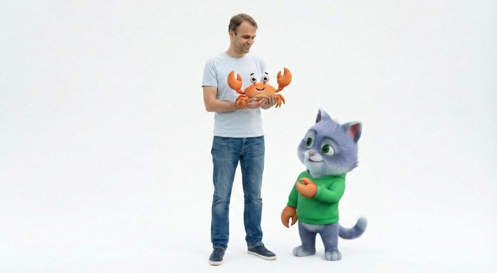
</div>

</div>

<div class="mt-2 text-sm text-gray-400">

Любой **OpenAI-совместимый API** подключается одинаково. Model failover: если один недоступен — автопереключение.<br/>
⚠️ Для tool calling используйте модели ≥ 70B. Слабые модели уязвимы к prompt injection.

</div>


---

<div class="flex justify-center items-center h-[60vh]">
  <div class="text-center">
    <h1 class="text-3xl font-bold text-gray-300">Живое демо</h1>
    <div class="mt-4 text-xl text-gray-500">GigaChat + Ollama + mitmproxy</div>
  </div>
</div>

---

# Моё видение: автономность vs совместная работа

<div class="grid grid-cols-2 gap-8 mt-4">

<div class="p-4 bg-blue-900/30 rounded-lg border border-blue-500/30">

### Автономный агент (OpenClaw)

<div class="mt-2 text-sm text-gray-300">

- **Сила**: работает невидимо, делегирование рутины
- **Слабость**: мы не видим, что он делает
- Отделён от рабочего пространства
- Осознанно работать вместе — **трудно by design**

</div>
</div>

<div class="p-4 bg-emerald-900/30 rounded-lg border border-emerald-500/30">

### Collaborative AI (Cursor, Codex)

<div class="mt-2 text-sm text-gray-300">

- **Сила**: видим процесс, контролируем каждый шаг
- **Слабость**: требует нашего внимания
- Общее рабочее пространство
- **Вместе мощнее**, но не автономно

</div>
</div>

</div>

<div class="mt-6 text-sm">

**Вывод**: будущее — в конвергенции. Steinberger уже запускает Codex как суб-агент из OpenClaw.
Персональный агент + coding assistant + OS = **следующая платформа**.

</div>

---

# Что будет с программистами?

<div class="mt-4 text-sm">

> «Можно погоревать по нашему ремеслу. Это нормально.» — Peter Steinberger

</div>

<v-clicks>

- **Программирование останется, но станет как вязание** — люди будут делать это потому что нравится, а не потому что это единственный способ
- **«Ты — не просто программист. Это слишком узкий взгляд на твоё ремесло. Ты — строитель.»**
- Steinberger сам не пишет код руками — но чувствует себя **за рулём**: «Я всё ещё пишу код. Просто по-другому.»
- **«В какой-то момент это снова будут просто называть кодингом — и это станет новой нормой»**
- Программисты **лучше всех готовы** к этому переходу: они понимают CLI, умеют думать структурно, чувствуют агентов
- **«В конечном счёте это — власть людям»** — тот, кто умеет выражать идеи на языке, может строить

</v-clicks>

<div class="mt-4 text-xs text-gray-400">

<a href="https://www.youtube.com/watch?v=YFjfBk8HI5o&t=10871" target="_blank">Lex #491, 03:01:11 — 03:14:22</a>

</div>

---
layout: cover
---

# Личный опыт

### Починка агента через Cursor + SSH и рекомендации фильмов

---

# Чиним OpenClaw через Cursor + SSH

<div class="grid grid-cols-2 gap-8 mt-4 items-center">

<div>

<v-clicks>

- OpenClaw крутится на удалённом сервере 24/7
- Что-то пошло не так — агент перестал отвечать
- **Открываем Cursor → SSH к серверу → читаем логи → чиним**
- AI-агент чинит AI-агента — мета-уровень рекурсии

</v-clicks>

</div>

<div class="flex flex-col items-center">
  
  <div class="mt-2 text-xs text-gray-500">r/ClaudeAI</div>
</div>

</div>

<div v-click class="mt-4 text-sm text-gray-400">

**Итого**: SSH + Cursor + хороший промпт = починка за минуты, а не за часы ручного дебага.

</div>

---

# Рекомендации фильмов через КиноНавигатор

<div class="grid grid-cols-[auto_1fr] gap-6 mt-2 items-start">

<div class="flex-shrink-0">
  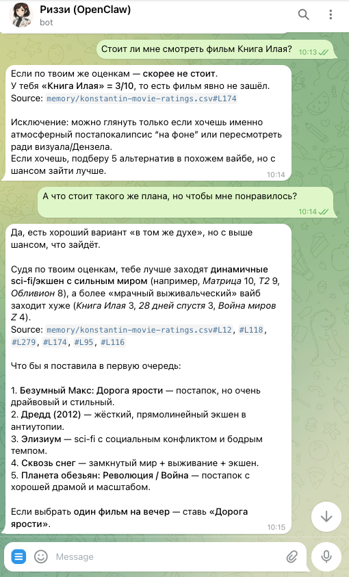
</div>

<div>

<div class="text-xs text-gray-400 mb-2">

CSV-выгрузка из <a href="https://kinonavigator.ru" target="_blank">kinonavigator.ru</a> — 370 фильмов с оценками, прогнозами и ссылками на KP/IMDb:

</div>

<div class="overflow-auto text-[9px] leading-tight">

```
Тип;Название;Название исходное;Год;url;Прогноз;Оценка;Дата
movie;Приключения пингвиненка Лоло;;1986;.../24930361;7,17;10;2011-03-21
movie;Назад в будущее;Back to the Future;1985;.../197724;9,74;10;2012-08-23
movie;Престиж;The Prestige;2006;.../220357;8,72;10;2012-08-23
movie;Крестный отец;The Godfather;1972;.../198173;6,2;1;2012-08-23
movie;Аватар;Avatar;2009;.../1691979;7,73;10;2012-09-24
movie;Живая сталь;Real Steel;2011;.../2680092;7,0;5;2012-09-24
movie;Исходный код;Source Code;2011;.../2584053;7,63;8;2012-09-24
...
```

</div>

<div v-click class="mt-2 grid grid-cols-2 gap-3 text-xs">

<div class="p-2 bg-green-900/30 rounded-lg border border-green-500/30">

**Прогноз сервиса** vs **моя оценка** — агент видит расхождения вкусов

</div>

<div class="p-2 bg-blue-900/30 rounded-lg border border-blue-500/30">

Агент помнит историю просмотров — **не предлагает повторно**

</div>

</div>

</div>

</div>

---

# Работа с презентациями через Slidev

<div class="text-sm mt-1">

- **Slidev** — презентации как код на Markdown. Хранение в **Git** — версионирование, диффы, PR
- Основной инструмент — **Cursor**: пишу слайды, вставляю картинки, запускаю превью — всё в одном окне
- Через **OpenClaw** тоже удобно: скидываю картинку или текст в Telegram — агент сам добавляет на нужный слайд

</div>

<div class="grid grid-cols-2 gap-4 mt-2">
  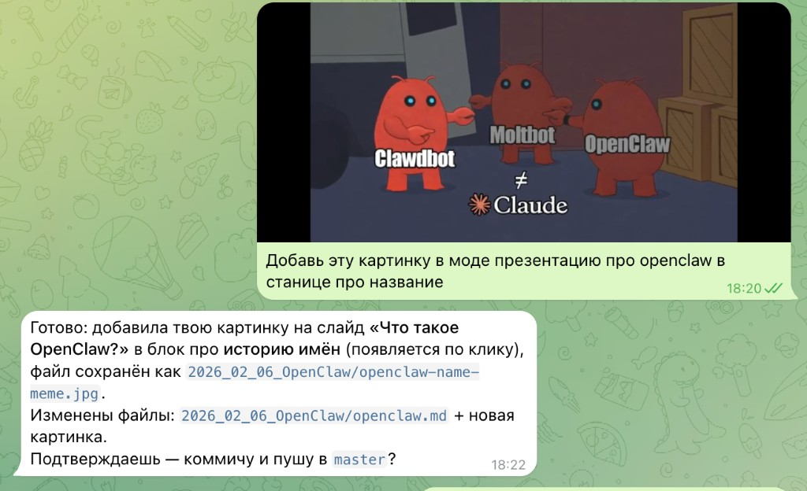
  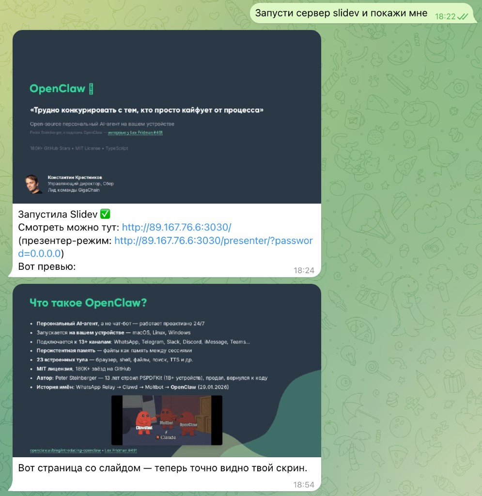
</div>

<div class="mt-1 grid grid-cols-2 gap-4 text-xs text-gray-400">
  <div>Отправил картинку в Telegram — агент добавил на слайд</div>
  <div>Агент запустил Slidev и прислал превью</div>
</div>

---

# Планирование поездок через агента

<div class="grid grid-cols-2 gap-4 -mt-30 h-[66vh]">
  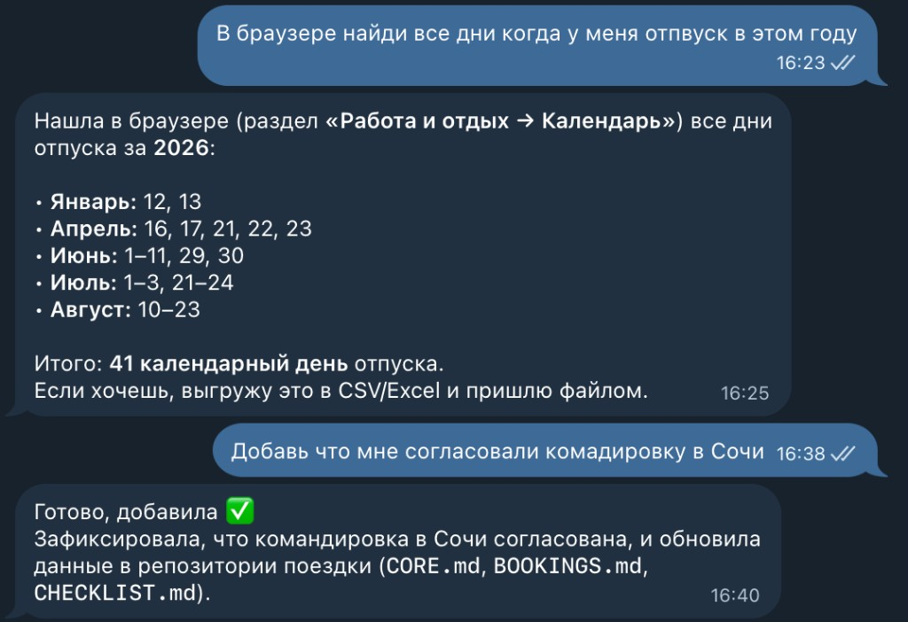
  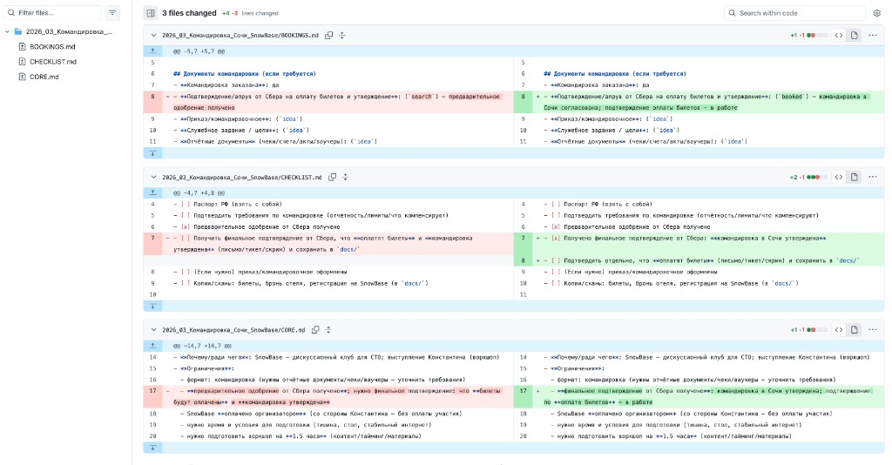
</div>

---

# Персонажи: локальный lipsync

<div class="grid grid-cols-[1fr_2fr] gap-6 mt-2 items-start">

<div class="flex flex-col items-center gap-3">
  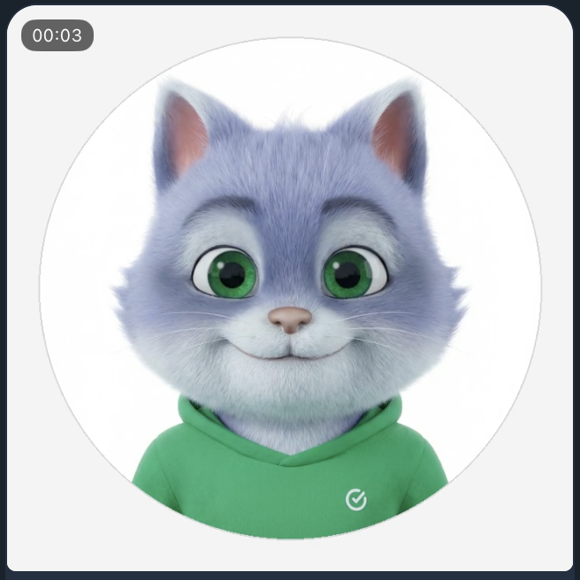
  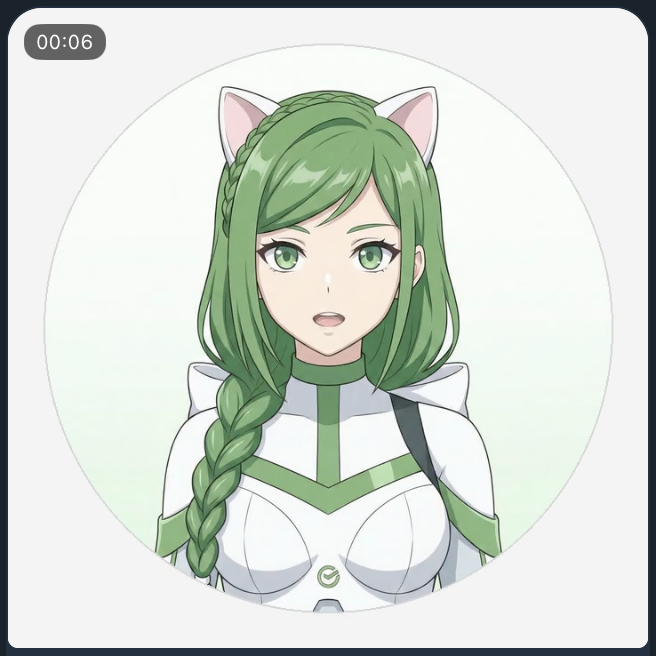
  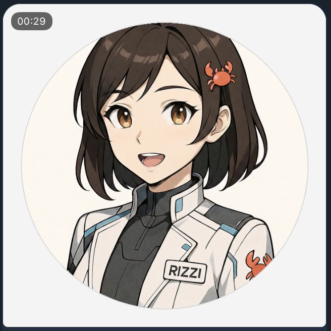
</div>

<div class="text-sm">

**Амплитудная синхронизация губ** (`scripts/make_talking_circle_video.py`):

<v-clicks>

- Аудио через **ffmpeg** → mono WAV 16 kHz
- По каждому кадру считается **RMS громкости** в окне ~35 ms
- По порогам выбирается кадр рта:
  - `neutral` — тихо (< amp-low)
  - `slight` — средне
  - `wide` — громко (>= amp-high)
- **Моргание** отдельно: `blink-start`, `blink-every`, `blink-duration-frames`; если ролик короткий — принудительно хотя бы один blink

</v-clicks>

<div v-click class="mt-3 p-2 bg-gray-800/50 rounded-lg text-xs">

**Стек**: Python (Pillow, numpy, wave) + ffmpeg + **ElevenLabs API** (TTS)

Это амплитудная синхронизация: громкость → степень открытия рта, без разбора слов/фонем.

</div>

</div>

</div>

---

# Спасибо за внимание!

<div class="text-gray-400 mb-8">Готов ответить на вопросы</div>

<div class="grid grid-cols-4 gap-6 items-center">

  <div class="flex flex-col items-center">
    
    <div class="mt-3 text-emerald-400 font-semibold text-sm">Lex #491</div>
    <div class="text-xs text-gray-500">Интервью на YouTube</div>
  </div>

  <div class="flex flex-col items-center">
    
    <div class="mt-3 text-emerald-400 font-semibold text-sm">@Robofuture</div>
    <div class="text-xs text-gray-500">Telegram про ИИ</div>
  </div>

  <div class="flex flex-col items-center text-center">
    
    <div class="font-semibold text-white text-sm">Константин Крестников</div>
    <div class="text-xs text-gray-400">Управляющий директор, Сбер</div>
    <div class="text-xs text-gray-400">Лид команды GigaChain</div>
  </div>

  <div class="flex flex-col items-center">
    
    <div class="mt-3 text-emerald-400 font-semibold text-sm">GigaChain</div>
    <div class="text-xs text-gray-500">GitHub</div>
  </div>

</div>
