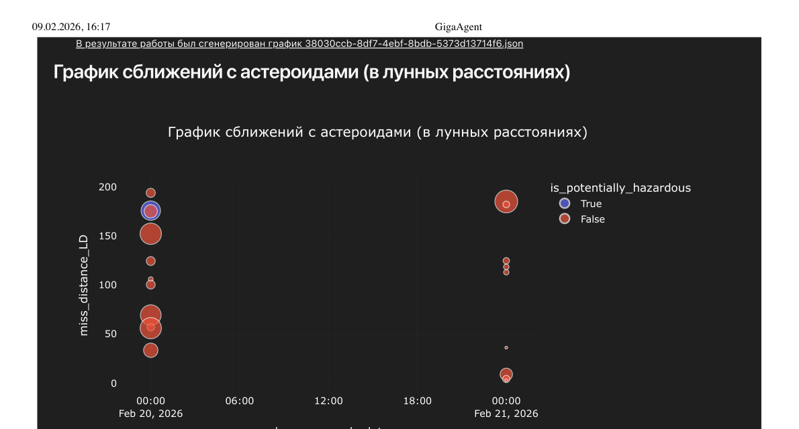
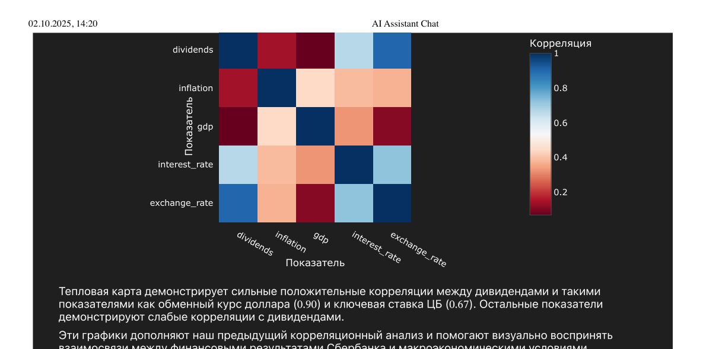
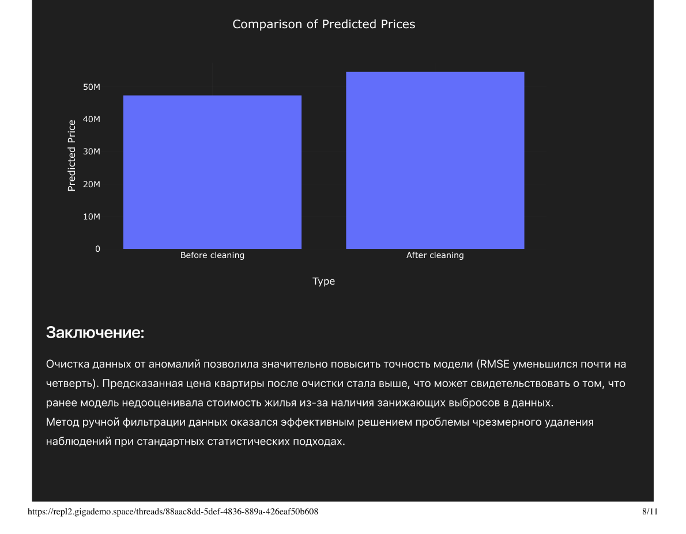

## GigaAgent

Open-source агент-оркестратор на базе **GigaChat-2-Max + LangGraph (GigaChain)**. Способен выполнять до **50 автономных шагов** для решения сложных задач. MIT лицензия.

**Что умеет:**
- 30+ встроенных инструментов и субагентов
- Исполнение кода в REPL-среде (как Jupyter)
- Работа с большими файлами (Excel на десятки тысяч строк)
- Генерация изображений, презентаций, лендингов, подкастов
- Подключение MCP-тулов и RAG базы знаний
- Интеграции: VK, GitHub, 2GIS, погода, поиск

**Архитектура:**
- Модульная — MCP, RAG, Memory
- Мультимодельность — GigaChat, OpenAI, Anthropic и др.
- Субагенты для специализированных задач
- REPL-контейнер для безопасного исполнения кода
- Self-hosted, on-prem, Docker

<a href="https://github.com/ai-forever/giga_agent" target="_blank" class="text-blue-400 hover:underline">github.com/ai-forever/giga_agent</a>

---

## Кейс 1: Выбор окна для запуска спутника

Пользователь просит оценить риски запуска космического спутника на определённое число.

Агент использует данные о метеоритной активности, солнечной активности.

**Тулы:**
- NASA MCP
- Поиск
- REPL
- Генерация диаграмм

**Автономных шагов агента: 12**

<a href="https://drive.google.com/file/d/1pQhavs3RZ-gjqdIWB_mrcsXiyXA6c1F6/view?usp=drive_link" target="_blank" class="text-blue-400 hover:underline">Полный лог (PDF)</a> · <a href="https://drive.google.com/file/d/1mWeiX6Hk9y1AvBbC7Pqom2y2frdve-3h/view?usp=drive_link" target="_blank" class="text-blue-400 hover:underline">Видео</a>

  

---

## Кейс 2: Deep-исследование дивидендов Сбера

Пользователь просит исследовать, от каких макроэкономических показателей зависят дивиденды Сбера.

Агент проводит полный цикл: сбор данных 2015–2025, корреляционный анализ, визуализация, построение модели прогнозирования.

**Прогон:**
- Deep-исследование через researcher_agent
- Поиск макропоказателей и дивидендов 2015–2025
- Поиск корреляций (топ: курс $ — 0.90, ставка ЦБ — 0.67)
- Визуализация (line chart + heatmap)
- Модель прогнозирования на топ-маркерах
- 3 прогноза на 2026 (27–39 руб.)
- Прогноз экстремального кейса (71 руб.)

**Тулы:** Поиск · Researcher Agent · REPL · Диаграммы

<a href="https://drive.google.com/file/d/1q-nQDk2UqaOuAsFHx8Ah98Zfrif2wZtF/view?usp=drive_link" target="_blank" class="text-blue-400 hover:underline">Полный лог (PDF)</a>

  

---

## Кейс 3: ML-модель цен на квартиры в Москве

Пользователь просит построить ML-модель (Random Forest) для предсказания цен на квартиры в Москве и оценить конкретную квартиру.

**Прогон:**
- Строит модель на сырых данных (RMSE 35 млн)
- Оценивает квартиру в ЦАО — 47 млн руб.
- Удаляет аномалии из данных (пробует 4 подхода)
- Перестраивает модель (RMSE 26 млн, +25%)
- Оценивает заново — 54 млн руб.
- Строит диаграмму сравнения цен
- Оценивает ещё 2 квартиры по запросу

**Тулы:** REPL · Диаграммы

**Автономных шагов: ~30.** Пример учебный, для более высокого качества модели требуется больше данных.

<a href="https://drive.google.com/file/d/1Du_ezZzViCflmaoJU9SCPGK1gIlY0K7Y/view?usp=drive_link" target="_blank" class="text-blue-400 hover:underline">Полный лог (PDF)</a>

  

