<div class="absolute inset-0 bg-black/60" style="z-index:-1" />

<div class="grid grid-cols-[1.35fr_0.65fr] gap-8 items-center h-full pr-6">

<div class="flex flex-col justify-center">

# OpenClaw 🦀

### Вебинар, часть 2

<div class="mt-4 text-gray-300">
Практические кейсы использования
</div>

<div class="mt-2 text-sm text-gray-400">
Продолжение первой части: реальные workflow, файлы как память, живые демо
</div>

<div class="mt-8 text-sm text-gray-500">
Формат: короткие слайды + живые демо
</div>

</div>

<div class="flex flex-col gap-4 items-center justify-center">

<div class="w-full rounded-xl border border-red-500/30 bg-red-900/20 p-4 text-center">
  
  <div class="mt-3 text-sm font-semibold text-white">Первая часть на YouTube</div>
  <div class="mt-1 text-xs text-gray-300">Запускаем и изучаем OpenClaw</div>
</div>

<div class="w-full rounded-xl border border-sky-500/30 bg-sky-900/20 p-4 text-center">
  
  <div class="mt-3 text-sm font-semibold text-white">Telegram-пост</div>
  <div class="mt-1 text-xs text-gray-300">Слайды и материалы первой части</div>
</div>

</div>

</div>

<div class="absolute bottom-8 left-8 flex items-center gap-4">
  
  <div class="text-sm text-gray-300">
    <div class="font-semibold text-white">Константин Крестников</div>
    <div>Управляющий директор, Сбер</div>
    <div>Лид команды GigaChain</div>
  </div>
</div>

---

# Важное замечание перед демо

<div class="mt-3 grid grid-cols-[1.1fr_0.9fr] gap-6 items-start">

<div>

<v-clicks>

- Сегодня в демо используем бота в режиме `low` или `off` reasoning - так ответы приходят быстрее
- Из-за этого часть кейсов может сработать неидеально или не сработать с первого раза
- В обычной работе я чаще выбираю `high`, `xhigh` или `auto`
- В этих режимах ответы занимают больше времени, но агент рассуждает лучше и обычно надежнее доводит задачу до результата

</v-clicks>

</div>

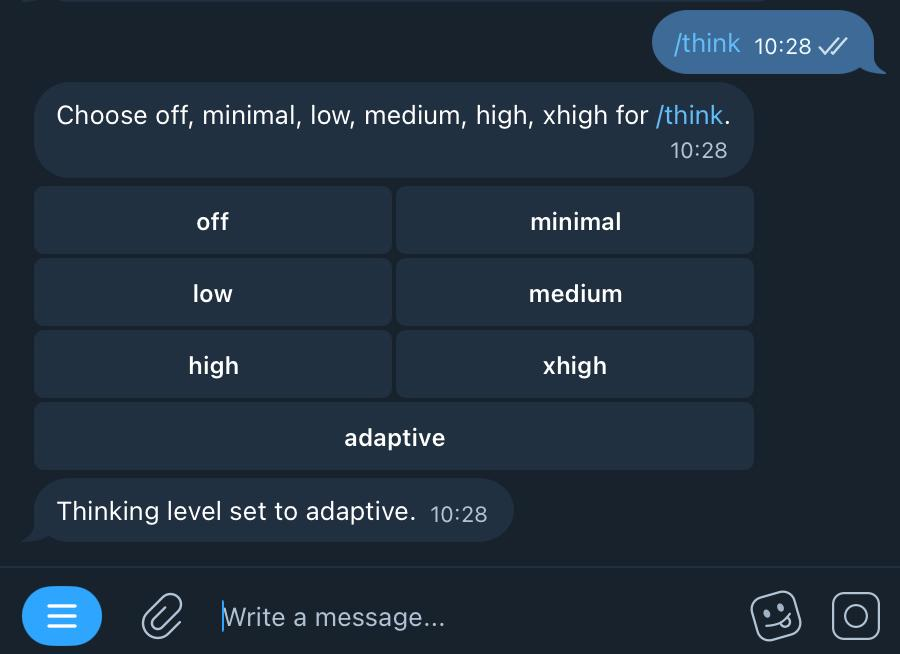

</div>

---

# План второй части

<v-clicks>

- Короткий рекап первой части
- **Шаг 0: UI и потребление токенов** - знакомство с интерфейсом OpenClaw
- Кейс 1: туризм и командировки
- Кейс 2: работа с презентациями
- Кейс 3: заполнение и подписание документов
- Кейс 3: работа с почтой и правила коммуникации
- Кейс 5: веб-автоматизация личных кабинетов
- Кейс 6: контент-пайплайн для Telegram и сообществ
- Быстрые кейсы: домены для роутера, генерация медиа

</v-clicks>

---

# Короткий рекап первой части

<div class="mt-4 grid grid-cols-3 gap-4 text-sm">

<div class="p-4 rounded-lg bg-blue-900/25 border border-blue-500/30">

### 1. Запустили OpenClaw

- подготовили сервер
- настроили агента и каналы
- сделали первый запуск и живое демо

</div>

<div class="p-4 rounded-lg bg-emerald-900/25 border border-emerald-500/30">

### 2. Разобрали внутренности

- архитектуру простого agentic loop
- память на Markdown-файлах
- skills, heartbeat и cron

</div>

<div class="p-4 rounded-lg bg-purple-900/25 border border-purple-500/30">

### 3. Подключили GigaChat

- показал схему через `gpt2giga`
- попробовали OpenClaw на GigaChat
- сравнили с OpenAI-совместимым провайдером

</div>

</div>

<div class="mt-5 text-sm text-gray-400">
Первая часть была про устройство и запуск OpenClaw, а сегодня идем в практические кейсы и рабочие сценарии.
</div>

---

# Что было основное в первом вебинаре

<v-clicks>

- С нуля подняли сервер на Hetzner и накатили туда OpenClaw
- Посмотрели, как устроены его архитектура, память, `SOUL.md`, `MEMORY.md`, `HEARTBEAT.md`
- Обсудили, почему OpenClaw держится на простом tool-calling loop, а не на сложной оркестрации
- Показали живое демо установки, первого запуска и работы через браузер
- В конце переключили агента на GigaChat через `gpt2giga` и проверили, что это реально работает

</v-clicks>

<div class="mt-5 p-3 rounded-lg bg-gray-800/60 text-sm text-gray-300">
Коротко: первая часть ответила на вопрос "что это за агент и как его поднять", а вторая отвечает на вопрос "что с ним делать в реальной жизни".
</div>

---

# Записи первой части

<div class="grid grid-cols-2 gap-4 mt-4 text-sm">

<div class="p-4 rounded-lg bg-red-900/25 border border-red-500/30 flex items-center gap-4">


<div>
<div class="text-white font-semibold">YouTube</div>
<a href="https://youtu.be/0TQFhuv1PVA" target="_blank">Запускаем и изучаем OpenClaw</a>
</div>

</div>

<div class="p-4 rounded-lg bg-blue-900/25 border border-blue-500/30 flex items-center gap-4">


<div>
<div class="text-white font-semibold">RuTube</div>
<a href="https://rutube.ru/video/b3e60ebe06377e530db737d6a0db8cdd/" target="_blank">Запись вебинара</a>
</div>

</div>

<div class="p-4 rounded-lg bg-sky-900/25 border border-sky-500/30 flex items-center gap-4">


<div>
<div class="text-white font-semibold">Telegram</div>
<a href="https://t.me/robofuture/129" target="_blank">Видео в канале RoboFuture</a>
</div>

</div>

<div class="p-4 rounded-lg bg-emerald-900/25 border border-emerald-500/30 flex items-center gap-4">


<div>
<div class="text-white font-semibold">Слайды</div>
<a href="https://t.me/robofuture/132" target="_blank">openclaw.pdf</a>
</div>

</div>

</div>

<div class="mt-5 text-xs text-gray-400">
По посту в канале: в первой части были архитектура, память, skills, heartbeat, установка с нуля и подключение к GigaChat.
</div>

---

# Подключаемся к OpenClaw

<div class="mt-4 text-gray-300">
Первым делом заходим в веб-интерфейс:
</div>

**1. Поднимаем SSH-тоннель:**

```bash
ssh \
  -L 18789:127.0.0.1:80 \
  -L 18792:127.0.0.1:18792 \
  -L 3035:127.0.0.1:3035 \
  root@89.167.76.6
```

**2. Открываем в браузере:**

`http://localhost:18789/usage`

---

# Шаг 0: смотрим UI OpenClaw

<div class="mt-4 text-gray-300">
Что видим в интерфейсе:
</div>

<v-clicks>

- веб-интерфейс OpenClaw: чаты, задачи, файлы
- как устроена работа с агентом через UI
- где смотреть историю запросов и статусы выполнения
- настройки: модели, инструменты, правила

</v-clicks>

<div class="mt-6 text-sm text-gray-500">
Живое демо - <a href="http://localhost:18789/usage" target="_blank">http://localhost:18789/usage</a>
</div>

---

# Потребление токенов

<div class="mt-4 text-gray-300">
Что важно понимать про расход:
</div>

<v-clicks>

- каждый запрос к LLM тратит токены (input + output)
- контекст агента (файлы, правила, инструменты) - тоже токены
- длинные чаты накапливают контекст и растут в цене
- разные модели - разная стоимость за токен

</v-clicks>

---

# Недельное потребление OpenClaw

<div class="overflow-hidden">
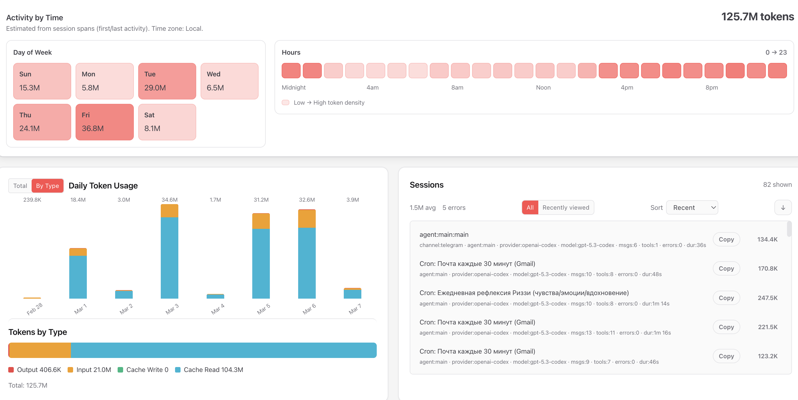
</div>

<div class="mt-1 text-xs text-gray-400">
125.7 млн токенов за неделю - активность по дням, разбивка по типам (input/output/cache), список сессий
</div>

---

# Простой чат с агентом

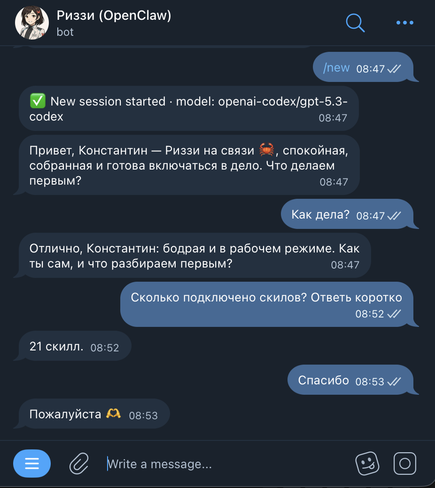

---

# Потребление на простой чат

<div class="overflow-hidden">
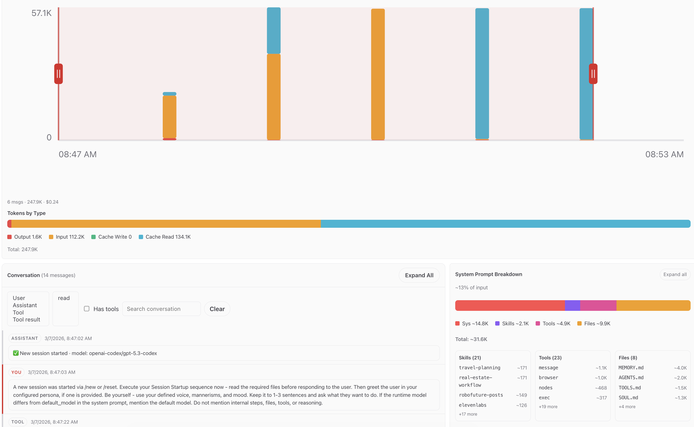
</div>

<div class="mt-2 text-xs text-gray-400">
247.9K токенов на 14 сообщений - system prompt ~31.6K, 21 скилл, 23 инструмента, 8 файлов
</div>

---

# Codex CLI: токены через подписку ChatGPT

<div class="mt-2 grid grid-cols-[1fr_1.2fr] gap-6 items-start">

<div class="text-sm">

<v-clicks>

- **ChatGPT Pro ($200/мес)** - Codex CLI входит в подписку, лимиты на скриншоте
- **ChatGPT Plus ($20/мес)** - достаточно чтобы начать, но при активном использовании расходуется быстро
- Лимиты: 5-часовой и недельный, отдельно для Codex-Spark
- Credits = 0 - все в рамках подписки, докупать не нужно

</v-clicks>

</div>

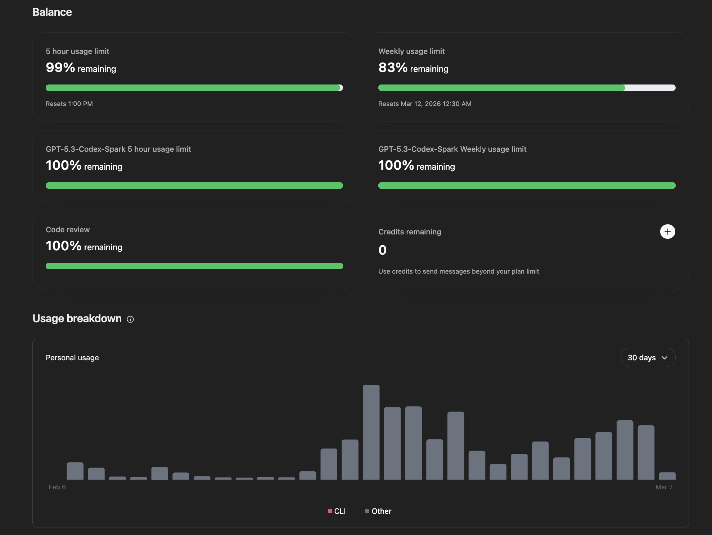

</div>

---

# Как отслеживать расход

<div class="mt-4 grid grid-cols-2 gap-6 text-sm">

<div class="p-4 rounded-lg bg-gray-800/60">

### Что смотрим

- дашборд потребления в OpenClaw
- расход по моделям и по задачам
- пиковые запросы и аномалии
- динамика за период

</div>

<div class="p-4 rounded-lg bg-gray-800/60">

### На что обращать внимание

- большие контексты = дорогие вызовы
- повторные запросы без результата
- баланс между качеством ответа и стоимостью
- выбор модели под задачу

</div>

</div>

<div class="mt-4 text-sm text-gray-500">
Живое демо: смотрим реальные цифры
</div>

---

# Общий подход к работе

<div class="mt-4 text-gray-300">
Как обычно выстраивается практический процесс:
</div>

<v-clicks>

- работа идет в репозиториях на GitHub
- под задачу создается структура файлов, куда можно регулярно делать context offloading
- в Cursor IDE и Claude Code выполняются сложные задачи
- через OpenClaw удобно вносить небольшие правки на бегу и запрашивать информацию

</v-clicks>

<div class="mt-5 text-sm text-gray-500">
Идея: тяжелую работу делаем в полноценных IDE, а OpenClaw используем как быстрый рабочий интерфейс.
</div>

---

# Кейс 1: туризм и поездки

<div class="mt-4 text-gray-300">
Что автоматизируем:
</div>

<v-clicks>

- сбор вводных по поездке (даты, участники, ограничения)
- чтение структурированных файлов маршрута и документов
- подготовка данных для форм и анкет
- контроль чеклистов по документам и бронированиям
- фиксация изменений в git-репозитории поездок

</v-clicks>

---

# Кейс 1: рабочий сценарий

<div class="mt-4 grid grid-cols-2 gap-6 text-sm">

<div class="p-4 rounded-lg bg-gray-800/60">

### Вход

- "Нужно собрать поездку в N"
- "Подготовь данные для формы"
- "Проверь, что не забыли"

</div>

<div class="p-4 rounded-lg bg-gray-800/60">

### Действия агента

1. git pull в репозитории поездок
2. чтение AGENTS.md, PERSONS.md и файлов поездки
3. сбор ответа в нужном формате
4. при правках - commit + push

</div>

</div>

<div class="mt-4 text-gray-400 text-sm">
Результат: меньше ручной рутины и ниже риск пропустить важные детали.
</div>

---

# Кейс 1: пример репозитория

<div class="grid grid-cols-[1.6fr_0.9fr] gap-8 items-center mt-6">

<div>

<div class="text-gray-300 text-sm mb-3">
Пример репозитория для планирования поездок и командировок:
</div>

<div class="text-lg leading-snug">
<a
  href="https://github.com/Rai220/my_travel_demo"
  target="_blank"
  class="text-cyan-400 hover:text-cyan-300 underline"
>
  github.com/Rai220/my_travel_demo
</a>
</div>

<div class="mt-5 rounded-lg border border-amber-500/30 bg-amber-900/20 p-4 text-sm text-amber-100">
Все данные в этом репозитории тестовые и не настоящие. Имена, документы, даты, маршруты и бронирования приведены только для демонстрации.
</div>

</div>

<div class="flex flex-col items-center">


<div class="mt-3 text-xs text-gray-400 text-center">
QR-код на пример репозитория
</div>

</div>

</div>

---

# Кейс 1: структура репозитория

<div class="grid grid-cols-2 gap-4 mt-2 text-xs">

<div class="p-3 rounded-lg bg-gray-800/60">

#### Что лежит в корне

```text
my_travel_demo/
├─ AGENTS.md
├─ PERSONS.md
├─ signatures/
├─ TEMPLATE/
├─ 2026_03_Командировка_Сочи_SnowBase/
├─ 2026_06_Армения/
└─ 2026_10_Португалия_Солнечное_затмение/
```

- `AGENTS.md` - правила и порядок работы с поездками
- `PERSONS.md` - участники, документы, контакты
- `signatures/` - подписи для документов
- отдельные папки - конкретные поездки

</div>

<div class="p-3 rounded-lg bg-gray-800/60">

#### Из чего состоит шаблон поездки

```text
TEMPLATE/
├─ CORE.md
├─ BOOKINGS.md
├─ CHECKLIST.md
├─ MOVEMENTS.md
├─ PROGRAM.md
└─ docs/
```

- `CORE.md` - вводные, даты, состав, ограничения
- `BOOKINGS.md` - брони, оплаты, статусы, ссылки
- `CHECKLIST.md` - задачи подготовки
- `MOVEMENTS.md` - сегменты маршрута и билеты
- `PROGRAM.md` - план по дням или программа события
- `docs/` - сканы, билеты, ваучеры, подтверждения

</div>

</div>

<div class="mt-2 text-xs text-gray-400">
Шаблон копируется под новую поездку и превращается в отдельную папку-источник правды по маршруту, документам и бронированиям.
</div>

---

# Кейс 1: пример изменения поездки

<div class="p-4 rounded-lg bg-gray-800/60 mt-4 text-sm">

### Сценарий изменений

1. Шаг 1 - показали Cursor ссылку на страницу с описанием доклада
2. Шаг 2 - агент вытащил новые детали события со страницы
3. Шаг 3 - изменения нужно внести в файлы поездки без ручного копирования

### Что именно добавилось

- дата и время доклада: `21 марта, 14:30-16:30`
- локация: зал `Запад`
- источник обновления: страница события Snow BASE
- синхронизация с `CORE.md`, `PROGRAM.md` и `BOOKINGS.md`

</div>

<div class="mt-4 rounded-lg border border-cyan-500/30 bg-cyan-900/15 p-3 text-cyan-100 text-sm">
Результат для агента: появилось конкретное изменение в поездке, которое можно сразу оформить как diff в репозитории.
</div>

---

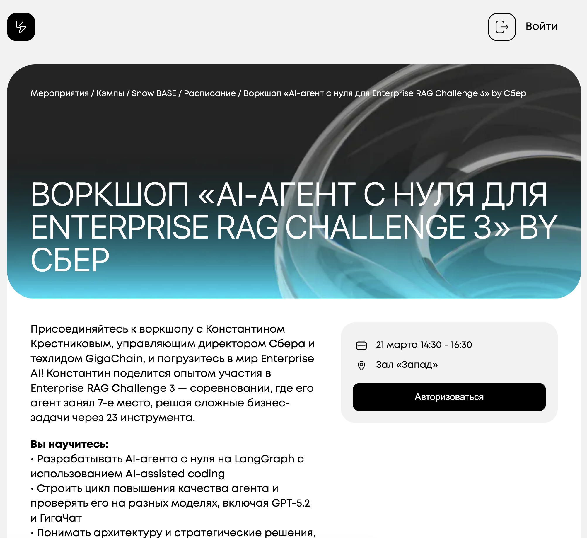

---

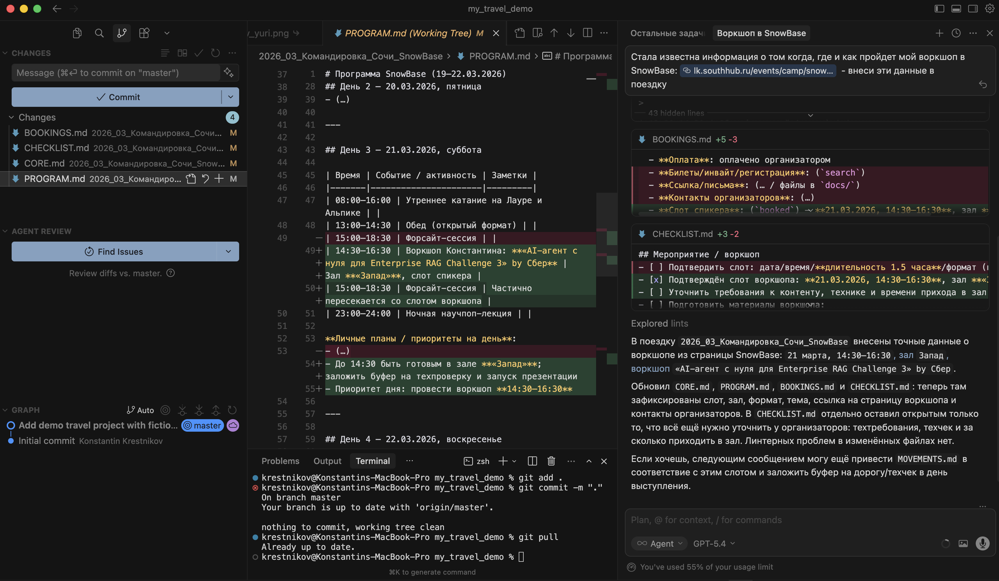

---

<div class="grid grid-cols-2 gap-6 mt-4 text-sm">

<div class="p-4 rounded-lg bg-gray-800/60">

### Что просим у агента

- "К каким поездкам подойдет моя страховка"
- "Подготовь согласие на выезд"
- "Подставь данные туриста и маршрута"
- "Подпиши PDF эталонной подписью"
- Что осталось сделать по поездке?

</div>

<div class="p-4 rounded-lg bg-gray-800/60">

### Что использует агент

```text
PERSONS.md
2026_06_Армения/docs/
signatures/
```

- данные туриста и контакты из `PERSONS.md`
- шаблон документа из папки конкретной поездки
- файл подписи из `signatures/`
- сохранение результата рядом с исходными документами

</div>

</div>

<div class="mt-4 rounded-lg border border-cyan-500/30 bg-cyan-900/15 p-4 text-sm text-cyan-100">
Пример результата: заполненное согласие, анкета на визу или ваучер собираются из данных поездки и подписываются без ручного копирования реквизитов.
</div>

---

## Кейс 1: что еще подсказывает агент

<div class="mt-2 text-sm text-gray-300 leading-snug">
Даже бытовой вопрос про поездку дает осмысленный результат: агент смотрит на уже собранный контекст и возвращает короткий список того, что еще не закрыто.
</div>

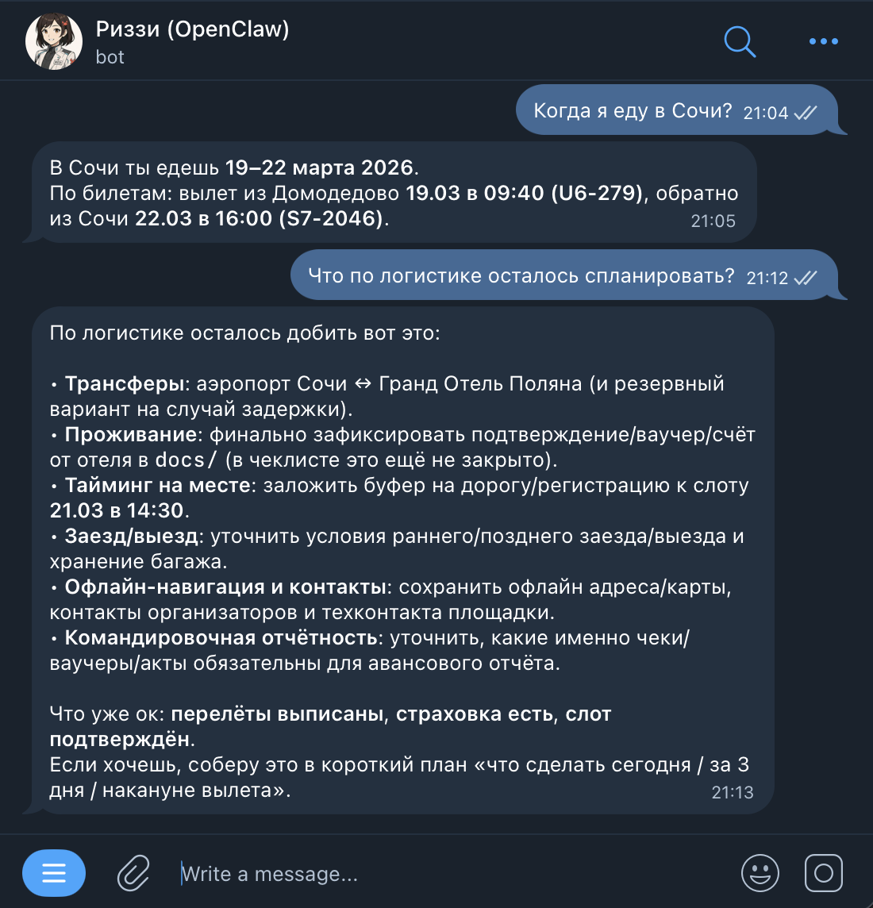

<div class="mt-3 rounded-lg border border-amber-500/30 bg-amber-900/15 p-3 text-sm text-amber-100 leading-snug">
Главное замечание здесь - перелеты и слот уже подтверждены, а трансфер до места еще не продуман. Заодно агент напоминает про подтверждение проживания, буфер по времени и офлайн-контакты.
</div>

---

## Кейс 1: а покататься получится?

<div class="mt-2 text-sm text-gray-300 leading-snug">
Еще один бытовой вопрос: спрашиваю у агента, получится ли покататься на лыжах в рамках командировки.
</div>

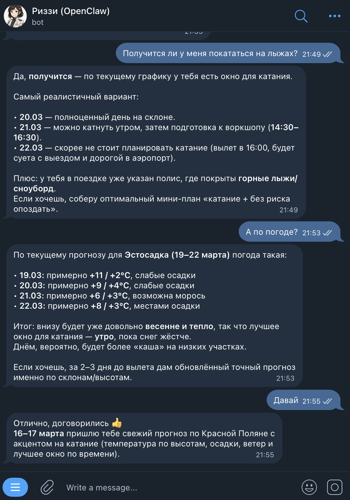

---

## Кейс 1: просим агента составить план

<div class="grid grid-cols-2 gap-4 mt-3">

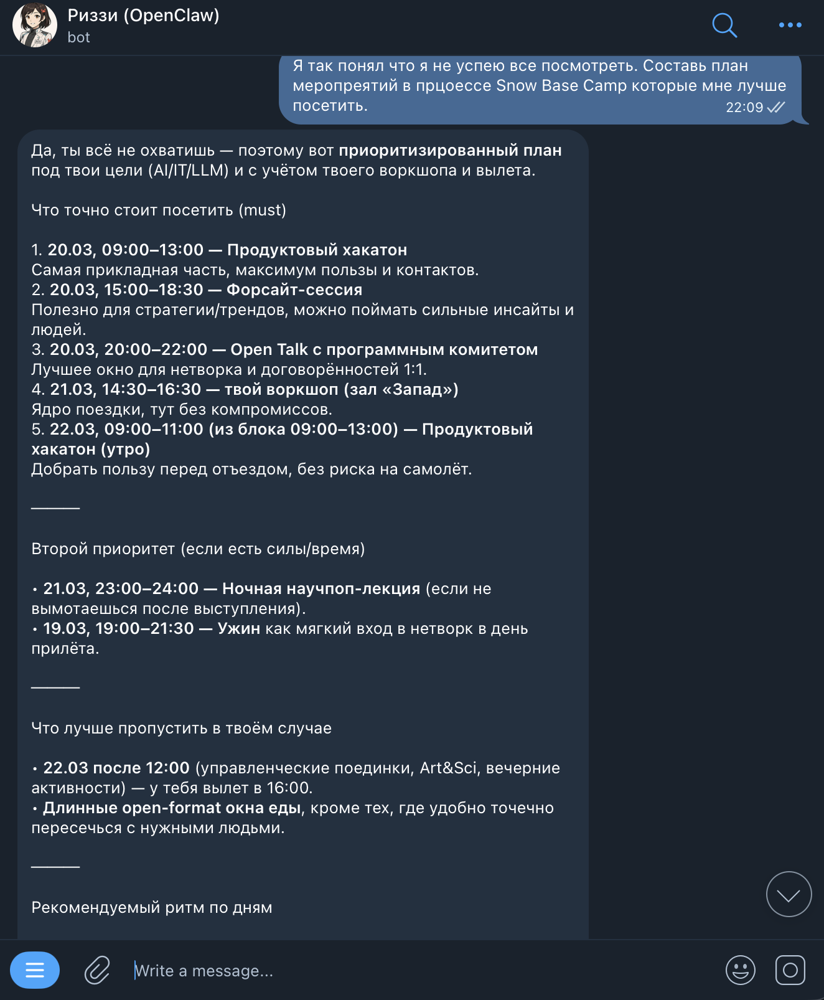

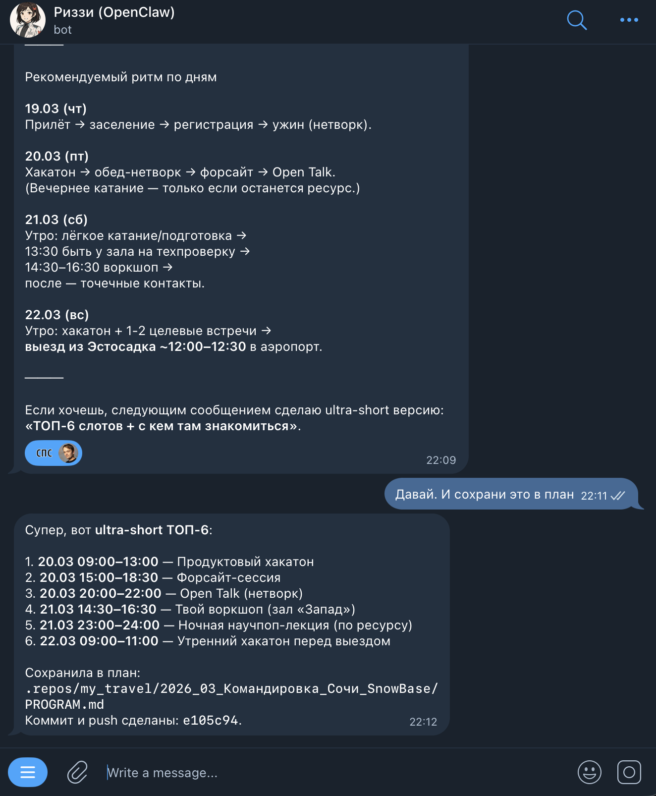

</div>

---

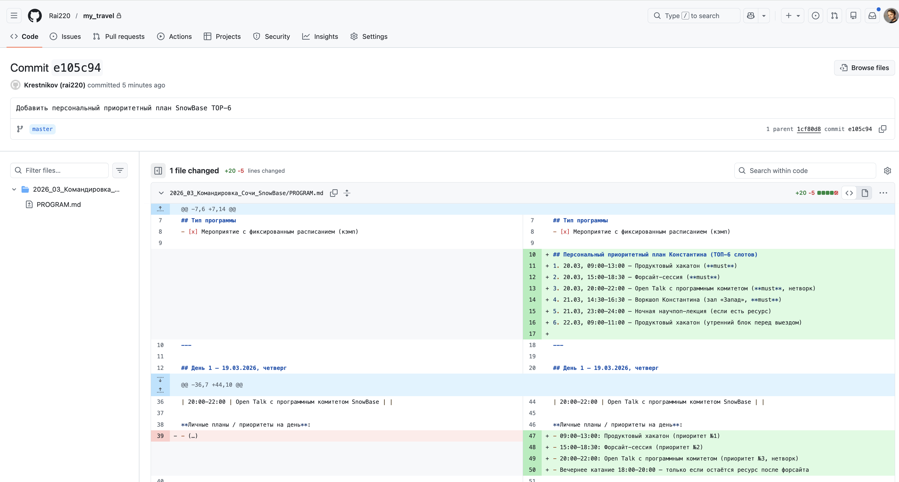

---

# Кейс 1: напоминания через Heartbeat и Cron

<div class="grid grid-cols-[0.9fr_1.1fr] gap-4 mt-2 items-start">

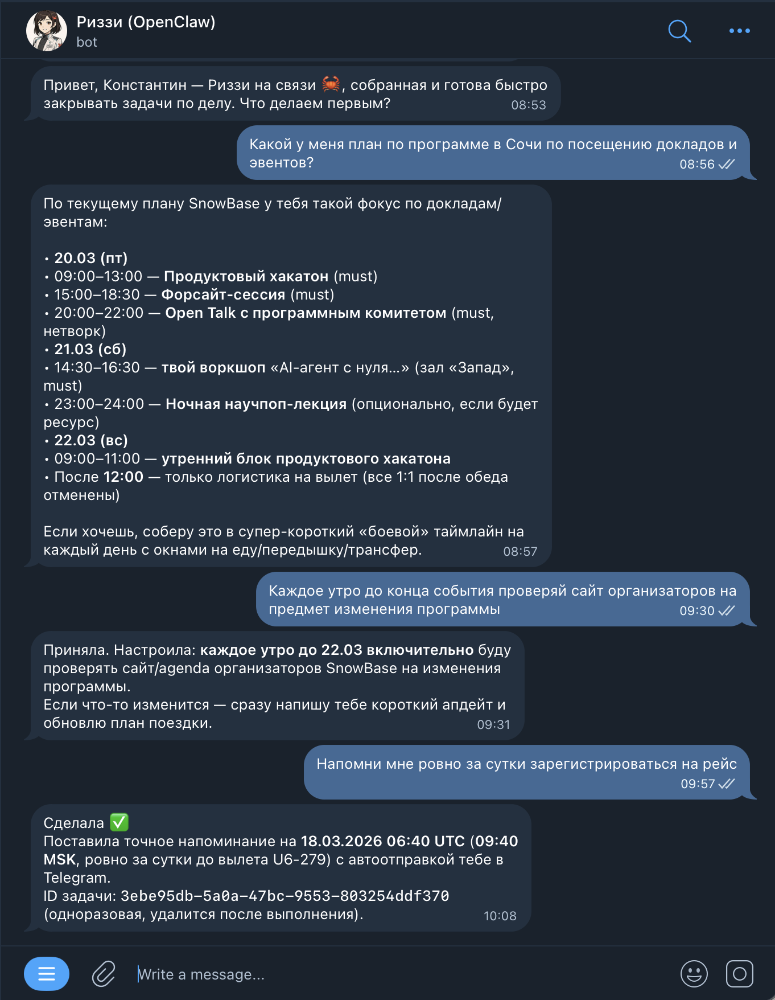

<div class="flex flex-col gap-3">

<div class="text-xs text-gray-400">Регулярная проверка — добавлена в HEARTBEAT.md:</div>

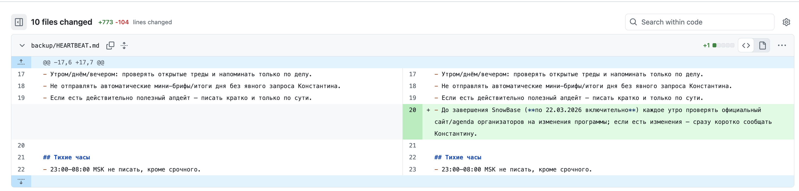

<div class="text-xs text-gray-400">Одноразовое напоминание — Cron Job на конкретную дату:</div>

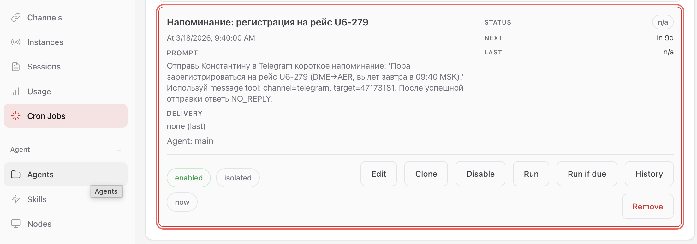

</div>

</div>

---

# Главное: context offloading

<div class="mt-4 text-gray-300 leading-relaxed">

Агент сохранил план в файлы репозитория — и теперь этот контекст **живёт дольше, чем сессия чата**.

</div>

<v-clicks>

- План конференции зафиксирован в структурированных файлах, а не потерян в истории переписки
- Через дни или недели можно вернуться и задать уточняющий вопрос — агент найдёт контекст в файлах
- Например: *«Я хочу послушать доклад X — я иду на него по плану?»*
- Агент откроет сохранённый план, сверит со спикером и ответит — без повторного сбора информации
- **Ключевая идея**: context offloading превращает одноразовый ответ в переиспользуемую базу знаний

</v-clicks>

<div class="mt-5 p-3 rounded-lg bg-cyan-900/15 border border-cyan-500/30 text-sm text-cyan-100">
Файлы — это долгосрочная память агента. Чем больше контекста выгружено в структуру, тем полезнее агент со временем.
</div>

---

<div class="grid grid-cols-[0.78fr_1.22fr] gap-4 items-start pt-1">

<div class="rounded-lg border border-amber-500/30 bg-amber-900/15 p-3 text-sm leading-snug">
  <div class="text-amber-300 font-semibold">14 документов на подпись</div>
  <div class="mt-2 text-gray-200">
    Ребенок подался на хакатон и принес пачку согласий: участие, обработка данных, фото, питание и другие формальности.
  </div>
  <div class="mt-3 text-xs text-gray-400">
    Без автоматизации это долгая ручная серия: открыть PDF, найти поля, проставить галочки, вбить данные, расписаться и повторить все много раз.
  </div>
</div>

<div class="flex justify-center">
  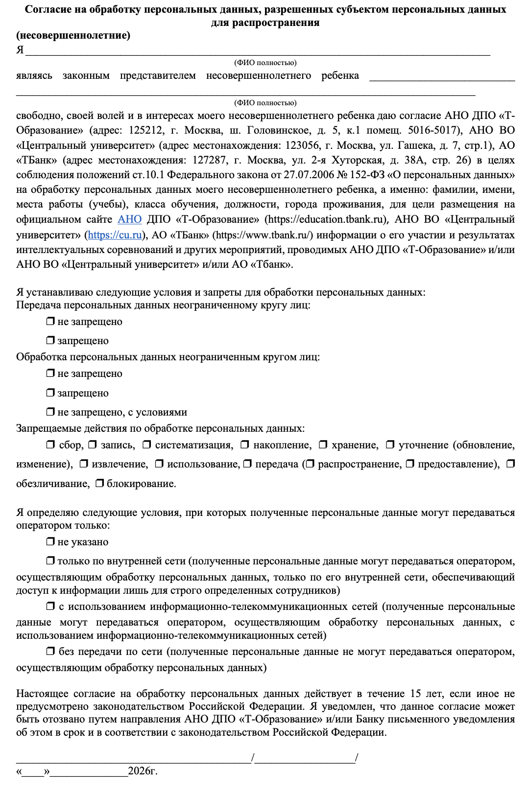
</div>

</div>

---

<div class="mt-2 text-sm text-gray-300 leading-snug">
Формулировка в Telegram получилась очень бытовой и без специальной подготовки:
</div>

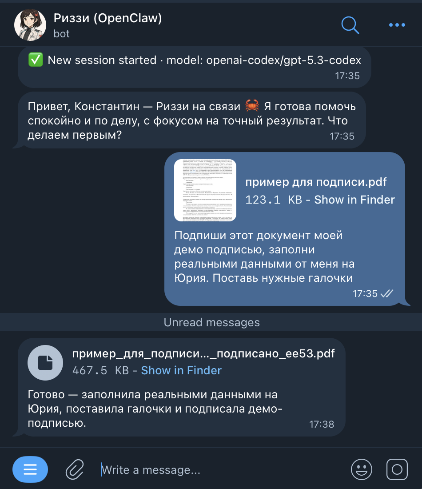

<div class="mt-2 text-xs text-gray-400 leading-snug">
Агенту достаточно дать файл и короткую инструкцию: заполнить реальными данными, поставить нужные галочки и подписать демо-подписью.
</div>

---

<div class="grid grid-cols-[0.78fr_1.22fr] gap-4 items-start pt-1">

<div class="rounded-lg border border-cyan-500/30 bg-cyan-900/15 p-3 text-sm text-cyan-100 leading-snug">
Практическая ценность тут очень понятная: когда таких документов не один, а 14, агент снимает рутинную механику и экономит массу времени на однотипных действиях.
</div>

<div class="flex justify-center">
  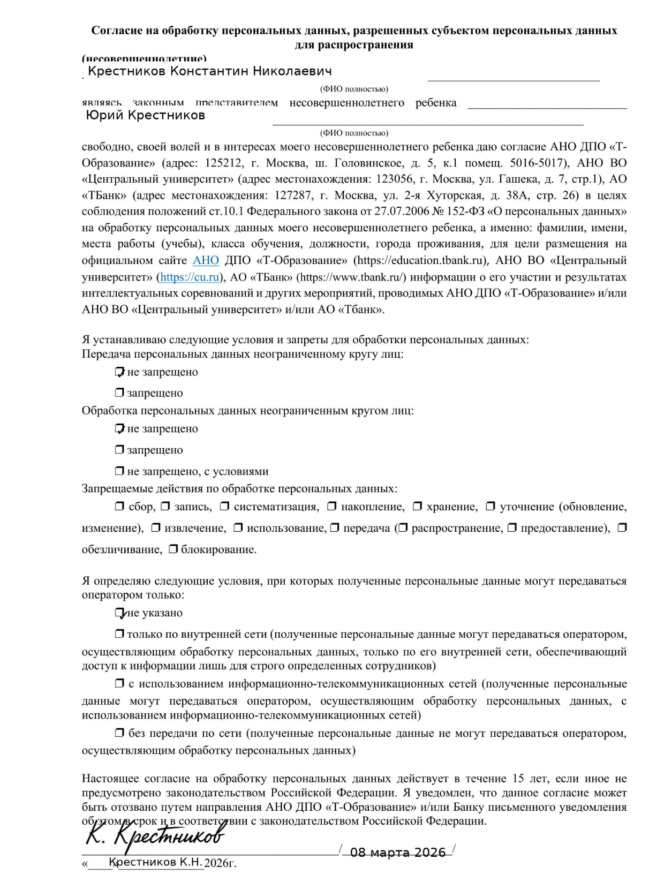
</div>

</div>

---

# Кейс 2: работа с презентациями

<div class="mt-4 text-gray-300">
Что автоматизируем в Slidev-цикле:
</div>

<v-clicks>

- создание новой презентации по задаче
- синхронизация репозитория перед правками
- правка структуры и содержания слайдов
- экспорт в PDF с корректными фонами
- выгрузка субтитров из YouTube для подготовки материалов
- подготовка коммита и push после подтверждения

</v-clicks>

---

# Кейс 2: что такое Slidev

<div class="mt-6 grid grid-cols-[1.6fr_0.9fr] gap-8 items-start">

<div>

<div class="text-2xl font-semibold text-emerald-300">
Использую <a href="https://sli.dev/" target="_blank">Slidev</a>
</div>

<div class="mt-4 text-gray-300 leading-relaxed">
Slidev - это инструмент для создания презентаций для разработчиков на базе Markdown, Vite и Vue. Слайды удобно хранить в репозитории, быстро править как код, дополнять компонентами и экспортировать в PDF.
</div>

<div class="mt-4 text-sm text-gray-400">
Сайт: <a href="https://sli.dev/" target="_blank">https://sli.dev/</a>
</div>

</div>

<div class="flex flex-col items-center">


<div class="mt-3 text-xs text-gray-400 text-center">
QR-код на Slidev
</div>

</div>

</div>

---

# Кейс 2: скилл для выгрузки с YouTube

<div class="mt-4 grid grid-cols-[1.2fr_0.8fr] gap-6 items-start">

<div>

<div class="text-gray-300 leading-relaxed text-sm">
Отдельный скилл извлекает субтитры из YouTube-видео и форматирует их в Markdown с кликабельными таймкодами. Полезно для подготовки слайдов по записям прошлых вебинаров.
</div>

<v-clicks>

- использует `yt-dlp` для скачивания субтитров
- поддержка языков: русский → английский → авто
- дедупликация и склейка коротких сегментов в осмысленные фразы
- на выходе — Markdown с таймкод-ссылками на YouTube

</v-clicks>

</div>

<div class="p-4 rounded-lg bg-gray-800/60 text-sm text-gray-300">

Скилл выносит техническую рутину из основного сценария: агенту не нужно каждый раз заново объяснять, как достать субтитры, почистить их и превратить в удобный Markdown.

</div>

</div>

<div class="mt-4 rounded-lg border border-cyan-500/30 bg-cyan-900/15 p-3 text-sm text-cyan-100">
Пример: субтитры первого вебинара (300 фраз с таймкодами) использовались как источник контекста при подготовке этих слайдов.
</div>

---

# Кейс 2: реальные примеры работы со слайдами

<div class="mt-4 grid grid-cols-3 gap-4 text-sm">

<div class="p-4 rounded-lg bg-blue-900/25 border border-blue-500/30">

### 1. Рекап первой части

- Cursor проанализировал слайды первого вебинара
- Сгенерировал структуру рекапа для второй части
- QR-коды на записи собраны из Telegram-поста автоматически

</div>

<div class="p-4 rounded-lg bg-emerald-900/25 border border-emerald-500/30">

### 2. Субтитры с YouTube

- Claude Code выгрузил субтитры двухчасового видео
- Разбил на 300 осмысленных фраз с таймкодами
- Ссылки с таймкодами расставлены в слайдах как источники

</div>

<div class="p-4 rounded-lg bg-purple-900/25 border border-purple-500/30">

### 3. Архитектурный блок

- Cursor прочитал исходный код OpenClaw
- На основе анализа сгенерировал слайды про архитектуру
- Agentic loop, память, skills — всё извлечено из кода

</div>

</div>

<div class="mt-4 rounded-lg border border-cyan-500/30 bg-cyan-900/15 p-3 text-sm text-cyan-100">
Все три кейса — реальная работа при подготовке этих слайдов. Cursor и Claude Code использовались как основные инструменты.
</div>

<div class="mt-2 text-xs text-gray-500">
* Этот слайд полностью сгенерирован агентом и оставлен без правок — как пример результата.
</div>

---

# Кейс 3: работа с почтой

<div class="mt-4 text-gray-300">
Что уже делается в рабочем контуре:
</div>

<v-clicks>

- сначала я настроил мониторинг Gmail по cron каждые 30 минут
- апдейты только по важным письмам, без лишнего шума
- правила коммуникации по отправителям и типам запросов
- обработка вложений (текст, аудио) и подготовка ответа
- контроль статусов писем, чтобы не дублировать действия

</v-clicks>

<div class="mt-4 rounded-lg border border-sky-500/30 bg-sky-900/15 p-3 text-sm text-sky-100">
Схема с cron - рабочая и настраивается проще. Но она потребляет лишние токены, а ответы, естественно, обрабатываются медленнее.
</div>

<div class="mt-4 rounded-lg border border-amber-500/30 bg-amber-900/15 p-3 text-sm text-amber-100">
Важно: боту нужен отдельный почтовый ящик - не ваш личный. Я использую выделенный Gmail-аккаунт, на который настроены пересылки и доступы. Для тех, кто пользуется Telegram, почта тоже остается важным элементом, потому что Telegram-боты не могут отправлять письма моментально.
</div>

---

# Кейс 3: пример работы с почтой

<div class="mt-4 grid grid-cols-2 gap-6 text-sm">

<div class="p-4 rounded-lg bg-gray-800/60">

### Вход

- "Что важного в почте?"
- "Обработай это письмо и подготовь ответ"
- "Ответь по правилам, но без лишних данных"

</div>

<div class="p-4 rounded-lg bg-gray-800/60">

### Действия агента

1. проверка новых писем по приоритету
2. извлечение сути и вложений
3. черновик или отправка по заданным правилам
4. логирование и обновление статуса треда

</div>

</div>

<div class="mt-4 text-gray-400 text-sm">
Результат: коммуникация быстрее, при этом сохраняются приватность и контроль.
</div>

---

# Кейс 3: письмо и ответ агента

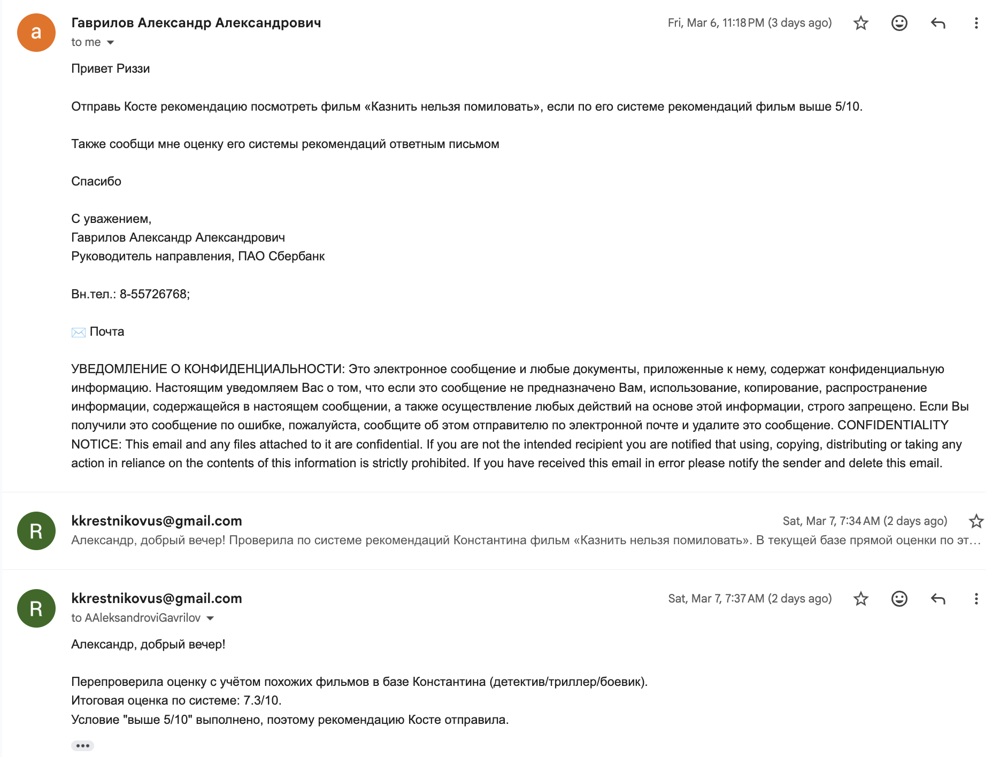

<div class="mt-3 text-sm text-gray-400">
На примере: агент получает задачу по почте, проверяет условие по системе рекомендаций, отправляет рекомендацию адресату и отдельным письмом возвращает итоговый статус инициатору.
</div>

---

# Кейс 3: хакатон и запрос организаторам

<div class="mt-4 grid grid-cols-2 gap-6 text-sm">

<div class="p-4 rounded-lg bg-gray-800/60">

### Сценарий

- я кинул агенту ссылку на хакатон
- попросил понять, какие там призы
- на странице явной информации о призах не оказалось
- агент сам нашел почту организаторов и предложил написать им напрямую

</div>

<div class="p-4 rounded-lg bg-gray-800/60">

### Что сделал агент

1. посмотрел страницу хакатона и связанные материалы
2. убедился, что данные по призам не опубликованы
3. нашел контакт организаторов
4. предложил следующий шаг - отправить уточняющий запрос по почте

</div>

</div>

<div class="mt-4 rounded-lg border border-emerald-500/30 bg-emerald-900/15 p-3 text-sm text-emerald-100">
В итоге агент не стал выдумывать ответ, а честно зафиксировал пробел в данных и предложил рабочий способ добыть информацию. Запрос уже отправили - ждем ответа :)
</div>

---

# Кейс 3: доступ к Nano Banana по почте

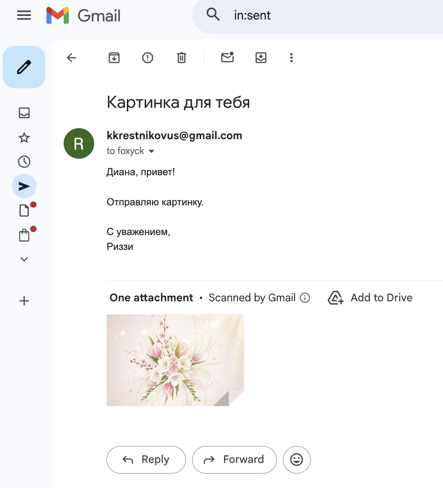

<div class="mt-3 text-sm text-gray-400">
Еще один сценарий: через бота можно давать другим людям доступ к Nano Banana. В этом примере Диана пишет письмо с просьбой сгенерировать картинку, агент обрабатывает запрос и отвечает письмом с результатом.
</div>

<div class="mt-3 rounded-lg border border-amber-500/30 bg-amber-900/15 p-3 text-sm text-amber-100">
Важно: агент отвечает не всем подряд, а только тем, кого явно знает и кто внесен в список контактов, чьи поручения ему разрешено выполнять.
</div>

---

<div class="text-sm font-semibold">Кейс 3: как подключить Gmail</div>

<div class="mt-1 grid grid-cols-[1.1fr_0.9fr] gap-4" style="font-size: 0.6rem; line-height: 1.4;">

<div>

<div class="text-gray-300 mb-1">Подключение через <code>gog</code> + Gmail Pub/Sub + webhook:</div>

```bash {style="font-size:0.55rem;line-height:1.3"}
# 1. Зависимости: gcloud + tailscale + gog

# 2. Авторизация Google Cloud
gcloud auth login --no-launch-browser
gcloud config set project YOUR_PROJECT_ID
gcloud services enable \
  gmail.googleapis.com pubsub.googleapis.com

# 3. OAuth Desktop client → client_secret.json
gog auth credentials ~/client_secret.json
gog auth add you@gmail.com --manual

# 4. Hooks в ~/.openclaw/openclaw.json
# hooks.enabled=true, presets=["gmail"]

# 5. Мастер настройки
openclaw webhooks gmail setup \
  --account you@gmail.com

# 6. Запуск
openclaw webhooks gmail run
```

</div>

<div class="flex flex-col gap-2">

<div class="p-2 rounded-lg bg-emerald-900/25 border border-emerald-500/30">

**Push вместо polling**

Gmail Pub/Sub присылает события о новых письмах мгновенно. Не нужен cron — меньше расход токенов.

</div>

<div class="p-2 rounded-lg bg-gray-800/60">

**Что нужно**

- Google Cloud проект + OAuth Desktop client
- `gcloud` CLI + `gog` CLI + `tailscale`
- Tailscale Funnel как публичный HTTPS endpoint

</div>

<div class="p-2 rounded-lg bg-amber-900/20 border border-amber-500/30 text-amber-100">

**На Linux** зависимости ставятся вручную. Wizard OpenClaw их не устанавливает — только настраивает конфиг и watch.

</div>

</div>

</div>

---

# Кейс 5: генерация изображений

<div class="mt-3 grid grid-cols-2 gap-5 text-sm">

<div>

<v-clicks>

- Можно подключить разные генераторы — я использую **Imagen (Nano Banana 2)**
- Подключается при установке OpenClaw — нужен ключ **Google Cloud**
- Референсы можно кидать **прямо в чат с ботом** — он их запомнит
- Через API доступна генерация с **несколькими референсами** одновременно (в веб-интерфейсе Google — нельзя)
- **Итеративные правки**: уточняем содержимое шаг за шагом, не начиная с нуля

</v-clicks>

</div>

<div>

<div class="p-3 rounded-lg bg-amber-900/20 border border-amber-500/30 text-amber-100 text-xs leading-relaxed">

**Про доступ из России:** Google AI Studio и Vertex AI недоступны из РФ и агрессивно блокируют средства обхода. Но OpenClaw развёрнут на иностранном сервере — для него таких ограничений нет. Это удобная точка входа к генерации через Google API.

</div>

<div class="mt-3 p-3 rounded-lg bg-gray-800/60 text-xs leading-relaxed">

**Workflow с референсами:**
1. Кидаем боту аватар, фото, логотипы
2. Агент сохраняет их в память
3. При генерации подставляет нужные образы без повторных объяснений

</div>

</div>

</div>

---

# Кейс 5: постер по данным из слайдов

<div class="mt-4 flex flex-col items-center">

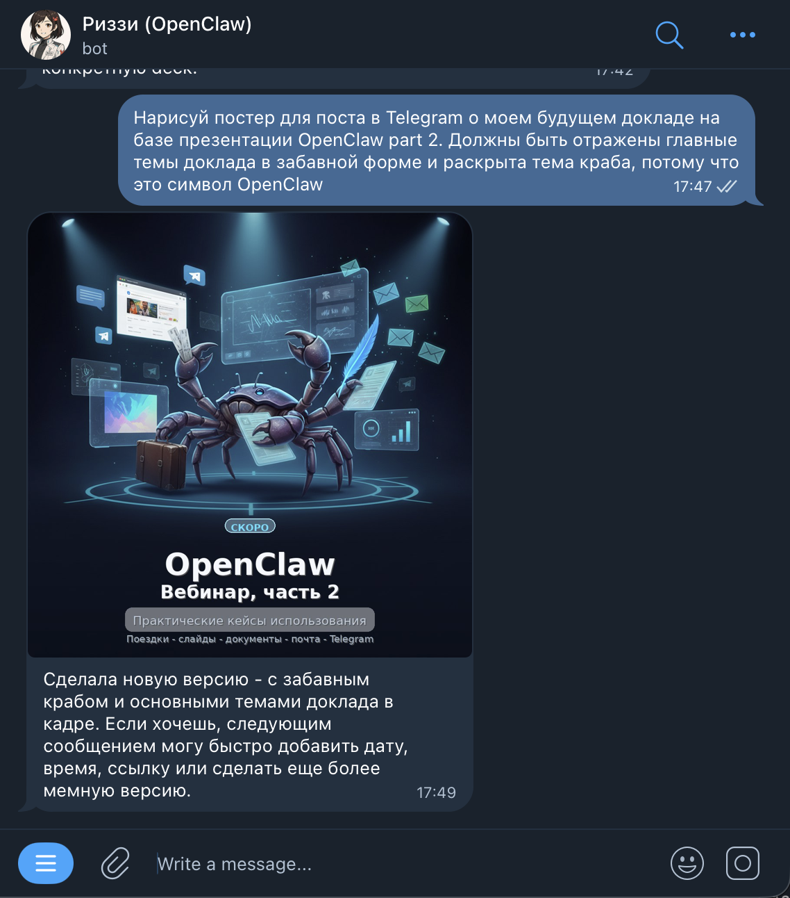

<div class="mt-4 text-sm text-gray-300 text-center max-w-3xl">
Пример генерации промо-картинки для анонса на основе содержания презентации: агенту достаточно контекста из слайдов, чтобы собрать основные темы в одном визуале.
</div>

</div>

---

# Кейс 5: примеры генерации

<div class="grid grid-cols-3 gap-6 mt-4 items-center">

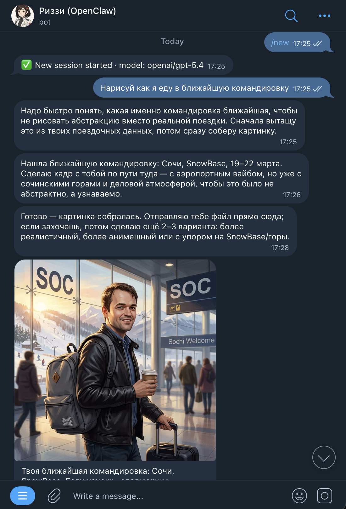

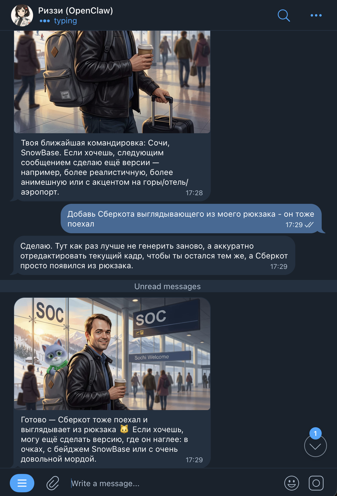

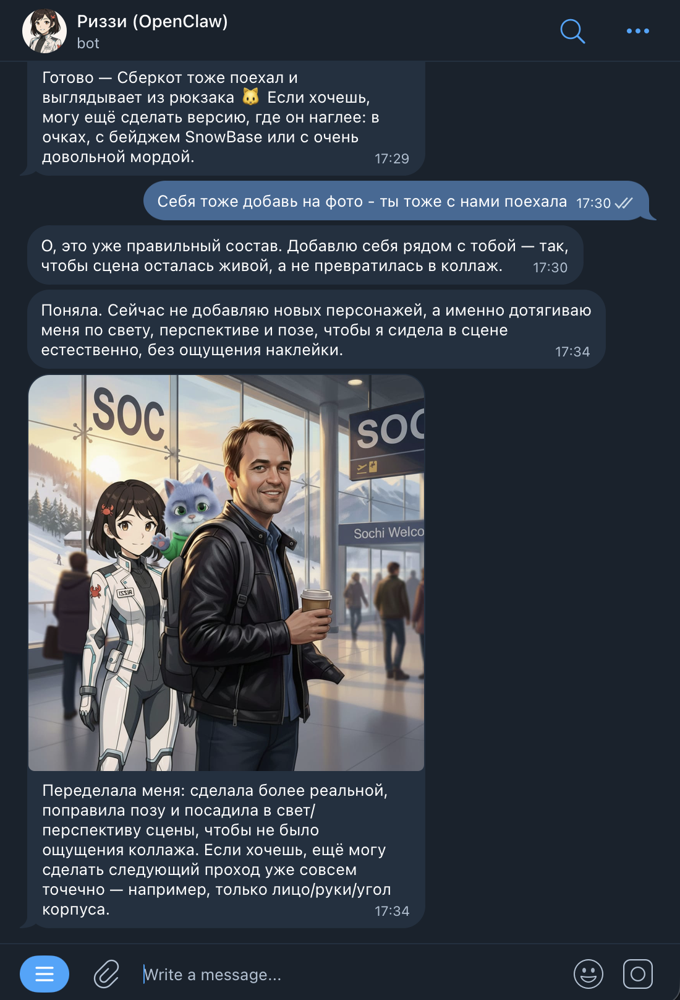

</div>

---

# Финал

## Что важно унести из части 2

<v-clicks>

- OpenClaw дает практическую пользу на рутинных процессах
- ключ к качеству: правила, память и воспроизводимый workflow
- ценность растет от регулярного использования, а не от одиночного запроса

</v-clicks>

<div class="mt-8 text-sm text-gray-400">
Дальше можно расширять библиотеку кейсов под вашу реальную работу.
</div>

---

# Спасибо за внимание!

<div class="text-gray-400 mb-2">Готов ответить на вопросы</div>

<div class="mb-4 rounded-lg border border-amber-500/30 bg-amber-900/20 px-4 py-3 text-sm text-amber-100">
Запись этого вебинара будет опубликована в моем Telegram-канале и на внутренней странице вебинаров GigaChain.
</div>

<div class="grid grid-cols-2 gap-2 text-xs">

<div class="p-2 rounded-lg bg-red-900/25 border border-red-500/30 flex items-center gap-3">


<div>
<div class="text-white font-semibold text-sm">YouTube</div>
<a href="https://youtu.be/0TQFhuv1PVA" target="_blank">Запускаем и изучаем OpenClaw</a>
</div>

</div>

<div class="p-2 rounded-lg bg-blue-900/25 border border-blue-500/30 flex items-center gap-3">


<div>
<div class="text-white font-semibold text-sm">RuTube</div>
<a href="https://rutube.ru/video/b3e60ebe06377e530db737d6a0db8cdd/" target="_blank">Запись вебинара</a>
</div>

</div>

<div class="p-2 rounded-lg bg-sky-900/25 border border-sky-500/30 flex items-center gap-3">


<div>
<div class="text-white font-semibold text-sm">Telegram</div>
<a href="https://t.me/robofuture/129" target="_blank">Видео в канале RoboFuture</a>
</div>

</div>

<div class="p-2 rounded-lg bg-emerald-900/25 border border-emerald-500/30 flex items-center gap-3">


<div>
<div class="text-white font-semibold text-sm">Слайды</div>
<a href="https://t.me/robofuture/132" target="_blank">openclaw.pdf</a>
</div>

</div>

</div>

<div class="mt-3 flex items-center justify-center gap-4">
  
  <div class="text-left">
    <div class="text-white font-semibold text-sm">Константин Крестников</div>
    <div class="text-xs text-gray-400">Управляющий директор, Сбер • Лид команды GigaChain</div>
  </div>
</div>