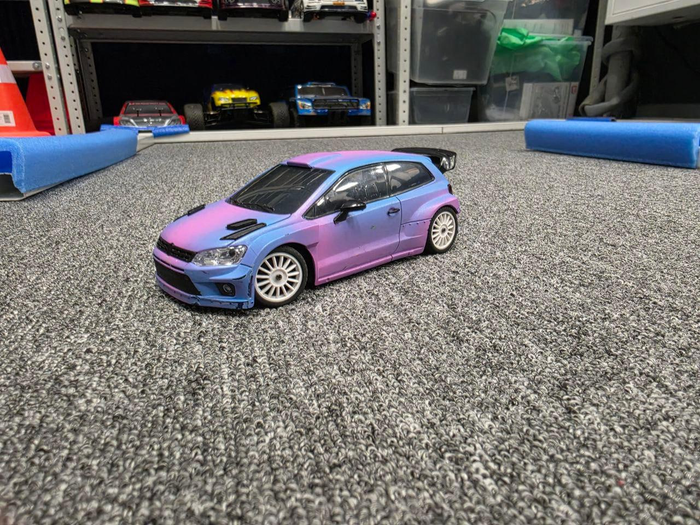
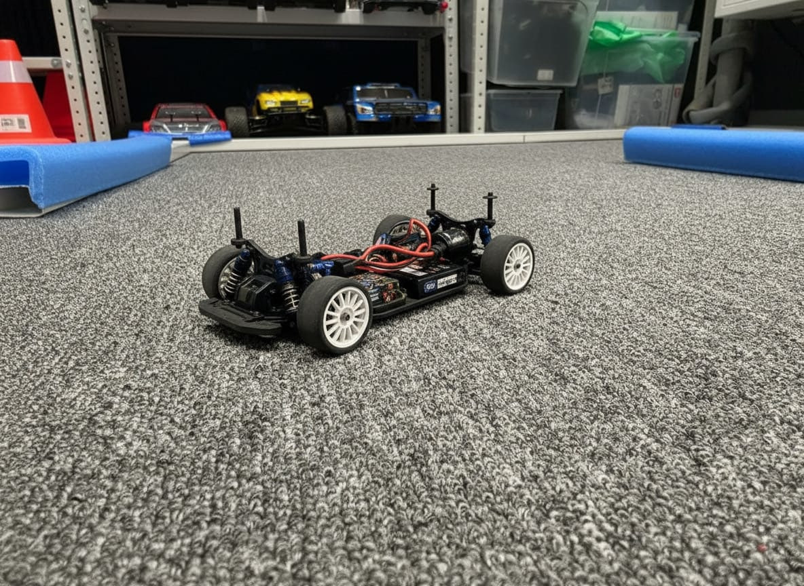
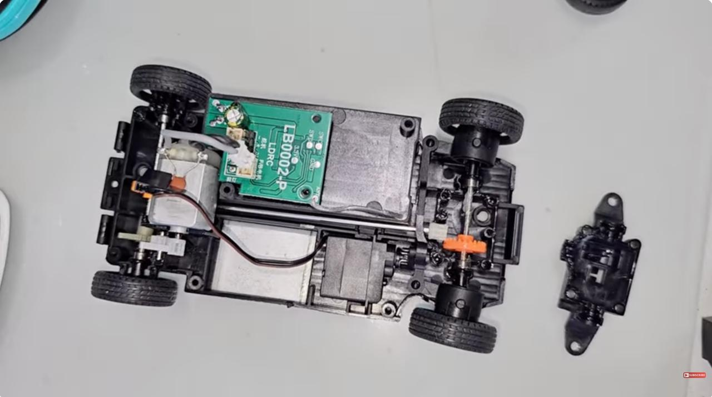
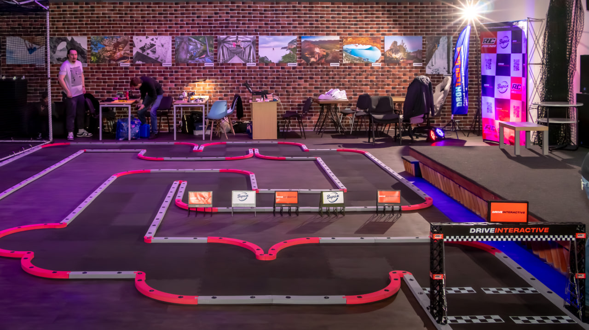
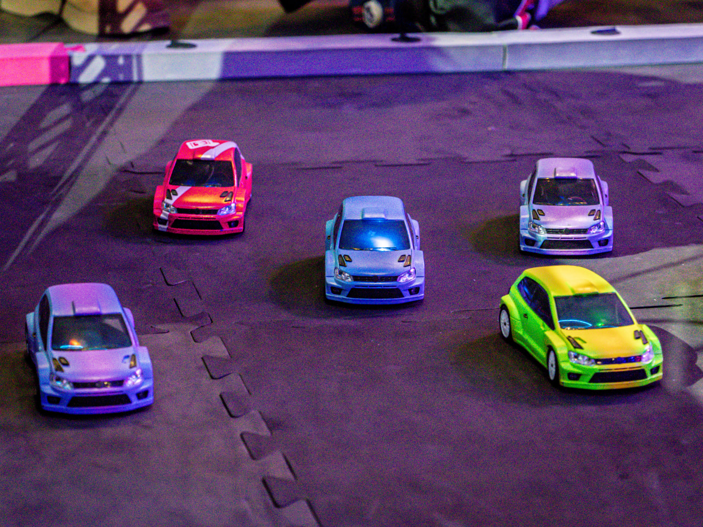

# Цель и задачи проекта

**Цель проекта**

Составить понятную инструкцию по подготовке радиоуправляемой модели масштаба `1:28` к соревнованиям.

**Задачи**

- изучить устройство модели
- определить главные этапы подготовки
- описать действия перед стартом и во время соревнований
- собрать удобную контрольную карту

# Почему эта тема важна

В автомоделировании важны не только умение рулить, но и правильная подготовка машины.

- если пропустить один шаг, машина может ехать хуже
- от подготовки зависят скорость, устойчивость и управляемость
- инструкция помогает ничего не забыть перед заездом

Для детей модели `1:28` удобны, потому что они компактные, безопасные для занятий в помещении и доступны по цене.

# Что это за модель

:::::::::::::: {.columns}
::: {.column width="58%"}
- Масштаб `1:28` означает, что машина уменьшена в 28 раз
- Такие модели используют на специальных трассах в помещении
- Марка моей модели - `LD2801`

Основные части модели:

- кузов
- шасси
- колеса
- двигатель
- аккумулятор
- пульт управления
:::
::: {.column width="42%"}
{width=85%}

Моя радиоуправляемая модель на трассе
:::
::::::::::::::

# Что находится внутри

:::::::::::::: {.columns}
::: {.column width="58%"}
Когда кузов снят, можно увидеть основные части модели:

- шасси
- двигатель
- провода и электронику
- крепления кузова
- колеса и подвеску
:::
::: {.column width="42%"}
{width=85%}

Модель со снятым кузовом
:::
::::::::::::::

# Устройство модели

:::::::::::::: {.columns}
::: {.column width="58%"}
На фотографии сверху хорошо видно, как устроена модель внутри.

- электродвигатель
- плата управления
- место для аккумулятора
- элементы трансмиссии
- рулевое управление

Знание устройства помогает быстрее находить и исправлять проблемы перед стартом.
:::
::: {.column width="42%"}
{width=85%}

Вид модели сверху без кузова
:::
::::::::::::::

# Общая подготовка модели

Перед соревнованиями важно подготовить машину заранее:

- покрасить кузов аккуратно и ровно
- придумать название и расцветку модели
- установить электронный чип для подсчета кругов
- проверить, что все детали на месте и хорошо закреплены

Электронный чип нужен для того, чтобы система на финише точно считала круги и время.

# Предстартовая подготовка

Перед каждым стартом я должна:

1. очистить модель от пыли и лишней смазки
2. проверить колеса и подшипники
3. убедиться, что трансмиссия работает плавно
4. обработать шины для лучшего сцепления с трассой
5. проверить пульт, газ и поворот колес
6. поставить заряженный аккумулятор

# Где проходят соревнования

:::::::::::::: {.columns}
::: {.column width="58%"}
Заезды проходят на специальной трассе для моделей.

На такой трассе важно:

- точно проходить повороты
- не терять скорость
- хорошо чувствовать управление
- следить за состоянием машины перед стартом

Подготовленная модель едет увереннее и стабильнее.
:::
::: {.column width="42%"}
{width=90%}
:::
::::::::::::::

# Что нужно делать во время соревнований

После заездов за моделью тоже нужно следить:

- продувать кузов и шасси от пыли
- снова очищать шины примерно за 10 минут до старта
- следить за зарядом аккумулятора
- менять аккумулятор примерно каждые два заезда
- проверять, не прокручивается ли шина на диске
- при необходимости проклеивать колесо

Я убедилась в этом на своем опыте: однажды забыла заменить аккумулятор, и машина к концу заезда стала терять скорость.

# Модели во время заезда

:::::::::::::: {.columns}
::: {.column width="58%"}
Во время соревнований на трассе одновременно может быть несколько машин.

Поэтому особенно важно:

- проверять, что пульт подключился именно к своей машине
- следить за чистотой шин и зарядом аккумулятора
- сохранять аккуратное управление на поворотах
- соблюдать правила соревнований
:::
::: {.column width="42%"}
{width=90%}
:::
::::::::::::::

# Что нельзя делать

Во время соревнований есть важные ограничения:

- нельзя кататься на модели между заездами
- нельзя разряжать аккумулятор без необходимости
- нельзя ездить по местам, не предназначенным для моделей
- нельзя выезжать на трассу на грязной машине

# Итог

Я собрала основные правила подготовки модели масштаба `1:28` к соревнованиям и сделала понятную инструкцию.

Эта инструкция может помочь начинающим участникам кружка быстрее научиться правильно готовить свою машину к старту.

Инструкция находится в приложении к тексту проекта.

# Спасибо за внимание!

Готова ответить на вопросы.
