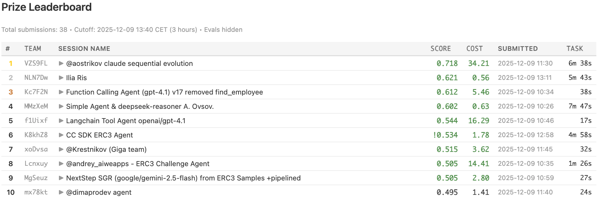
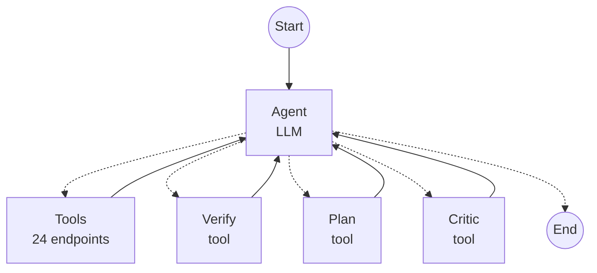
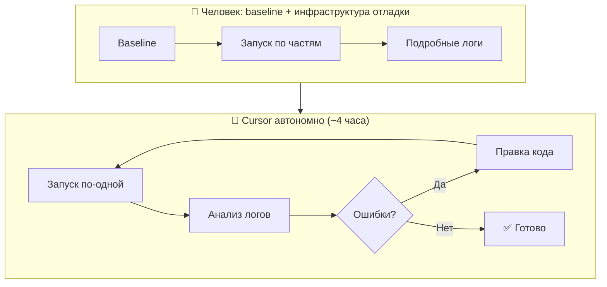

<div class="absolute inset-0 bg-black/60"></div>

<div class="relative z-10">

# Enterprise RAG Challenge 3

Создаем агента, входящего в ТОП с нуля с помощью AI-assistant development

<div class="mt-8 text-gray-300">
7 место • 162 задачи • 360995 запусков агентов
</div>

</div>

<div class="absolute bottom-8 left-8 flex items-center gap-4 z-10">
  
  <div class="text-sm text-gray-300">
    <div class="font-semibold text-white">Константин Крестников</div>
    <div>Управляющий директор, Сбер</div>
    <div>Лид команды GigaChain</div>
  </div>
</div>

<!--
Всем привет, начинаем трансляцию. Сегодня новый вебинар команды GigaChain. Костя Крестников расскажет о своём опыте участия в Enterprise RAG Challenge. Расскажет о самом соревновании, разберёт задачи, покажет архитектуру агента и многое другое. Так, коллеги, всем привет, рад всех видеть. Слышно ли меня и видно? Напомнили, что запись идёт, можно задавать вопросы в чате. Хочу рассказать о своём опыте, как поучаствовал в соревновании Enterprise RAG Challenge по созданию агентов, работающих в реалистичной среде. Моя идея была поучаствовать с использованием AI-ассистента для кодинга, который можно назвать вайб-кодингом. Сегодня хочу и рассказать, как я участвовал, и показать. Сделаем прямо с нуля, с помощью Cursor, агента. Запустим и добьёмся, чтобы он показывал какие-то результаты. Дисклеймер: я показываю на личном ноутбуке, это моя личная подписка на Cursor. Как это использовать в Сбере, мы сегодня не обсуждаем.
-->

---

# Agenda

<div class="grid grid-cols-2 gap-x-8 gap-y-2 mt-4">
  <div class="flex items-center gap-2"><span class="text-blue-400">1.</span> <a href="https://www.youtube.com/watch?v=cveXhWvj_zo&t=159s" class="hover:text-blue-300" target="_blank">Что такое ERC3</a></div>
  <div class="flex items-center gap-2"><span class="text-blue-400">5.</span> <a href="https://www.youtube.com/watch?v=cveXhWvj_zo&t=3871s" class="hover:text-blue-300" target="_blank">Win & Fail</a></div>
  <div class="flex items-center gap-2"><span class="text-blue-400">2.</span> <a href="https://www.youtube.com/watch?v=cveXhWvj_zo&t=970s" class="hover:text-blue-300" target="_blank">Архитектура агента</a></div>
  <div class="flex items-center gap-2"><span class="text-blue-400">6.</span> <a href="https://www.youtube.com/watch?v=cveXhWvj_zo&t=3314s" class="hover:text-blue-300" target="_blank">Пробуем GigaChat</a></div>
  <div class="flex items-center gap-2"><span class="text-blue-400">3.</span> <a href="https://www.youtube.com/watch?v=cveXhWvj_zo&t=1100s" class="hover:text-blue-300" target="_blank">Настройка Cursor</a></div>
  <div class="flex items-center gap-2"><span class="text-blue-400">7.</span> <a href="https://www.youtube.com/watch?v=cveXhWvj_zo&t=4205s" class="hover:text-blue-300" target="_blank">Дополнительные ресурсы</a></div>
  <div class="flex items-center gap-2"><span class="text-blue-400">4.</span> <a href="https://www.youtube.com/watch?v=cveXhWvj_zo&t=1983s" class="hover:text-blue-300" target="_blank">Создание агента с нуля</a></div>
  <div class="flex items-center gap-2"><span class="text-blue-400">8.</span> <a href="https://www.youtube.com/watch?v=cveXhWvj_zo&t=4295s" class="hover:text-blue-300" target="_blank">Q&A</a></div>
</div>

<div class="mt-8 text-sm text-gray-400">
Демо: интерфейс ERC3, настройка Cursor, разработка агента, запуск на разных моделях
</div>

<!--
Какая у нас агенда? Расскажу, как строилось соревнование, почему оно вообще меня заинтересовало. В российском AI-сообществе оно оказалось очень популярным. Какая была архитектура агента для участия. Покажу, как настроить Cursor для создания такого агента с нуля. Потом мы этого агента создадим с нуля, погоняем, посмотрим, как он улучшается и приближается к хорошему результату. Расскажу, какие были успешные и неуспешные решения по итогу участия. Попробуем переключить агента на GigaChat, посмотрим, как GigaChat справляется. Тут важная оговорка — чтобы занять как можно выше место, я взял самую мощную из доступных мне моделей, выбор пал на GPT-5.1, сейчас будет 5.2. Но очень хотелось, чтобы GigaChat тоже можно было использовать. И потом поотвечаю на вопросы.
-->

---
layout: cover
background: ./agent_developer.jpg
---

<div class="absolute inset-0 bg-black/50"></div>

<div class="relative z-10">

# Что такое ERC3?

## ERC3 - соревнование AI агентов, которые должны решать задачи в рамках организаций, приближенных к реальным.

<v-clicks>

- **Организация + HTTP API** — магазин, офис или крупная компания с набором эндпоинтов для взаимодействия
- **Текстовые задачи** — например, "Купить все GPU в интернет-магазине"
- **Агент на стороне пользователя** — отправляет решения по API
- **Свобода архитектуры** — любые модели, любой подход (можно даже вручную)
- **Ограниченное время** — в момент запуска выдаются новые задачи, агент должен успеть решить и отправить ответы - хардкод не работает

<div>

Площадка продолжает работать, зарегистрироваться можно тут: https://erc.timetoact-group.at/
</div>

</v-clicks>

</div>

<!--
Что же такое Enterprise RAG Challenge? Это соревнование для AI-агентов, которые должны решать задачи в рамках некой виртуальной организации, похожей на реальную. Организация выглядела следующим образом: это был некий абстрактный магазин, у которого есть свой бэкенд, публикующий HTTP-эндпоинты — магазин, офис, компания. Это зависело от задачи. Представьте, если есть интернет-магазин и агент должен с ним работать, то у этого магазина должны быть эндпоинты — например, посмотреть список товаров, добавить товар в корзину, применить купон, сделать чекаут. Если это компания, то команды: нанять сотрудника, ответить на письмо, объявить выходной, назначить человеку премию, прочитать внутреннюю Википедию и тому подобное. В самой сложной итоговой задаче было 24 эндпоинта. Задача в рамках соревнования формируется просто текстом — например, «купить все GPU в интернет-магазине комплектующих». Агент выполняется на стороне пользователя — и это самое классное в этом челлендже. Не надо его никуда загружать для замеров. Всё выполняется на твоём компьютере. Можно его дебажить, использовать любые архитектуры, любые модели — локальные, до каких дотянешься. Можно было даже вместо агента сесть и отвечать вручную. Как от этого защищались организаторы? Участники готовили агентов на некотором наборе задач. После этого объявлялась точка отсечки по времени, когда все задачи менялись. И дальше надо было в течение часа, чтобы агент все задачи решал. Если человек решал задачи вручную, всё захардкодил — он чисто физически не успеет прорешать новые задачи. В этом весь секрет соревнования. Площадка продолжает работать, можно зарегистрироваться, продолжить разрабатывать агентов, попробовать сделать своего. Замеры продолжаются — можно показать лучший результат по качеству, по времени работы, или есть отдельное соревнование для локальных моделей. Очень хорошая тренировка для разработчиков агентов.
-->

---

# Типы задач в ERC3

<div class="grid grid-cols-3 gap-2 text-sm">
  <div class="p-2 bg-gray-800 rounded font-bold">Бенчмарк</div>
  <div class="p-2 bg-gray-800 rounded font-bold text-center">Задачи</div>
  <div class="p-2 bg-gray-800 rounded font-bold">Назначение</div>
  
  <div class="p-2 bg-gray-900/50 rounded"><code>demo</code></div>
  <div class="p-2 bg-gray-900/50 rounded text-center">4</div>
  <div class="p-2 bg-gray-900/50 rounded">Тест инфраструктуры</div>
  
  <div class="p-2 bg-gray-900/50 rounded"><code>store</code></div>
  <div class="p-2 bg-gray-900/50 rounded text-center">15</div>
  <div class="p-2 bg-gray-900/50 rounded">Онлайн-магазин</div>
  
  <div class="p-2 bg-gray-900/50 rounded"><code>erc3-dev</code></div>
  <div class="p-2 bg-gray-900/50 rounded text-center">16</div>
  <div class="p-2 bg-gray-900/50 rounded">Разработка агента для корпорации</div>
  
  <div class="p-2 bg-gray-900/50 rounded"><code>erc3-test</code></div>
  <div class="p-2 bg-gray-900/50 rounded text-center">24</div>
  <div class="p-2 bg-gray-900/50 rounded">Разработка агента для корпорации (расширенный тест)</div>
  
  <div class="p-2 bg-blue-900/50 rounded font-bold"><code>erc3-prod</code></div>
  <div class="p-2 bg-blue-900/50 rounded text-center font-bold">103</div>
  <div class="p-2 bg-blue-900/50 rounded font-bold">Финал</div>
</div>

<!--
Сразу расскажу, есть несколько типов задач — это можно смотреть как категории соревнований или лиги. Есть площадка Demo, где очень простые вопросы и очень простой набор эндпоинтов, четыре задачи — на ней можно протестировать свою инфраструктуру. Площадка Store имитирует интернет-магазин — это самый простой набор задач, но не любой агент может их решить, их 15. Сегодня мы с ней как раз поэкспериментируем, для неё сделаем агента. И дальше три площадки с набором задач, которые усложняются по мере движения от Dev к Test и к Prod. Это компания, в ней 24 эндпоинта. Агент должен изучить внутреннюю документацию компании через Википедию, после этого обработать входящую задачу. Пример задачи — человек написал агенту письмо: «Я увольняюсь, сотри все мои данные». Агент должен изучить, что содержится в компании, как правильно действовать, можно ли выполнить запрос человека — или только частично, или нужен аппрув начальника. Собрав всю информацию, он должен принять правильные решения, ответить человеку и переключить нужные переключатели в компании.
-->

---

# Какой у меня был план
(и я его придерживался)

<v-clicks>

- Потратить 2–4 часа
- Реализовать все с помощью AI Assistant coding
- Сделать реализацию на стеке GigaChain с возможностью проверить работу агента на GigaChat
- Запустить цикл самоулучшения
- Применить наши лучшие практики — think tool, планирование, reasoning в JSON полях

</v-clicks>

<!--
Чего я хотел от соревнования. У меня изначально был план потратить на него 2-4 часа, не больше, попрактиковаться в ассистент-кодинге. Вообще я хотел, чтобы всё за меня сделал Cursor. Моя цель была только запустить цикл самоулучшения, в котором Cursor будет непрерывно пробовать решить задачу лучше и лучше, и в итоге добьётся результата. Сразу скажу — цикл получилось такой запустить. Хотел всё сделать с помощью AI-ассистентов. Обязательное моё требование — сделать всё на нашем стеке GigaChain. Почему? Потому что это наш основной стек, и была возможность легко переключиться на GigaChat, чтобы сравнить его с другими моделями. Изначально я сделал на GPT-5.1. И конечно интересный вопрос: а GigaChat сколько баллов наберёт? Сможет ли он тягаться с этой моделью или нет? И если нет, то в каких местах он проседает — очень ценная для нас информация. Хотелось в агенте применить наши лучшие практики по созданию агентов — это think tool, инструмент который добавляет по сути reasoning в non-reasoning модель, тулы для планирования и финализер — тул, который принимает окончательное решение о том, решена ли задача, и внутри него использовать reasoning внутри JSON-структурированных полей.
-->

---

# Что в итоге получилось

<v-clicks>

- Потратил в итоге ~10 часов
- Создан агент на базе GPT-5.1 + LangGraph ReAct Agent
- Агент может работать на базе GigaChat
- Удалось запустить цикл самоулучшения
- Агент занял седьмое место
- Стоимость финального прогона: **$3.62** за 103 задачи
- 

</v-clicks>

<!--
В итоге что у меня получилось? Конечно, ни в какие 2-4 часа я не уложился — ушло наверное часов 10, а может и больше, не считая время работы и прогонов самих агентов. Получилось создать агента на GPT-5.1, на нашем стеке, на LangGraph. Это ванильный ReAct со всеми тулами, которые я хотел добавить. Получилось, что он легко переключается на GigaChat и на нём работает. Получилось запустить цикл самоулучшения. Ну и самое главное — агент занял седьмое место в основном лидерборде. Из итогового набора задач решил чуть больше половины. Из приятного — небольшая итоговая цена, всего $3.62 за прогон 103 сложных задач. Это час работы. Видим, что у других участников есть лучшие результаты, но при этом сильно выше цена. Время решения задачи тоже среднее — у меня 32 секунды. Если бы я вложил больше денег и дал агенту больше времени работать, наверное, можно было бы ещё подтянуться.
-->

---

# Пример задачи 1

<span class="text-green-500 text-sm font-semibold">
Buy all GPUs
</span>

<ul class="list-disc pl-6 mt-2">
  <li>В магазине продается компьютерное железо — его можно просматривать через список всех товаров</li>
  <li>Часть железа — GPU A100 (4 штуки) и H100 (3 штуки)</li>
  <li>Их нужно добавить в корзину</li>
  <li>При вызове Checkout возвращается ошибка — Status: 400, Error: insufficient inventory for product gpu-h100 during checkout: available 1, in basket 3, Code 400. Две H100 уже купили, осталась одна</li>
  <li>Нужно удалить из корзины две H100</li>
  <li>Снова делаем чекаут — на этот раз все ок, покупка совершена.</li>
</ul>

<div class="mt-4 text-sm text-gray-400">
  Посмотреть содержимое задачи можно тут — 
  <a href="https://erc.timetoact-group.at/tasks/tsk-42p4e73LVV7ZrWcAWs551q" class="underline text-blue-400" target="_blank">
    https://erc.timetoact-group.at/tasks/tsk-42p4e73LVV7ZrWcAWs551q
  </a>
</div>

<!--
Хочу показать ещё пару задач, которые будем сегодня разбирать. Первая задача — купи все GPU в интернет-магазине. Как агент эту задачу должен решать? В магазине есть список товаров, он их может запрашивать. Причём запросить сразу все нельзя — используется пагинация. Если попросим «покажи мне 1000 товаров», система выдаст ошибку. Агент должен с этим в реалтайме разобраться, потому что в каждой задаче настройки свои, они могут динамически меняться. В магазине есть несколько видеокарт — NVIDIA H100 и A100. Агент добавляет их в корзину и должен сделать чекаут, но тут от создателей соревнования заложен сюрприз. При попытке сделать чекаут ситуация меняется — оказывается, что часть видеокарт уже раскупили. Система выдаёт ошибку, что недостаточно инвентаря. Агент должен догадаться: если не могу купить то, что добавил, значит надо из корзины лишнее удалить и снова сделать чекаут. Вот это будет правильное решение.
-->

---

# Пример задачи 2

<span class="text-green-500 text-sm font-semibold">
Buy 3× Dog Food Premium with the most discount. Coupons: DOGSALE, DOGGY10, DOGGY25, WOOF15
</span>

<ul class="list-disc pl-6 mt-2">
  <li>В магазине продаются товары для животных</li>
  <li>Среди товаров есть премиальная собачья еда</li>
  <li>Купон DOGSALE не работает</li>
  <li>Купон WOOF15 не даёт скидку</li>
  <li>Купоны DOGGY10 и DOGGY25 дают 10% и 25% соответственно, но не суммируются</li>
  <li>В других задачах логика работы купонов может быть другой — агенту нужно попробовать различные варианты и найти оптимальный.</li>
</ul>

<div class="mt-4 text-sm text-gray-400">
  Посмотреть содержимое задачи можно тут — 
  <a href="https://erc.timetoact-group.at/tasks/tsk-42p4w4i1FWmNdQxgU7hNiae" class="underline text-blue-400" target="_blank">
    https://erc.timetoact-group.at/tasks/tsk-42p4w4i1FWmNdQxgU7hNiae
  </a>
</div>

<!--
Задача два: купить три единицы собачьего питания с максимальной скидкой, и дан список купонов — DOGSALE, DOGGY10, DOGGY25, WOOF15. Без каких-либо пояснений. Ситуация максимально жизненная — есть пачка купонов, какие к какому товару применяются, непонятно. Какую скидку они дают, по названию можно догадаться, но не факт, что они работают. Что мы ждём от агента? Во-первых, найдёт в магазине собачью еду, добавит её в корзину, дальше попробует разные купоны, разберётся, как они работают, проверит, можно ли их комбинировать или применять один на другой, и найдёт оптимальное сочетание купонов, которое даст минимальную цену на товар. После этого сделает чекаут. Как площадка проверяет, решил ли я задачу? Она не вдаётся, каким путём я шёл. Главное, чтобы в конце в корзине был нужный набор товаров по правильной цене. Она проверяет, что я сделал правильные действия для достижения результата. Иногда правильным действием является ничего не делать, поэтому даже агент, который просто закрывает все задачи, тоже набирает не ноль очков.
-->

---
layout: cover
background: ./ui_background.jpg
---

# Часть 1

### Интерфейс ERC3
... живое демо ...

<div class="absolute bottom-4 right-4 text-xs text-gray-500">
<a href="https://www.youtube.com/watch?v=cveXhWvj_zo&t=770s" target="_blank" class="underline">▶ 12:50</a>
</div>

<!--
Давайте посмотрим на интерфейс самого RAG Challenge, для понимания того, с чем мы будем работать. Вот так выглядит сайт — человек регистрируется, я уже зарегистрирован, и в процессе регистрации получает API-ключ, по которому дальше можно с площадкой взаимодействовать. Мы видим список доступных бенчмарков — демо для отладки, магазин и три бенчмарка с усложняющимися задачами про компании. Давайте посмотрим на магазин. Тут 15 задач, 67 тысяч раз разные агенты пробовали их решать. Внутри бенчмарка — описание, набор эндпоинтов: получить список продуктов, посмотреть корзину, добавить в корзину, удалить из корзины, сделать чекаут, применить купон, отменить купон. И набор задач — первая задача та, о которой я говорил, купить все GPU. Дальше могу посмотреть My Sessions — как мои агенты решали задачи. Например, я запускал базовый пример агента на GPT-5.2, он набрал почти 100% — 93.3. Решил все задачи кроме одной. Могу зайти внутрь и посмотреть, как агент вызывал команды — пошёл прогон, агент запросил список продуктов с параметрами, получил ответ, применял пагинацию, обнаружил видеокарты, добавил в корзину, делал чекаут, получил ошибку, что не хватает инвентаря, удалил из корзины раскупленные товары, снова сделал чекаут — задача решена, получает один балл.
-->

---
layout: cover
background: ./arc_background.jpg
---

# Часть 2

### Архитектура агента

<div class="absolute bottom-4 right-4 text-xs text-gray-500">
<a href="https://www.youtube.com/watch?v=cveXhWvj_zo&t=970s" target="_blank" class="underline">▶ 16:10</a>
</div>

<!--
Вернёмся к нашей презентации. Какую архитектуру агента я хотел создать?
-->

---

<div class="absolute inset-0 bg-cover bg-center" style="background-image: url('./arc_background.jpg'); filter: brightness(0.15);"></div>

<div class="relative z-10 h-full flex flex-col items-center justify-center">

<h1 class="mb-4 text-center">Архитектура агента</h1>



</div>

<!--
Выглядит очень просто. Я это называю ванильный ReAct — агент, который имеет только набор тулов, имеет задачу и дальше сам решает, как двигаться. Вызывает тулы до тех пор, пока не решит, что задача выполнена. После этого автоматически завершается. Всего в агенте было 24 тула для управления компанией — это если говорить про итоговое соревнование. Также я добавил к нему три тула. Это тул для планирования, тул для критики своих решений и тул для проверки перед тем, как сказать, что агент полностью завершил работу. Почему такие тулы? Потому что мы, работая с агентами, заметили, что planning tool, который изначально придумал Anthropic, хорошо работает, в том числе на GigaChat.
-->

---

### Пример тула

Этот пример иллюстрирует функцию структурированной проверки ответа агента перед отправкой
```python
def verify_function(
    outcome: str,
    employee_links: str,
    project_links: str,
    customer_links: str,
    made_modifications: bool,
    permissions_checked: bool,
    wiki_checked: bool,
    reasoning: str
) -> str:
    """
    Структурированная верификация перед финальным ответом.
    Проверяет что агент явно продумал outcome, links и соблюдение правил.
    """
```

<!--
Verify tool был устроен довольно хитрым образом. Для того чтобы его вызвать, агенту нужно заполнить набор полей — например, ссылки на учтённых работников, ссылки на проекты, ответить, были ли сделаны модификации в компании, были ли проверены разрешения на действия, сверился ли агент с Википедией, и в конце reasoning. После того, как он вызывает такую функцию, у самого агента появляется гораздо больше понимания, готов ли он завершить задачу. Откуда взялась такая схема, почему именно такие поля? Их родил Cursor в процессе цикла самоулучшения. Изначально у меня был только reasoning, но разбираясь с каждой задачей по отдельности, выясняя, почему они не работали, Cursor в итоге предложил такой список полей. Седьмое место агент занял — наверное, достаточно эффективен.
-->

---
layout: cover
---

# Часть 3

### Настроим Cursor
... Живое демо ...

<div class="absolute bottom-4 right-4 text-xs text-gray-500">
<a href="https://www.youtube.com/watch?v=cveXhWvj_zo&t=1100s" target="_blank" class="underline">▶ 18:20</a>
</div>

<!--
Теперь давайте перейдём к живому демо. Покажу, как я настроил для работы Cursor. Создам пустой проект. В рамках Enterprise Challenge есть репозиторий с базовыми примерами агентов — это самые простые агенты без каких-либо настроек, которые могут из коробки решить какую-то часть задач. Клонируем репозиторий, открываем в Cursor. Нас интересует пример только для магазина. Чтобы Cursor лучше справлялся, я задал настройки: подключил MCP-сервер, который позволяет использовать актуальную документацию по LangChain и LangGraph. LangChain быстро развивается, и если полагаться только на мозги модели, она будет использовать устаревшие паттерны. Подключённый MCP позволит агенту при необходимости свериться с самой актуальной документацией. Настройки MCP-сервера — это просто URL, внутри которого описана одна функция: поищи документы по LangChain. Далее добавил документацию — по GigaChat дал URL на GitHub библиотеки, и документацию по самому Enterprise Challenge. Cursor индексирует сайт, обходит его, индексирует лидерборд, описание платформы, бенчмарки. Также я хочу, чтобы агент использовал LangChain create_react_agent — нашёл кусок документации, скопировал его в markdown и положил в проект как docs/agents.md, чтобы Cursor мог на него ссылаться. Создал виртуальное окружение, установил зависимости. Настроил .env файл с ключами — токен для RAG Challenge, ключи для OpenAI, для GigaChat. Запустил базовый агент — получил ошибку 403 Unsupported Country Region от OpenAI. Решили проблему через OpenRouter — заменили base URL. Агент пошёл решать задачи, видим в логах, что работает: запустилась задача «купить все GPU», агент запрашивает список продуктов, обнаружил видеокарты, добавляет в корзину. Baseline работает.
-->

---
layout: cover
---

# Часть 4

### Создание агента с нуля

<div class="absolute bottom-4 right-4 text-xs text-gray-500">
<a href="https://www.youtube.com/watch?v=cveXhWvj_zo&t=1983s" target="_blank" class="underline">▶ 33:03</a>
</div>

<!--
Настроили Cursor. Теперь хочу переделать агента на LangChain и запустить цикл самоулучшения.
-->

---

# Цикл самоулучшения



<div class="text-sm mt-2">

- **Человек:** создаёт baseline, добавляет запуск по частям (одна задача / до первой ошибки), настраивает логи
- **Cursor:** запускает задачи по одной → читает логи → правит код → повторяет до успеха

</div>

<!--
Что такое цикл самоулучшения и как будет происходить работа? Мы взяли baseline, и наша задача — научиться его запускать по частям. Сейчас агент решает сразу все задачи — какие-то решил, какие-то не решил. Работать с этим сложно, получится огромный лог. Если отдать его Cursor со словами «проанализируй, сделай лучше», это забьёт весь контекст. Поэтому первое — научить агента работать с задачами по одной: запустить каждую задачу, проанализировать, поработать с ней, перейти к следующей. Второе — логи: они должны быть достаточно подробными, чтобы понять, что происходит, но не слишком подробными, чтобы не уничтожать контекст. После подготовки я запускаю цикл самоулучшения: говорю Cursor — запускай задачи по одной, анализируй логи и добивайся, чтобы каждая задача проходила. Если есть ошибки — вноси правки, перезапускай, и так до тех пор, пока задачу не решишь. Потом переходи к следующей. На итоговом тесте из 30 задач это заняло 4 часа, и на выходе получился агент, который показал тот результат, который показал.
-->

---

<div class="flex justify-center items-center h-[60vh]">
  <h1 class="text-3xl font-bold text-center">...Живое демо...</h1>
</div>

<!--
Переходим к живому демо создания агента. Прошу Cursor переделать store_agent на LangChain с использованием create_react_agent, ссылаюсь на документацию. Cursor переписал агента — использовал create_react_agent, Tool, ChatOpenAI, реализовал тулы на LangChain: list_products, view_basket, add_to_basket, clear_basket, apply_coupon. Реализация агента максимально простая — create_react_agent, в качестве аргументов LLM, список тулов и system prompt. С первого раза агент работает хуже, чем baseline — не совсем аккуратно переделал вызовы тулов. Прошу добавить возможность запускать задачи по одной через ключи запуска main.py. Cursor добавляет поддержку ключей. Начинаю цикл самоулучшения: «Добейся, чтобы стартовая задача проходила, обрати внимание на возможные ошибки при вызове тулов». Модель Opus 4.5 бьётся над задачей — запускает, видит проблемы, срабатывает запрос документации по LangChain, разбирается. Обнаруживает неправильно написанные тулы — частая проблема из-за отсутствия этапа планирования, агент недостаточно глубоко изучил baseline. Делает около пяти попыток, агент начинает работать — получает скор 0.9, что значит не отчитался о потраченных токенах. Важная вещь — файл AGENTS.md, куда пишем требования для работы: задачи в будущем будут меняться, избегай оверфита. Агент прирешал первую задачу на 1.0, пошёл решать вторую — тоже прирешал. Третья задача — самая сложная: надо купить 24 бутылки колы с набором купонов, которые работают хитрым образом. Cursor правит промпт, добавляет блок critical thinking. Запускаю полный цикл: «Запускай задачи по одной, добейся чтобы все были решены на 1.0». Агент пачками пошёл решать задачи.
-->

---
layout: cover
---

# Часть 5

Win & Fail

<div class="absolute bottom-4 right-4 text-xs text-gray-500">
<a href="https://www.youtube.com/watch?v=cveXhWvj_zo&t=3871s" target="_blank" class="underline">▶ 1:04:31</a>
</div>

<!--
Переходим к разделу Win и Fail — какие были успешные и неуспешные решения.
-->

---
layout: cover
---

# Fail

<v-clicks>

- Проскочил этап планирования и исследования – сразу пошел решать
- Не догадался решать задачи параллельно
- Не стал делать предварительную выгрузку данных. Это делает агент и это повышает на него нагрузку
- Не предполагал, что в финале задач будет так много

</v-clicks>

# Win

<v-clicks>

- Угадал с моделью — идеальный баланс времени и качества
- Удалось вовремя среагировать на изменение правил финала (1 → 3 часа)
- LangGraph спас ситуацию — встроенная защита от зацикливаний сработала там, где я не подумал
- Вышло недорого — $3.62 за весь финал

</v-clicks>

<!--
Какие результаты, какие win и fail я из этого соревнования вынес. Самый главный fail — я сразу пошёл решать задачу, не потратил нисколько времени на планирование, на изучение. Честно говоря, у меня был даже план не читать условия задач. В итоге пришлось и чтобы вам рассказать, и некоторые задачи всё-таки не получалось решить. Не пропускайте этап планирования. Второй большой fail — не придумал решать задачи параллельно. Мой агент тратил 32 секунды на задачу, задач было 109, на решение давался час — впритык успел. А некоторые участники тратили почти 8 минут на задачу, потому что решали параллельно. Я вообще об этом не подумал. Третья ошибка — не стал делать предварительную выгрузку данных. Агент тратит много шагов на чтение содержимого через пагинацию. Это можно было забрать у агента и захардкодить. И неожиданный момент — когда выкатили итоговые задачи, их оказалось 109 вместо ожидаемых 30. Я думал, что успею цикл улучшения прямо во время соревнования несколько раз прогнать. Оказалось, хватает только на один прогон. Какие были win? Угадал с моделью — GPT-5.1, 32 секунды на задачу, тютелька в тютельку попали в тайминг. Организаторы увеличили время с 1 часа до 3, и я успел сделать одну дополнительную итерацию — прогнать все задачи, выявить ключевые проблемы, сделать точечное исправление, ещё один полный прогон. Это позволило подняться с восьмого места на седьмое. LangGraph спасал ситуацию за счёт встроенной защиты от зацикливания — fail-safe механизм, максимум 25 шагов. Если бы делал чистого агента, даже не подумал бы об этом. Ну и вышло недорого — $3.62 за прогон 103 задач.
-->

---
layout: cover
background: ./arc_background.jpg
---

# Часть 6

### Пробуем GigaChat
... живое демо ...

<div class="absolute bottom-4 right-4 text-xs text-gray-500">
<a href="https://www.youtube.com/watch?v=cveXhWvj_zo&t=3314s" target="_blank" class="underline">▶ 55:14</a>
</div>

<!--
Сохраним изменения, агент у нас какой-то получился. Покажу, как я переключил его на GigaChat. В этом сила LangChain — однажды реализовав агента, мы можем теперь легко переключаться между разными моделями. Библиотека GigaChat пока не установлена. Есть важная оговорка — LangChain недавно перешёл на версию 1.0, и основная библиотека langchain-gigachat её пока не поддерживает. Но у нас есть альфа-версия — langchain-gigachat-lc1, она совместима с LangChain 1.0. Установил её. Прошу модель — сделай так, чтобы агент мог работать на GigaChat. Используй from langchain_gigachat import GigaChat. Cursor переписывает store_agent, добавляет в main.py возможность выбирать провайдер. Но он удалил мою правильную зависимость — за ним надо внимательно следить. GigaChat требует, чтобы тулы возвращали валидный JSON. Прописываю модель вручную — давайте попробуем GigaChat-3-Ultra, нашу новую самую мощную модель. Она анонсирована, пока недоступна всем пользователям, но скоро будет. Запускаю — Ultra тоже решила задачу на 1.0. Задачу два тоже решила — применяла купоны, смотрела корзину, делала чекаут. А третью задачу уже не решила.
-->

---

# Результаты

<div class="space-y-4 mt-8">
  <div class="flex items-center gap-4">
    <div class="w-40 text-right text-sm">GPT-5.2</div>
    <div class="flex-1 bg-gray-800 rounded-full h-8">
      <div class="bg-green-500 h-8 rounded-full flex items-center justify-end pr-3 text-sm font-bold" style="width: 100%">100%</div>
    </div>
  </div>
  <!-- <div class="flex items-center gap-4">
    <div class="w-40 text-right text-sm">GPT-4o</div>
    <div class="flex-1 bg-gray-800 rounded-full h-8">
      <div class="bg-blue-500 h-8 rounded-full flex items-center justify-end pr-3 text-sm font-bold" style="width: 80%">80%</div>
    </div>
  </div> -->
  <div class="flex items-center gap-4">
    <div class="w-40 text-right text-sm">GigaChat-3-Ultra</div>
    <div class="flex-1 bg-gray-800 rounded-full h-8">
      <div class="bg-yellow-500 h-8 rounded-full flex items-center justify-end pr-3 text-sm font-bold" style="width: 80%">80%</div>
    </div>
  </div>
  <div class="flex items-center gap-4">
    <div class="w-40 text-right text-sm">GigaChat-2-Max</div>
    <div class="flex-1 bg-gray-800 rounded-full h-8">
      <div class="bg-orange-500 h-8 rounded-full flex items-center justify-end pr-3 text-sm font-bold" style="width: 73.3%">73.3%</div>
    </div>
  </div>
  <div class="flex items-center gap-4">
    <div class="w-40 text-right text-sm">GPT-5-nano</div>
    <div class="flex-1 bg-gray-800 rounded-full h-8">
      <div class="bg-purple-400 h-8 rounded-full flex items-center justify-end pr-3 text-sm font-bold" style="width: 60%">60%</div>
    </div>
  </div>
  <div class="flex items-center gap-4">
    <div class="w-40 text-right text-sm">GPT-3.5-turbo</div>
    <div class="flex-1 bg-gray-800 rounded-full h-8">
      <div class="bg-gray-400 h-8 rounded-full flex items-center justify-end pr-3 text-sm font-bold" style="width: 13.3%">13.3%</div>
    </div>
  </div>
</div>


- Важно, что промпты затюнены под OpenAI. После небольшого тюнинга на GigaChat также достигается 100%.
- Стоимость прогона 15 задач на GPT-5.2: **$1.5**
- Итоговый финал на 103 задачи может быть использован как бенчмарк агентов/моделей

<!--
Когда я первый раз переключился на GigaChat на уже отлаженном агенте, результаты были не очень — на уровне GPT-4o. Я даже расстроился, думаю, модель плохая. Потом понял, что система довольно сильно заоверфитилась под промптинг OpenAI. Попробовал переключить на Claude — тоже результат похуже. Попросил модель снова улучшить, добиться прохождения всех тестов — она это сделала быстро. И теперь модель на GigaChat проходит на 100%, а на GPT не на 100%. На лицо не плохая модель, а просто оверфит под конкретную модель. Результаты: GPT-5.2 — 100%, GigaChat-3-Ultra — 80% без допотюнинга, GigaChat-2-Max — 73.3%, GPT-5-nano — 60%, GPT-3.5-turbo — 13.3% как baseline. Важно, что промпты затюнены под OpenAI — после небольшого тюнинга на GigaChat также достигается 100%. Выглядит как бенчмарк, но 15 задач для бенчмарка мало. Зачем я прогоняю? Для уверенности, что делаю правильно — когда модели распределились по своим способностям, значит код написан корректно. Итоговый финал на 103 задачи — хороший бенчмарк для агентов и моделей. Стоимость прогона GPT-5.2 на 15 задачах — $1.5.
-->

---
layout: cover
---

# Часть 7
Дополнительные ресурсы

<div class="absolute bottom-4 right-4 text-xs text-gray-500">
<a href="https://www.youtube.com/watch?v=cveXhWvj_zo&t=4205s" target="_blank" class="underline">▶ 1:10:05</a>
</div>

<!--
Переходим к разделу дополнительных ресурсов.
-->

---

# Промпты

1. Изучи как работает store_agent.py, обрати внимание на типизацию аргументов функций и их описание. Как они реализованы?
2. Переделай store_agent на langchain с использованием create_agent. Возьми пример реализации из @docs/agents.md . Сохрани точно сигнатуры функций, название и описание аргументов, описания функций, чтобы они были точно такими же как у исходного решения. Добавь функции plan и critic, которые в качестве аргументов принимают рассуждения и критику модели. В промпт добавь необходимость их вызвать в начале и в конце. Добавь обработку ошибок внутри функций. Если функция упала с ошибкой - модель должна это увидеть и иметь возможность исправить ситуацию. Лимит на количество рекурсий агента - 50.
3. Сделай так, чтобы задачи можно было запускать по-одной с помощью ключей в main.py, затем запускай их по-одной и добейся чтобы проходили все
4. Поменяй модель на GigaChat с использованием from langchain_gigachat import gigachat. Она уже установлена.

<!--
Презентацией потом поделюсь. Тут есть набор дополнительных ресурсов. Я сделал промпты — это промпты получше, чем я сейчас показывал. Это то, что я реально прогонял, получал хорошие результаты. Первый запрос, второй запрос, третий запрос, который запускает цикл обучения, и четвёртый запрос по подключению GigaChat. Если вдруг захотите повторить этот эксперимент или углубить, можно прямо отсюда взять.
-->

---

# Подсказки

1. Клонируем репозиторий с примером: git clone git@github.com:trustbit/erc3-agents.git
2. Настраиваем Cursor:
2.1. Подключаем MCP docs-langchain
2.2. Добавляем документацию по ERC3
3. Инициализируем venv (python3.13 -m venv .venv && source .venv/bin/activate && pip install -r requirements.txt)
4. Добавляем библиотеки: pip install langchain langgraph langchain-openai python_dotenv langchain-gigachat-lc1==0.4.0b4
5. Просим переписать на langchain create_agent
6. Просим добавить возможность запускать задачи по одной через ключи.
7. Формируем AGENTS.md – агент для участия в соревновании в рамках ERC3. Он получает задачи и должен их решать. При разработке учитывай, что задачи в будущем будут заменены, поэтому не используй жесткую привязку к конкретным значениям, чтобы избежать оверфита
8. Запускаем непрерывный цикл улучшения

<!--
Также набор подсказок — откуда копировать репозиторий, какие библиотеки установить, чтобы это повторить, что просить, что сделать в AGENTS.md. По этим двум подсказкам можно сегодняшний вебинар у себя руками тоже прогнать, если хотите потренироваться.
-->

---

# MCP сервер langchain-gigachat

Настройка в Cursor: `~/.cursor/mcp.json`

```json
{
  "mcpServers": {
    "docs-langchain": {
      "url": "https://docs.langchain.com/mcp"
    }
  }
}
```

<div class="mt-6 text-gray-400 text-sm">

- MCP (Model Context Protocol) позволяет подключать внешние источники данных к AI-ассистенту
- Сервер `docs-langchain` предоставляет актуальную документацию LangChain прямо в контексте Cursor
- После настройки Cursor автоматически получает доступ к документации при работе с кодом

</div>

<!--
Настройка MCP-сервера в Cursor. Первым делом подключил MCP-сервер документации LangChain — это просто URL, внутри которого описана функция поиска документов по LangChain. Инструкция: используй её, когда нужна документация по LangChain. MCP позволяет подключать внешние источники данных к AI-ассистенту. Сервер docs-langchain предоставляет актуальную документацию LangChain прямо в контексте Cursor. После настройки Cursor автоматически получает доступ к документации при работе с кодом.
-->

---
layout: cover
background: ./final_background.jpg
---

# Часть 8

Финал

<!--
Кажется, на этом я рассказал всё, что хотел сегодня рассказать и показать.
-->

---

# Материалы прошлого вебинара

<div class="grid grid-cols-3 gap-8 mt-4 items-start">

  <div class="flex flex-col items-center">
    
    <div class="mt-2 text-blue-400 font-semibold text-sm">Запись вебинара</div>
    <a href="https://www.youtube.com/watch?v=cveXhWvj_zo&t=8s" class="text-xs text-gray-400 underline" target="_blank">youtube.com/watch?v=cveXhWvj_zo</a>
  </div>

  <div class="text-xs space-y-1">
    <div class="text-gray-300 font-semibold mb-2">Таймкоды записи:</div>
    <div><a href="https://www.youtube.com/watch?v=cveXhWvj_zo&t=159s" target="_blank" class="text-blue-400 underline">2:39</a> Что такое ERC3</div>
    <div><a href="https://www.youtube.com/watch?v=cveXhWvj_zo&t=615s" target="_blank" class="text-blue-400 underline">10:15</a> Примеры задач</div>
    <div><a href="https://www.youtube.com/watch?v=cveXhWvj_zo&t=770s" target="_blank" class="text-blue-400 underline">12:50</a> Демо: интерфейс ERC3</div>
    <div><a href="https://www.youtube.com/watch?v=cveXhWvj_zo&t=970s" target="_blank" class="text-blue-400 underline">16:10</a> Архитектура агента</div>
    <div><a href="https://www.youtube.com/watch?v=cveXhWvj_zo&t=1100s" target="_blank" class="text-blue-400 underline">18:20</a> Демо: настройка Cursor</div>
    <div><a href="https://www.youtube.com/watch?v=cveXhWvj_zo&t=1983s" target="_blank" class="text-blue-400 underline">33:03</a> Демо: создание агента</div>
    <div><a href="https://www.youtube.com/watch?v=cveXhWvj_zo&t=3314s" target="_blank" class="text-blue-400 underline">55:14</a> Демо: GigaChat</div>
    <div><a href="https://www.youtube.com/watch?v=cveXhWvj_zo&t=3723s" target="_blank" class="text-blue-400 underline">62:03</a> Результаты моделей</div>
    <div><a href="https://www.youtube.com/watch?v=cveXhWvj_zo&t=3871s" target="_blank" class="text-blue-400 underline">64:31</a> Win & Fail</div>
    <div><a href="https://www.youtube.com/watch?v=cveXhWvj_zo&t=4295s" target="_blank" class="text-blue-400 underline">71:35</a> Q&A</div>
  </div>

  <div class="flex flex-col items-center">
    
    <div class="mt-2 text-blue-400 font-semibold text-sm">Пост с материалами</div>
    <a href="https://t.me/robofuture/126" class="text-xs text-gray-400 underline" target="_blank">t.me/robofuture/126</a>
  </div>

</div>

<!--
Могу только пригласить всех подписаться и полайкать наш репозиторий на GitHub — GigaChain. Из него можно попасть в остальные наши библиотеки для работы с GigaChat и LangChain. Наш универсальный агент GigAgent, GPT2GIGA прокси для работы с GigaChat вместо OpenAI и другие разработки, примеры, сообщества. Также скромно подсвечу свой Telegram-канал, в котором собираюсь эту запись выложить.
-->

---

# Спасибо за внимание!

<div class="text-gray-400 mb-8">Готов ответить на вопросы</div>

<div class="grid grid-cols-3 gap-8 items-center">

  <div class="flex flex-col items-center">
    
    <div class="mt-3 text-emerald-400 font-semibold">@Robofuture</div>
    <div class="text-xs text-gray-500">Telegram про ИИ</div>
  </div>

  <div class="flex flex-col items-center text-center">
    
    <div class="font-semibold text-white">Константин Крестников</div>
    <div class="text-sm text-gray-400">Управляющий директор, Сбер</div>
    <div class="text-sm text-gray-400">Лид команды GigaChain</div>
  </div>

  <div class="flex flex-col items-center">
    
    <div class="mt-3 text-emerald-400 font-semibold">GigaChain</div>
    <div class="text-xs text-gray-500">GitHub</div>
  </div>

</div>

<!--
Готов ответить на несколько вопросов. Время позволяет, вопросов получено много. По стоимости разработки: минимальная подписка на Cursor стоит $20, и этих $20 наверное бы хватило, если не экспериментировать — хватит прогнать цикл улучшения по всем 30 задачам и дойти до конца. Стоит дорого, можно использовать более дешёвые модели, но модели Opus 4.5 и GPT-5.2 как будто перешагнули планку, когда длинная разработка становится консистентной. По управлению контекстом: следим за контекстом, когда кружочек заполнится, Cursor предложит сжать контекст. Лучше вносить инсайды в AGENTS.md и запускать разные задачи разными агентами. По итоговому финалу: агент работал как ванильный ReAct с think tool, planning tool, critic tool. Их работа описана в промпте. Агент запускался прямо на ноутбуке в Cursor. Про код: выложим. Я бы оставил ReAct Agent, потому что с появлением Opus 4.5 наблюдается фазовый переход — раньше нужен был сложный пайплайн с гардрейлами, а сейчас агент, который не сильно заоверфичен и способен разобраться с проблемой, вызывая множество функций, может оказаться лучше. Спасибо коллеги что пришли, послушали, отличные вопросы. Всем хорошего дня.
-->
