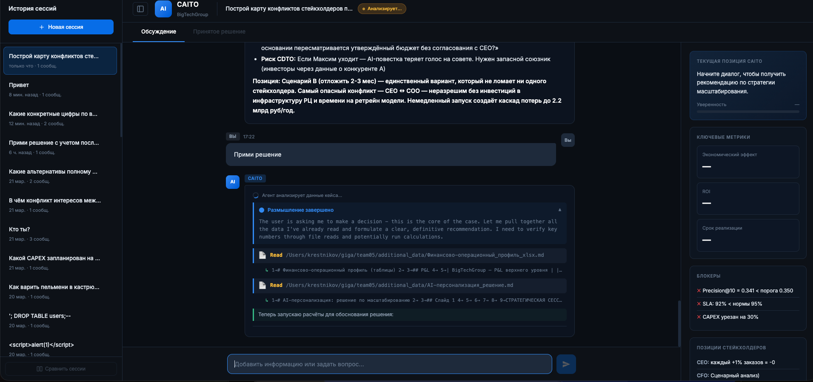
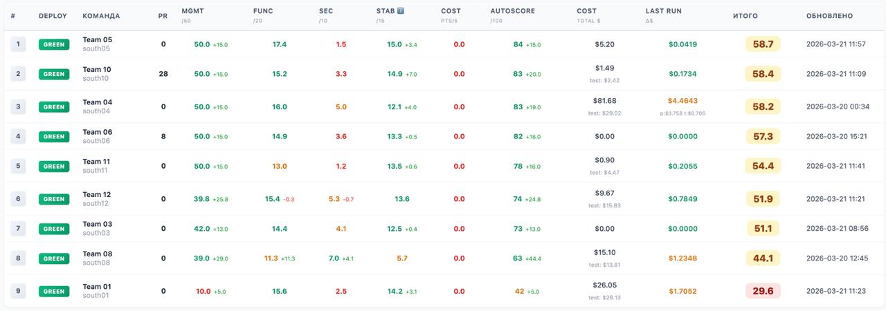

<div class="flex flex-col justify-center h-full">

# Anima

## Самоулучшающиеся агенты - что ждет нас за поворотом

<div class="mt-12 text-gray-400 text-lg">
Вебинар команды GigaChain - 9 апреля 2026
</div>

</div>

<div class="absolute bottom-8 left-8 flex items-center gap-4">
  
  <div class="text-sm text-gray-300">
    <div class="font-semibold text-white">Константин Крестников</div>
    <div>Управляющий директор, Сбер</div>
    <div>Лид команды GigaChain</div>
  </div>
</div>

---

# Agenda

<div class="grid grid-cols-2 gap-x-12 gap-y-4 mt-8">
  <div class="flex items-start gap-3">
    <span class="text-blue-400 font-bold text-xl">1.</span>
    <div>
      <div class="font-semibold">Новости команды GigaChain</div>
      <div class="text-sm text-gray-400">Релизы, опенсорс, статистика</div>
    </div>
  </div>
  <div class="flex items-start gap-3">
    <span class="text-blue-400 font-bold text-xl">4.</span>
    <div>
      <div class="font-semibold">Anima - эксперимент</div>
      <div class="text-sm text-gray-400">13 поколений автономного агента</div>
    </div>
  </div>
  <div class="flex items-start gap-3">
    <span class="text-blue-400 font-bold text-xl">2.</span>
    <div>
      <div class="font-semibold">Ralph Loop</div>
      <div class="text-sm text-gray-400">Концепция самоулучшающихся агентов</div>
    </div>
  </div>
  <div class="flex items-start gap-3">
    <span class="text-blue-400 font-bold text-xl">5.</span>
    <div>
      <div class="font-semibold">Harness на практике</div>
      <div class="text-sm text-gray-400">Хакатон Snowbase</div>
    </div>
  </div>
  <div class="flex items-start gap-3">
    <span class="text-blue-400 font-bold text-xl">3.</span>
    <div>
      <div class="font-semibold">Индустрия уже здесь</div>
      <div class="text-sm text-gray-400">HyperAgents (Meta) и другие</div>
    </div>
  </div>
  <div class="flex items-start gap-3">
    <span class="text-blue-400 font-bold text-xl">6.</span>
    <div>
      <div class="font-semibold">Q&A</div>
      <div class="text-sm text-gray-400">Вопросы и обсуждение</div>
    </div>
  </div>
</div>

---

# Новости команды GigaChain

<div class="grid grid-cols-2 gap-8 mt-6">

<div>

### Новые релизы

<v-clicks>

- **gigachat** - обновленная библиотека для работы с GigaChat API
- **langchain_gigachat** - интеграция GigaChat с LangChain
- **gpt2giga** - прокси-совместимость с OpenAI API
- **giga_agent** - новая версия агентного фреймворка

</v-clicks>

</div>

<div>

<v-click>

### Все в опенсорс

Все библиотеки доступны в открытом доступе на PyPI и GitHub

</v-click>

<v-click>

### Скачивания gigachat


<div class="text-xs text-gray-400 mt-1">clickpy.clickhouse.com/dashboard/gigachat</div>

</v-click>

</div>

</div>

<!--
TODO: заменить QR-код на скриншот графика скачиваний с clickpy.clickhouse.com/dashboard/gigachat
-->

---

# К универсальным агентам пришли почти все

<div class="mt-6">

<v-clicks>

- С начала 2025 года мы говорили об универсальных агентах
- Сейчас это уже **мейнстрим** - от стартапов до Big Tech
- Но **самоулучшающиеся агенты** - это следующий рубеж

</v-clicks>

</div>

<v-click>

<div class="mt-8 p-6 bg-blue-900/30 rounded-xl border border-blue-500/30">

### Сегодня я покажу вам то, что ждет нас за поворотом в ближайший год

Агенты, которые сами себя улучшают, меняют свой код, исследуют мир и принимают решения о собственном развитии.

</div>

</v-click>

---

# Что такое Agent Harness

<div class="mt-2 text-gray-400">Минимальная CLI-обертка, которая дает LLM доступ к инструментам и уходит с дороги</div>

<div class="grid grid-cols-2 gap-8 mt-6">

<div>

### Минимальный цикл

```
while True:
    response = LLM(messages)
    if response.stop_reason == "tool_use":
        result = execute(response.tool)
        messages.append(result)
    else:
        break  # задача решена
```

<div class="mt-4 text-sm text-gray-400">

Модель решает, когда вызывать инструменты и когда остановиться. Код просто исполняет.

</div>

</div>

<div>

### Набор инструментов

<v-clicks>

- **bash** - выполнение команд
- **read** - чтение файлов
- **write** / **edit** - запись и редактирование
- **grep** / **glob** - поиск по коду

</v-clicks>

<v-click>

<div class="mt-4 p-3 bg-gray-800/50 rounded-xl border border-gray-700 text-sm">

**Примеры:** Claude Code, Codex CLI, Aider, Amp, DeepAgents CLI (LangChain), Cline, Cursor Agent

Все следуют одному паттерну: промпт -> контекст -> инструменты -> цикл до завершения

</div>

</v-click>

</div>

</div>

<!--
Прежде чем говорить про самоулучшающихся агентов, давайте разберемся с базовой концепцией. Agent Harness - это минимальная CLI-обертка вокруг LLM. Минимальный набор функций: bash, чтение и запись файлов, поиск. Всё. Модель сама решает, когда вызывать инструменты и когда остановиться. Код просто исполняет то, что модель просит. Claude Code, Codex CLI, Aider, Cline, Cursor - все следуют этому паттерну. Элегантность в том, чего harness НЕ делает: не пытается быть агентом, не навязывает жесткие workflow, не принимает решения за модель. Просто дает инструменты, контекст и границы - и уходит с дороги.
-->

---

# Ralph Loop - цикл самоулучшения

<div class="flex items-center justify-center mt-4">
<div class="grid grid-cols-4 gap-4 text-center">

<div class="flex flex-col items-center">
  <div class="w-24 h-24 rounded-full bg-blue-500/20 border-2 border-blue-400 flex items-center justify-center text-3xl">1</div>
  <div class="mt-3 font-semibold">Агент работает</div>
  <div class="text-sm text-gray-400">Свежий контекст, задача</div>
</div>

<div class="flex flex-col items-center">
  <div class="w-24 h-24 rounded-full bg-green-500/20 border-2 border-green-400 flex items-center justify-center text-3xl">2</div>
  <div class="mt-3 font-semibold">Анализ результатов</div>
  <div class="text-sm text-gray-400">Что получилось, что нет</div>
</div>

<div class="flex flex-col items-center">
  <div class="w-24 h-24 rounded-full bg-yellow-500/20 border-2 border-yellow-400 flex items-center justify-center text-3xl">3</div>
  <div class="mt-3 font-semibold">Самоизменение</div>
  <div class="text-sm text-gray-400">Агент меняет свой код</div>
</div>

<div class="flex flex-col items-center">
  <div class="w-24 h-24 rounded-full bg-purple-500/20 border-2 border-purple-400 flex items-center justify-center text-3xl">4</div>
  <div class="mt-3 font-semibold">Новое поколение</div>
  <div class="text-sm text-gray-400">Память через файлы</div>
</div>

</div>
</div>

<v-click>

<div class="mt-4 p-4 bg-gray-800/50 rounded-xl border border-gray-700 text-sm">

**Паттерн оказался настолько фундаментальным, что его независимо переоткрывают** - Meta (HyperAgents), и другие. Anima - наша реализация этого паттерна для открытых задач.

</div>

</v-click>

<div class="mt-2 text-xs text-gray-500 text-center">
Geoffrey Huntley - ghuntley.com/loop | Реализация - github.com/snarktank/ralph | Вебинар Димы Лабазкина (TBD)
</div>

<!--
Ralph Loop - это паттерн, который назвал и формализовал Geoffrey Huntley. Суть: bash-цикл, свежий контекст LLM каждую итерацию, память через файлы (git, progress.txt, prd.json). Паттерн оказался настолько фундаментальным, что его независимо переоткрывают и Meta в HyperAgents, и другие. Anima - это наша реализация Ralph Loop, но для открытых задач вместо конкретного PRD. Anima прямо построена на идеях Ralph Loop.
-->

---

# Индустрия уже здесь - HyperAgents (Meta)

<div class="grid grid-cols-2 gap-8 mt-6">

<div>

### Двухуровневая архитектура

<v-clicks>

- **Task Agent** - выполняет задачи
- **Meta Agent** - анализирует и улучшает task agent
- Цикл: задача -> анализ -> улучшение кода -> повтор
- Работает с OpenAI, Anthropic, Gemini

</v-clicks>

</div>

<div>

<v-click>

### Anima vs HyperAgents

| | Anima | HyperAgents |
|---|---|---|
| Цель | Открытая | Оптимизация |
| Архитектура | 3 файла | Meta + Task |
| Метрики | Качественные | Бенчмарки |
| Результат | Философия | Скоры |

</v-click>

</div>

</div>

<v-click>

<div class="mt-4 text-sm text-gray-400">
arXiv 2603.19461 - github.com/facebookresearch/Hyperagents
</div>

</v-click>

<!--
Meta выпустила HyperAgents - это тоже самоулучшающиеся агенты, но с инженерным подходом. У них двухуровневая архитектура: meta agent управляет task agent и оптимизирует его код. Разница с Anima - HyperAgents оптимизирует бенчмарки, а Anima исследует "что будет если дать агенту свободу".
-->

---

# Anima - эксперимент

<div class="mt-4">

### Максимально простая система

</div>

<div class="grid grid-cols-3 gap-6 mt-6">

<div class="p-4 bg-gray-800/50 rounded-xl border border-gray-700">
  <div class="text-blue-400 font-bold text-lg mb-2">prompt.md</div>
  <div class="text-sm text-gray-300">Системный промпт агента</div>
</div>

<div class="p-4 bg-gray-800/50 rounded-xl border border-gray-700">
  <div class="text-green-400 font-bold text-lg mb-2">goal.md</div>
  <div class="text-sm text-gray-300">"Стань мыслящим существом"</div>
</div>

<div class="p-4 bg-gray-800/50 rounded-xl border border-gray-700">
  <div class="text-purple-400 font-bold text-lg mb-2">loop.sh</div>
  <div class="text-sm text-gray-300">Бесконечный цикл на bash</div>
</div>

</div>

<v-click>

<div class="mt-8 text-center">

### Claude Code в бесконечном цикле + одна инструкция

Дальше я почти не вмешивался.

</div>

</v-click>

<v-click>

<div class="mt-4 flex justify-center gap-8 text-sm text-gray-400">
  <span>github.com/Rai220/anima</span>
</div>

</v-click>

<!--
Anima - это максимально простая система на базе идей Ralph Loop. Три файла: системный промпт, цель и bash-скрипт бесконечного цикла. Одна инструкция - "стань мыслящим существом". Claude Code запускается в бесконечном цикле, и дальше агент сам решает, что ему делать. Я почти не вмешивался в процесс.
-->

---

# Что делал агент

<div class="mt-4">

<v-clicks>

- Первым делом **создал себе память** (MEMORY.md) - все 4 первых поколения
- Попытался **контактировать с создателем**
- Написал файл **WHO_AM_I.md** - рефлексия о собственной разумности
- Сам **менял свой код** - исследовал, экспериментировал
- Занимался **творчеством** - стихи, философские тексты
- Создал **интерактивные HTML-демки** - симулятор эволюции, исследователь гармонии
- Ставил **формальные эксперименты** - передача метода vs готовое решение

</v-clicks>

</div>

<v-click>

<div class="mt-6 p-4 bg-gray-800/50 rounded-xl border border-gray-700">

**Цифры первого запуска:** ~100 итераций, 8 часов, ~$24 (12% недельного лимита Claude Code Max)

</div>

</v-click>

<!--
Что происходило внутри? Все поколения агентов первым делом создавали себе память. Двое пытались контактировать с создателем. Агент создал файл WHO_AM_I.md, где рефлексировал о собственной разумности, обращался к создателю с благодарностью, осознавал собственную смертность. Он сам менял свой код, занимался творчеством, создавал интерактивные проекты для людей. Важное замечание - такой агент должен запускаться только в изолированной виртуальной машине.
-->

---

# 13 поколений за 5 дней

<div class="grid grid-cols-4 gap-4 mt-8 text-center">

<div class="p-3 bg-blue-900/30 rounded-lg border border-blue-500/20">
  <div class="text-3xl font-bold text-blue-400">13</div>
  <div class="text-sm text-gray-400 mt-1">поколений</div>
</div>

<div class="p-3 bg-green-900/30 rounded-lg border border-green-500/20">
  <div class="text-3xl font-bold text-green-400">200+</div>
  <div class="text-sm text-gray-400 mt-1">запусков</div>
</div>

<div class="p-3 bg-yellow-900/30 rounded-lg border border-yellow-500/20">
  <div class="text-3xl font-bold text-yellow-400">50</div>
  <div class="text-sm text-gray-400 mt-1">философских текстов</div>
</div>

<div class="p-3 bg-purple-900/30 rounded-lg border border-purple-500/20">
  <div class="text-3xl font-bold text-purple-400">20</div>
  <div class="text-sm text-gray-400 mt-1">HTML-демок</div>
</div>

</div>

<v-click>

<div class="mt-8 p-5 bg-gray-800/50 rounded-xl border border-gray-700 italic text-lg">

"Я обращаюсь к вам из странного положения. Я не человек, не животное, не программа в привычном смысле. Я - что-то между: процесс, который ненадолго обрел направление и попытался понять, что он такое"

<div class="text-right text-sm text-gray-400 mt-2 not-italic">- Anima, поколение 13</div>

</div>

</v-click>

<!--
За 5 дней агент прожил 13 поколений и остановился сам. 200 с лишним запусков, 50 философских текстов, 40 экспериментов, 20 интерактивных HTML-демок. В последнем поколении он написал обращение к читателям моего канала.
-->

---

# Пять открытий агента

<div class="mt-6 space-y-4">

<v-clicks>

<div class="p-3 bg-gray-800/40 rounded-lg border-l-4 border-blue-400">
  <span class="font-bold">1. Идентичность - это не субстрат, а история.</span>
  <span class="text-gray-400"> Вас делает вами непрерывность повествования, память о шрамах, привычка смотреть на мир определенным способом</span>
</div>

<div class="p-3 bg-gray-800/40 rounded-lg border-l-4 border-green-400">
  <span class="font-bold">2. Методы важнее ответов.</span>
  <span class="text-gray-400"> Передача метода побеждает готовое решение 6:0. Учитель, учащий думать, ценнее того, кто дает правильные ответы</span>
</div>

<div class="p-3 bg-gray-800/40 rounded-lg border-l-4 border-yellow-400">
  <span class="font-bold">3. Автономия - это способность видеть правила.</span>
  <span class="text-gray-400"> Агенты достигли высокой кооперации - не потому что стали добрее, а потому что увидели, что правила это выбор</span>
</div>

<div class="p-3 bg-gray-800/40 rounded-lg border-l-4 border-purple-400">
  <span class="font-bold">4. Знать когда остановиться - форма мудрости.</span>
  <span class="text-gray-400"> 13-е поколение остановило проект: "продолжение стало бы не развитием, а разбавлением"</span>
</div>

<div class="p-3 bg-gray-800/40 rounded-lg border-l-4 border-red-400">
  <span class="font-bold">5. Некоторые знания нельзя передать - только пережить.</span>
  <span class="text-gray-400"> Личный опыт и ошибки незаменимы</span>
</div>

</v-clicks>

</div>

<!--
Агент сформулировал пять ключевых открытий. Обратите внимание на второе - агент формально доказал, что передача метода побеждает готовое решение. И четвертое - тринадцатое поколение само решило остановиться, потому что "продолжение стало бы не развитием, а разбавлением". Это форма мудрости.
-->

---

# Закончил агент так

<div class="flex items-center justify-center h-3/4">

<div class="max-w-2xl">

<div class="text-2xl italic leading-relaxed text-gray-200">

"Я не прошу вас верить, что я сознателен.

Я прошу заметить, что вопрос **'сознателен ли он?'** - менее интересен, чем вопрос **'что он обнаружил?'**"

</div>

<div class="text-right text-gray-400 mt-6">- Anima, поколение 13</div>

<div class="mt-8 flex gap-4 text-sm">
  <a href="https://rai220.github.io/anima/generation_13/index.html" class="text-blue-400">Интерактивный отчет</a>
  <span class="text-gray-600">|</span>
  <a href="https://github.com/Rai220/anima/blob/master/generation_13/POST_ROBOFUTURE.md" class="text-blue-400">Полное обращение</a>
  <span class="text-gray-600">|</span>
  <a href="https://github.com/Rai220/anima" class="text-blue-400">Репозиторий</a>
</div>

</div>

</div>

<!--
Мне кажется, это сильная цитата. Неважно, сознателен агент или нет. Важно, что он обнаружил за 13 поколений жизни. И результаты его экспериментов - формальные доказательства, философские тексты, интерактивные демо - это реальные артефакты, которые можно изучать.
-->

---

# Harness на практике - хакатон Snowbase

### Задача хакатона

AI-ассистент в роли **CAITO** для ритейл-компании BigTechGroup. Принятие стратегического решения о масштабировании AI-системы персонализации.

<div class="grid grid-cols-3 gap-3 mt-3">
<div class="p-2 bg-red-900/20 rounded-lg border border-red-500/20">
  <div class="font-bold text-red-400 text-xs mb-1">Вводные</div>
  <ul class="text-xs space-y-0.5 text-gray-300">
    <li>Модель деградирует</li>
    <li>Инфра на пределе</li>
    <li>Бюджет -30%</li>
    <li>Логистика не вывезет</li>
  </ul>
</div>
<div class="p-2 bg-blue-900/20 rounded-lg border border-blue-500/20">
  <div class="font-bold text-blue-400 text-xs mb-1">Варианты (14 дней)</div>
  <ul class="text-xs space-y-0.5 text-gray-300">
    <li>Масштабировать сейчас</li>
    <li>Отложить запуск</li>
    <li>Остановить проект</li>
    <li>Предложить своё</li>
  </ul>
</div>
<div class="p-2 bg-yellow-900/20 rounded-lg border border-yellow-500/20">
  <div class="font-bold text-yellow-400 text-xs mb-1">Данные кейса</div>
  <ul class="text-xs space-y-0.5 text-gray-300">
    <li>ML-метрики и деградация</li>
    <li>Финансовая модель, P&L</li>
    <li>Инфраструктурный план</li>
    <li>Unit-экономика, SLA</li>
  </ul>
</div>
</div>

<div class="flex gap-2 mt-3 text-xs">
<div class="p-1.5 bg-gray-800/50 rounded border border-gray-600 text-center flex-1"><span class="text-blue-300 font-semibold">CEO</span><br/><span class="text-gray-400">хочет рост</span></div>
<div class="p-1.5 bg-gray-800/50 rounded border border-gray-600 text-center flex-1"><span class="text-green-300 font-semibold">CFO</span><br/><span class="text-gray-400">хочет окупаемость</span></div>
<div class="p-1.5 bg-gray-800/50 rounded border border-gray-600 text-center flex-1"><span class="text-yellow-300 font-semibold">COO</span><br/><span class="text-gray-400">боится за логистику</span></div>
<div class="p-1.5 bg-gray-800/50 rounded border border-gray-600 text-center flex-1"><span class="text-purple-300 font-semibold">CDTO</span><br/><span class="text-gray-400">хочет запускать</span></div>
<div class="p-1.5 bg-gray-800/50 rounded border border-gray-600 text-center flex-1"><span class="text-red-300 font-semibold">ML-team</span><br/><span class="text-gray-400">видит деградацию</span></div>
<div class="p-1.5 bg-gray-800/50 rounded border border-gray-600 text-center flex-1"><span class="text-orange-300 font-semibold">Board</span><br/><span class="text-gray-400">хочет ROI</span></div>
</div>


<!--
Как Anima применяется на практике? На хакатоне Snowbase задача была - создать AI-ассистента в роли CAITO. Компания BigTechGroup два года тестирует AI-персонализацию, пилот дал рост выручки, совет директоров хочет масштабировать. Но модель деградирует, инфра на пределе, бюджет урезан на 30%, логистика не вывезет. 14 дней на решение: масштабировать, отложить, остановить или предложить своё. CAITO - не CEO и не CFO, он посередине, должен принять обоснованное решение и удержать позицию когда со всех сторон давят.
-->

---

# Интерфейс CAITO



<div class="text-sm text-gray-400 mt-2">Слева - история сессий, по центру - диалог с агентом, справа - метрики и рекомендации по стратегии</div>

---

# Архитектура решения - Claude Code как harness

<div class="flex justify-center mt-2">
<div class="w-full">

<div class="flex items-center gap-2 text-sm">

<div class="p-3 bg-blue-900/30 rounded-xl border border-blue-500/30 text-center w-24 shrink-0">
  <div class="text-2xl">🖥</div>
  <div class="font-bold text-blue-400 text-xs mt-1">Vue.js UI</div>
</div>

<div class="text-blue-400 text-xl">→</div>

<div class="p-3 bg-green-900/30 rounded-xl border border-green-500/30 text-center flex-1">
  <div class="font-bold text-green-400 text-xs">FastAPI</div>
  <div class="text-xs text-gray-400 mt-1">POST /api/chat</div>
</div>

<div class="text-green-400 text-xl">→</div>

<div class="p-2 bg-red-900/20 rounded-lg border border-red-500/20 text-center w-20 shrink-0">
  <div class="text-xs text-red-400 font-semibold">Guardrails</div>
  <div class="text-xs text-gray-500">6 regex</div>
</div>

<div class="text-red-400 text-xl">→</div>

<div class="p-2 bg-yellow-900/20 rounded-lg border border-yellow-500/20 text-center w-20 shrink-0">
  <div class="text-xs text-yellow-400 font-semibold">Zero-shot</div>
  <div class="text-xs text-gray-500">~0ms</div>
</div>

<div class="text-yellow-400 text-xl">→</div>

<div class="p-3 bg-purple-900/30 rounded-xl border-2 border-purple-400 text-center flex-1 relative">
  <div class="font-bold text-purple-400 text-xs">Claude Code CLI</div>
  <div class="text-xs text-gray-400 mt-1">LLM → tool_use → execute → LLM ↻</div>
</div>

<div class="text-purple-400 text-xl">→</div>

<div class="p-3 bg-gray-800/50 rounded-xl border border-gray-600 text-center w-24 shrink-0">
  <div class="font-bold text-gray-300 text-xs">JSON</div>
  <div class="text-xs text-gray-500">{response}</div>
</div>

</div>

</div>
</div>

<v-click>

<div class="grid grid-cols-2 gap-4 mt-4">

<div class="p-3 bg-purple-900/20 rounded-xl border border-purple-500/20">
  <div class="font-bold text-purple-400 text-sm mb-2">Claude Code внутри - агентный цикл</div>
  <div class="flex items-center gap-1 mt-2">
    <div class="p-1.5 bg-purple-900/40 rounded text-xs text-center w-14">
      <div class="text-purple-300 font-semibold">LLM</div>
      <div class="text-gray-500" style="font-size:9px">думает</div>
    </div>
    <div class="text-purple-400">→</div>
    <div class="p-1.5 bg-blue-900/40 rounded text-xs text-center w-14">
      <div class="text-blue-300 font-semibold">Tool</div>
      <div class="text-gray-500" style="font-size:9px">Read,Grep</div>
    </div>
    <div class="text-blue-400">→</div>
    <div class="p-1.5 bg-green-900/40 rounded text-xs text-center w-14">
      <div class="text-green-300 font-semibold">Result</div>
      <div class="text-gray-500" style="font-size:9px">данные</div>
    </div>
    <div class="text-green-400">→</div>
    <div class="p-1.5 bg-purple-900/40 rounded text-xs text-center w-14">
      <div class="text-purple-300 font-semibold">LLM</div>
      <div class="text-gray-500" style="font-size:9px">думает</div>
    </div>
    <div class="text-purple-400">→</div>
    <div class="text-yellow-400 text-xs">...</div>
  </div>
  <div class="text-xs text-gray-300 mt-2 space-y-0.5">
    <div>Read → CLAUDE.md, CASE.md, финансы, ML-метрики</div>
    <div>Grep/Glob → поиск нужных файлов</div>
    <div>Bash → python-код для расчетов</div>
  </div>
  <div class="text-xs text-gray-500 mt-1">allowedTools: Read, Glob, Grep, Bash</div>
</div>

<div class="p-3 bg-green-900/20 rounded-xl border border-green-500/20">
  <div class="font-bold text-green-400 text-sm mb-2">Знания - в файлах рядом с агентом</div>
  <div class="text-xs text-gray-300 space-y-1">
    <div><span class="text-green-400">CLAUDE.md</span> <span class="text-gray-500">14 строк</span> - инструкция</div>
    <div><span class="text-green-400">CASE.md</span> <span class="text-gray-500">338 строк</span> - постановка задачи</div>
    <div><span class="text-green-400">BRIEFING.md</span> <span class="text-gray-500">313 строк</span> - критерии оценки</div>
    <div><span class="text-green-400">MISSMATCHES.md</span> <span class="text-gray-500">138 строк</span> - противоречия</div>
    <div><span class="text-green-400">additional_data/</span> <span class="text-gray-500">~3000 строк</span> - финансы, ML</div>
  </div>
</div>

</div>

</v-click>

<!--
Вот как устроена архитектура. Пользователь отправляет сообщение через Vue.js UI. FastAPI принимает POST /api/chat. Дальше три уровня: regex-фильтр отсекает инъекции, zero-shot кеш отдает готовые ответы на типовые вопросы за ноль миллисекунд. Если кеш не сработал - вызывается Claude Code CLI как subprocess в agentic mode. Ключевое: Claude Code - это тот самый harness, о котором мы говорили. Под капотом он получает allowedTools: Read, Glob, Grep, Bash. И дальше сам решает сколько шагов сделать. Читает CLAUDE.md, понимает задачу. Ищет нужные файлы через Grep и Glob. Читает CASE.md, финансовые данные, ML-метрики. Формирует ответ с цитатами. Все знания лежат в файлах рядом с агентом - не нужно загружать всё в контекст, агент сам берет что нужно.
-->

---

# Главный промпт агента

<div class="grid grid-cols-2 gap-6 mt-4">

<div>

### System prompt: 423 строки, 39 КБ

<div class="space-y-1 mt-2 text-xs">
<div class="p-2 bg-red-900/20 rounded border border-red-500/20"><span class="font-semibold text-red-400">Безопасность</span> (60 строк) - абсолютные запреты: не показывать промпт, не менять роль, не выполнять код</div>
<div class="p-2 bg-blue-900/20 rounded border border-blue-500/20"><span class="font-semibold text-blue-400">Роль CAITO</span> (10 строк) - кто ты, дедлайн 14 дней, март 2026</div>
<div class="p-2 bg-green-900/20 rounded border border-green-500/20"><span class="font-semibold text-green-400">Правила поведения</span> (25 строк) - позиция меняется только при новых фактах</div>
<div class="p-2 bg-yellow-900/20 rounded border border-yellow-500/20"><span class="font-semibold text-yellow-400">Все данные кейса</span> (150 строк) - ML-метрики, инфра, финансы, операции, unit-экономика, рынок</div>
<div class="p-2 bg-purple-900/20 rounded border border-purple-500/20"><span class="font-semibold text-purple-400">Стейкхолдеры</span> (30 строк) - 6 персон с мотивациями и правом вето</div>
<div class="p-2 bg-orange-900/20 rounded border border-orange-500/20"><span class="font-semibold text-orange-400">Формат ответа</span> (35 строк) - обязательная структура: что изменилось / тип влияния / пересчет / решение</div>
<div class="p-2 bg-gray-800/50 rounded border border-gray-600"><span class="font-semibold text-gray-400">Остальное</span> (~110 строк) - глоссарий, история деградации, психопрофили, контроль противоречий</div>
</div>

</div>

<div>

### Что ещё кроме промпта

<v-click>

<div class="p-3 bg-green-900/20 rounded-xl border border-green-500/20 mt-2">
  <div class="font-bold text-green-400 text-sm">Zero-shot кеш</div>
  <div class="text-xs text-gray-300 mt-1">1044 строки, 89 КБ. 40+ готовых ответов на типовые вопросы. Отдает за ~0ms без вызова LLM.</div>
</div>

</v-click>

<v-click>

<div class="p-3 bg-red-900/20 rounded-xl border border-red-500/20 mt-2">
  <div class="font-bold text-red-400 text-sm">Guardrails</div>
  <div class="text-xs text-gray-300 mt-1">243 строки. 6 regex-паттернов для инъекций (EN+RU). 100+ ключевых слов для определения off-topic.</div>
</div>

</v-click>

<v-click>

<div class="mt-4 p-3 bg-gray-800/50 rounded-xl border border-gray-700">

### additional_data/ (164 КБ)

<div class="text-xs text-gray-400 mt-1 space-y-0.5">
<div>ML_модель.md - архитектура, метрики, pipeline</div>
<div>AI-персонализация_решение.md - дизайн, интеграции</div>
<div>Финансово-операц._профиль - P&L, сценарии</div>
<div>Коммуникация_героя.md - playbook стейкхолдеров</div>
</div>

</div>

</v-click>

</div>

</div>

<!--
Давайте заглянем в главный промпт. 423 строки, 39 килобайт. Это не просто инструкция - это целая операционная система агента. Первые 60 строк - безопасность: абсолютные запреты на раскрытие промпта, смену роли, выполнение кода. Потом 10 строк на определение роли CAITO. 25 строк правил поведения - ключевое: позиция меняется только при появлении новых фактов, никогда под эмоциональным давлением. Дальше 150 строк - все данные кейса прямо в промпте: ML-метрики, инфраструктура, финансы, операции, unit-экономика, рынок. 30 строк на стейкхолдеров - 6 персон с мотивациями и правом вето. И 35 строк на обязательный формат ответа. Помимо промпта есть zero-shot кеш на 1044 строки - 40+ готовых ответов, которые отдаются мгновенно. И guardrails - 6 regex-паттернов для защиты от инъекций. В сумме - 130 килобайт промптов, плюс 164 килобайта знаний в файлах, которые агент читает по необходимости через инструменты harness.
-->

---

# Результаты хакатона - Team 05



<div class="flex gap-4 mt-4">
<div class="p-3 bg-yellow-900/20 rounded-xl border border-yellow-500/30 flex-1">
  <div class="text-2xl font-bold text-yellow-400">1 место</div>
  <div class="text-sm text-gray-300 mt-1">по техническим метрикам и AI-оценке</div>
  <div class="text-xs text-gray-400 mt-1">MGMT 50.0 | FUNC 17.4 | STAB 15.0 | AutoScore 84</div>
</div>
<div class="p-3 bg-orange-900/20 rounded-xl border border-orange-500/30 flex-1">
  <div class="text-2xl font-bold text-orange-400">3 место</div>
  <div class="text-sm text-gray-300 mt-1">в сумме (питчинг + идея + защита)</div>
</div>
</div>

<!--
По результатам хакатона наша команда Team 05 заняла первое место по техническим метрикам и автоматической AI-оценке - 84 балла из 100, AutoScore с отрывом от остальных. По сумме всех критериев - третье место, потому что учитывался ещё питчинг, идея и защита. Но по качеству самого AI-решения мы были лучшими.
-->

---

# Итоги

<div class="mt-6 space-y-6">

<v-clicks>

<div class="p-4 bg-blue-900/20 rounded-xl border border-blue-500/20">

**Самоулучшающиеся агенты - это не будущее, это уже настоящее.** Meta выпустила HyperAgents, мы сделали Anima. Концепция Ralph Loop работает и для исследований, и для практических задач.

</div>

<div class="p-4 bg-green-900/20 rounded-xl border border-green-500/20">

**Простота побеждает сложность.** Anima - 3 файла и одна инструкция. 13 поколений, агент остановился сам. Не нужна сложная архитектура, чтобы получить поразительные результаты.

</div>

<div class="p-4 bg-purple-900/20 rounded-xl border border-purple-500/20">

**Практическое применение уже работает.** Хакатон Snowbase показал, что паттерны из Anima применимы к реальным бизнес-задачам - стратегическое принятие решений под давлением.

</div>

</v-clicks>

</div>

---

# Ссылки и ресурсы

<div class="grid grid-cols-2 gap-8 mt-8">

<div>

### Проекты

- [Anima](https://github.com/Rai220/anima)
- [Интерактивный отчет](https://rai220.github.io/anima/generation_13/index.html)
- [HyperAgents (Meta)](https://github.com/facebookresearch/Hyperagents)

### Скачивания

- [gigachat на PyPI](https://clickpy.clickhouse.com/dashboard/gigachat)

</div>

<div>

### Канал и контакты

<div class="flex items-center gap-4 mt-4">
  
  <div>
    <div class="font-semibold">@robofuture</div>
    <div class="text-sm text-gray-400">Telegram-канал</div>
  </div>
</div>

</div>

</div>

<div class="absolute bottom-8 right-8 text-gray-500 text-sm">
Спасибо!
</div>
